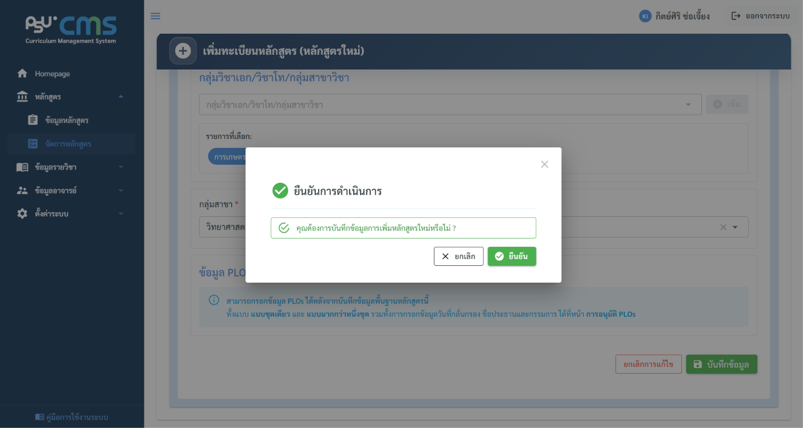
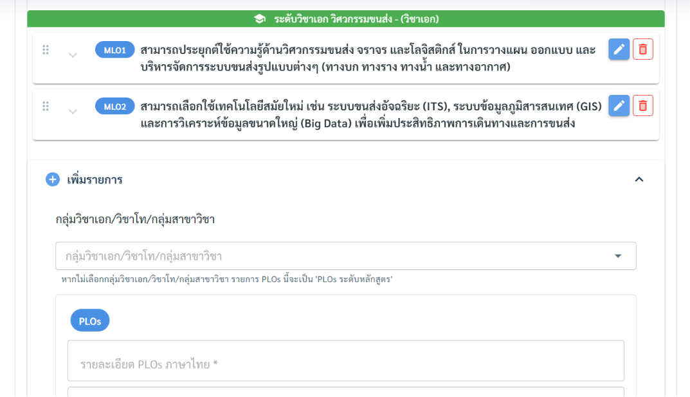
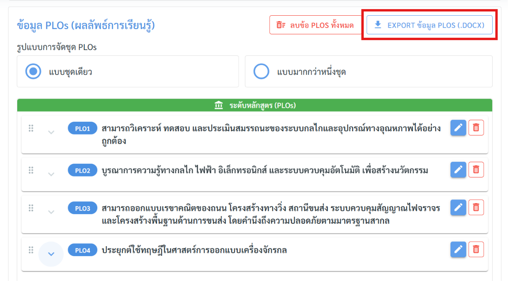
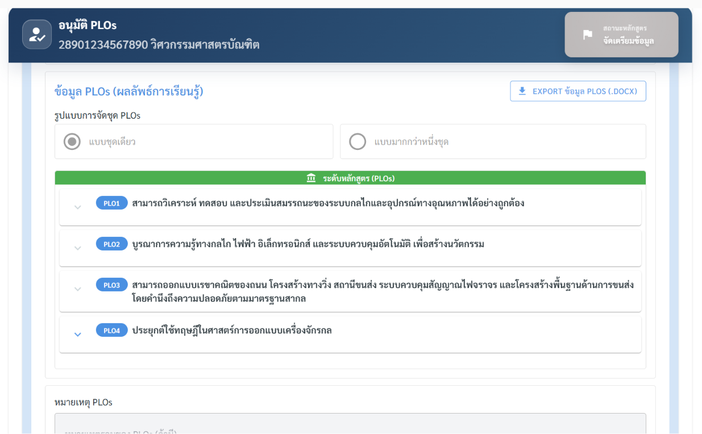
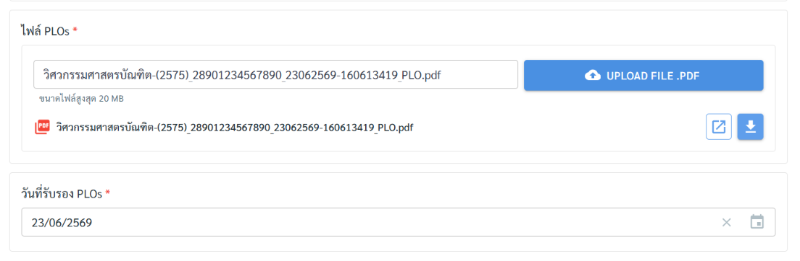
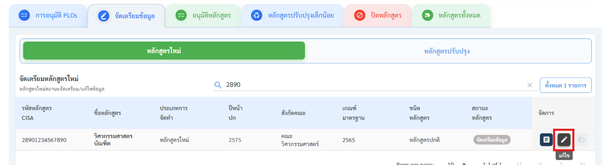
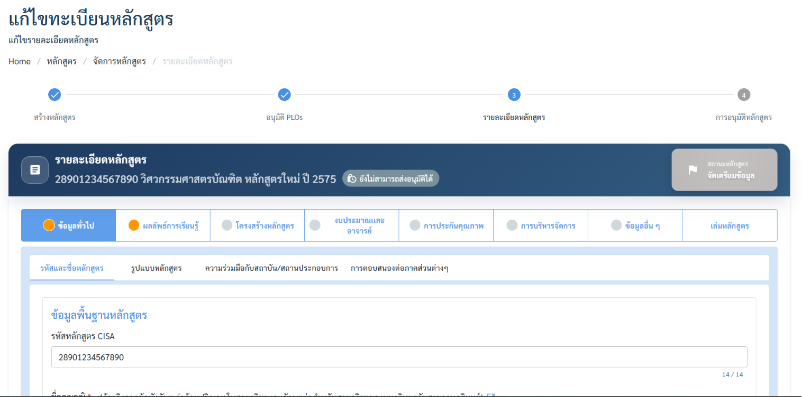
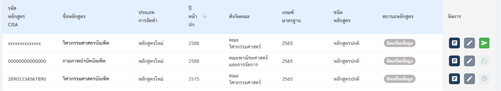
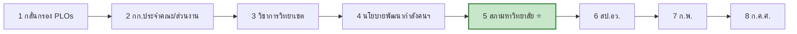

# 5. การเพิ่มหลักสูตรใหม่

การเพิ่มหลักสูตรใหม่แบ่งออกเป็น 4 ขั้นตอนหลัก ตามแถบ Stepper ด้านบนของหน้าจอ แถบนี้แสดงว่าขณะนี้อยู่ขั้นใด และยังเหลือขั้นใดบ้าง

```
[ขั้น 1: สร้างหลักสูตร] → [ขั้น 2: อนุมัติ PLOs] → [ขั้น 3: รายละเอียดหลักสูตร] → [ขั้น 4: การอนุมัติหลักสูตร]
```


> ⚠️ ลำดับสำคัญ ทั้ง 4 ขั้นต้องทำตามลำดับ ระบบจะไม่เปิดให้ทำขั้นถัดไปจนกว่าขั้นปัจจุบันจะผ่านเงื่อนไข (เช่น ต้องอนุมัติ PLO ก่อน จึงกรอกรายละเอียดหลักสูตรได้)

## ขั้นตอนที่ 1 — สร้างหลักสูตร

1. ไปที่เมนู จัดการหลักสูตร
2. คลิกปุ่ม เพิ่มหลักสูตร


1. กรอกข้อมูลพื้นฐานหลักสูตร


1. ตรวจทานความถูกต้องก่อนบันทึก



### ข้อมูลที่ต้องกรอกในขั้นตอนนี้

**ข้อมูลพื้นฐานหลักสูตร**

| ฟิลด์                                                               | รายละเอียด                                                                                                          |
| ------------------------------------------------------------------- | ------------------------------------------------------------------------------------------------------------------- |
| รหัสหลักสูตร CISA                                                   | กรอกรหัส CISA 14 หลัก                                                                                               |
| ชื่อคุณวุฒิ <mark style="color:red;">\*</mark>                      | เลือกชื่อคุณวุฒิ (อ้างอิงจากข้อบังคับฯ ว่าด้วยปริญญาในสาขาวิชาและอักษรย่อสำหรับสาขาวิชาของมหาวิทยาลัยสงขลานครินทร์) |
| สาขาวิชา                                                            | เลือกสาขาวิชา (ถ้ามี)                                                                                               |
| ชนิดหลักสูตร <mark style="color:red;">\*</mark>                     | เลือกชนิดหลักสูตร                                                                                                   |
| ชื่อหลักสูตร                                                        | แสดงอัตโนมัติหลังเลือกชื่อคุณวุฒิ และสาขาวิชา (ถ้ามี)                                                               |
| ชื่อปริญญา                                                          | แสดงอัตโนมัติหลังเลือกชื่อคุณวุฒิ และสาขาวิชา (ถ้ามี)                                                               |
| วิทยาเขต <mark style="color:red;">\*</mark>                         | เลือกวิทยาเขตที่เปิดสอน                                                                                             |
| สังกัดคณะ <mark style="color:red;">\*</mark>                        | เลือกคณะที่สังกัด                                                                                                   |
| สาขาวิชา/กลุ่มสาขาวิชาของส่วนงาน <mark style="color:red;">\*</mark> | เลือกสาขาวิชา/กลุ่มสาขาวิชาของส่วนงาน (ภาควิชา)                                                                     |

**สังกัดหน่วยงานบริหารจัดการหลักสูตร**

| ฟิลด์                                                   | รายละเอียด                                  |
| ------------------------------------------------------- | ------------------------------------------- |
| หน่วยงานบริหารจัดการ <mark style="color:red;">\*</mark> | เลือกคณะที่เป็นหน่วยงานบริหารจัดการหลักสูตร |

**การจำแนกหลักสูตรและเกณฑ์มาตรฐาน**

| ฟิลด์                                                               | รายละเอียด                                                                                                                                |
| ------------------------------------------------------------------- | ----------------------------------------------------------------------------------------------------------------------------------------- |
| ประเภทการจัดทำหลักสูตร                                              | จะปรากฏเป็นหลักสูตรใหม่ หรือ หลักสูตรปรับปรุง ตามการจัดทำได้แก่ เพิ่มหลักสูตร จะได้หลักสูตรใหม่ และปรับปรุงหลักสูตร จะได้หลักสูตรปรับปรุง |
| ประเภทหลักสูตร <mark style="color:red;">\*</mark>                   | เลือกประเภท หลักสูตรปกติ หรือ หลักสูตรsandbox                                                                                             |
| ระดับการศึกษา <mark style="color:red;">\*</mark>                    | จะปรากฏอัตโนมัติตาม ระดับการศึกษาของชื่อคุณวุฒิ                                                                                           |
| เกณฑ์มาตรฐานหลักสูตรที่บังคับใช้ <mark style="color:red;">\*</mark> | เลือกเกณฑ์มาตรฐานหลักสูตรที่บังคับใช้ \*                                                                                                  |
| ปีหน้าปก <mark style="color:red;">\*</mark>                         | กรอกปีที่จะระบุบนหน้าปกของหลักสูตร                                                                                                        |
| กลุ่มวิชาเอก / วิชาโท / กลุ่มสาขาวิชา                               | กรอกเฉพาะหลักสูตรที่มีการแบ่งกลุ่มวิชาเอก / วิชาโท / กลุ่มสาขาวิชา (ถ้ามี)                                                                |
| กลุ่มสาขา <mark style="color:red;">\*</mark>                        | เลือกกลุ่มสาขา ได้แก่ วิทยาศาสตร์และเทคโนโลยี, วิทยาศาสตร์และสุขภาพ, มนุษยศาสตร์และสังคมศาสตร์                                            |

> ⚠️ ข้อมูล PLOs (ผลลัพธ์การเรียนรู้) จะสามารถกรอกข้อมูล PLOs ได้หลังจากบันทึกข้อมูลพื้นฐานหลักสูตรนี้ ที่หน้าการอนุมัติ PLOs ขั้นตอนต่อไป

1. คลิก บันทึก เพื่อสร้างหลักสูตร เมื่อบันทึกสำเร็จ ระบบจะสร้างรายการหลักสูตรในสถานะเริ่มต้นเป็น "จัดเตรียมข้อมูล"

## ขั้นตอนที่ 2 — การอนุมัติ PLOs

PLO (Program Learning Outcomes) คือผลลัพธ์การเรียนรู้ที่คาดหวังว่านักศึกษาจะได้รับเมื่อสำเร็จการศึกษา เป็น "หัวใจ" ของหลักสูตร เพราะข้อมูลส่วนอื่น (รายวิชา การประเมิน กลยุทธ์การสอน) จะอ้างอิงกลับมาที่ PLOs เสมอ

1. เข้าสู่ขั้นตอนที่ 2 การอนุมัติ PLOs โดยที่หน้าจัดการหลักสูตร แท็บการอนุมัติ PLOs จะมีรายการหลักสูตรที่ได้ทำการสร้างมาข้างต้น ให้กดปุ่มแก้ไขข้อมูล PLOs เพื่อกรอกข้อมูล PLOs ของหลักสูตรนี้


1. เลือก รูปแบบการจัดชุด PLOs
2. แบบชุดเดียว : ทั้งหลักสูตรใช้ PLO ชุดเดียวร่วมกัน
3. แบบมากกว่าหนึ่งชุด : มี PLO หลายชุดแยกกัน แสดงเป็นแท็บ แต่ละชุดผูกกับกลุ่มวิชาเอก/วิชาโท/กลุ่มสาขาวิชาได้


1. กดเพิ่มรายการ PLOs แต่ละข้อ โดยจะรันรหัส PLOs ให้แบบอัตโนมัติ


1. หากเป็นหลักสูตรที่ กลุ่มวิชาเอก/วิชาโท/กลุ่มสาขาวิชา จะมีช่อง กลุ่มวิชาเอก/วิชาโท/กลุ่มสาขาวิชา ปรากฏ ให้เลือก เพื่อให้ข้อ PLOs นั้นอยู่ภายใต้ระดับวิชาเอกเป็นรหัส MLOs



1. หากมีข้อย่อย sub-PLOs สามารถกดเพิ่ม sub-PLOs เพื่อกรอกได้
2. สามารถลากเพื่อเลื่อนสลับข้อ PLOs และข้อย่อย sub-PLOs ได้ในตาราง


1. กรอก วันที่กลั่นกรองหลักสูตร ประธานและกรรมการ
2. จากนั้นกด บันทึกข้อมูล

> ℹ️ เมื่อสร้างหลักสูตรใหม่ ระบบตั้งค่าเริ่มต้นเป็น แบบชุดเดียว และสร้างชุดแรกให้อัตโนมัติ เลือก แบบมากกว่าหนึ่งชุด ขณะที่มีอยู่ชุดเดียว → ระบบสร้าง ชุดที่ 2 ขึ้นมาให้อัตโนมัติ และแสดงปุ่ม "เพิ่มชุด PLOs" สำหรับเพิ่มชุดถัดไป

> ⚠️ ต้องการเปลี่ยนกลับเป็น แบบชุดเดียว ขณะที่มีหลายชุด → ต้อง ลบชุดที่เกินให้เหลือชุดเดียวก่อน ไม่เช่นนั้นระบบจะเตือน "กรุณาลบชุด PLO ที่เกินมาให้เหลือชุดเดียว ก่อนเปลี่ยนเป็นชนิดแบบชุดเดียว" (หากเหลือชุดเดียวแล้ว ระบบจะปรับชนิดกลับเป็นชุดเดียวให้เอง)

1. จะสามารถ Export ข้อมูล PLOs ทั้งหมดเป็นไฟล์ word ได้ที่ปุ่ม Export ข้อมูล PLOs (.docx)



1. จากนั้นจึง กลับมาที่หน้าการอนุมัติ PLOs
2. เข้าสู่หน้า อนุมัติ PLOs โดยการกดปุ่ม อนุมัติ PLOs


1. จะปรากฏข้อมูล PLOs ที่ได้กรอกไว้ข้างต้นทั้งหมด




1. จากนั้นต้องกรอกวันที่รับรอง PLOs และแนบไฟล์ PLOs เพื่ออนุมัติ



1. หลังการกด บันทึกข้อมูล รายการหลักสูตรจะเข้าสู่ขั้นตอนที่ 3 รายละเอียดหลักสูตร ในแท็บจัดเตรียมข้อมูล
2. กดที่ปุ่ม แก้ไข เพื่อกรอกรายละเอียดหลักสูตร ตามข้อมูลในแต่ละแท็บ





## ขั้นตอนที่ 3 — รายละเอียดหลักสูตร

กรอกข้อมูลรายละเอียดหลักสูตรผ่าน 8 หมวดหมู่หลัก (แสดงเป็นแท็บด้านบน) แต่ละหมวดยังแบ่งเป็นแท็บย่อยอีกชั้น

แต่ละแท็บมีจุดสถานะ (วงกลม) แสดงความสมบูรณ์ของข้อมูล

1. **🟢** วงกลมสีเขียว + เครื่องหมายถูก = กรอกข้อมูลที่บังคับครบแล้ว


2. 🟡 วงกลมสีส้ม = ยังกรอกไม่ครบ


2. ⚪วงกลมสีเทา = ยังไม่ได้กรอก


## **ความคืบหน้าการจัดเตรียมข้อมูลหลักสูตร**


**ความคืบหน้า ของหลักสูตร คิดจากอะไร?**

ระบบแสดง **เปอร์เซ็นต์ความสมบูรณ์** ของแต่ละหลักสูตรในหน้าจัดการหลักสูตร โดยคิดจาก **จำนวนแท็บที่เป็นสีเขียว** (นับเป็นแท็บ ไม่ได้นับทีละฟิลด์)

* **หลักสูตรทั่วไป:** % = (จำนวนแท็บที่เขียว ในหมวดที่ 1–7) ÷ **7** × 100 — โดย **หมวดที่ 8 เล่มหลักสูตร ไม่ถูกนับ** ดังนั้นแท็บเขียวครบทั้ง 7 หมวด = **100%**
* **หลักสูตร Sandbox:** ใช้เฉพาะแท็บที่เปิดใช้งาน (active) เป็นตัวหาร
* แต่ละหมวดนับเป็น "เขียว / ไม่เขียว" เท่านั้น — จะเป็นสีเขียวเมื่อกรอก **ฟิลด์บังคับครบตามเงื่อนไขของหมวดนั้น** (ดูเงื่อนไขในกล่อง 🟢 ของแต่ละหมวดด้านล่าง)

หลักสูตรจะ **ส่งอนุมัติได้เมื่อครบ 100%** (ทุกหมวดที่นับเป็นสีเขียวครบ)


<figure><figcaption></figcaption></figure>

<figure><figcaption></figcaption></figure>


แนวทางการกรอกที่แนะนำ กรอกจากหมวดที่ 1 ไล่ไปตามลำดับ เพราะข้อมูลในหมวดต้น ๆ (เช่น รายวิชา และ PLO) จะถูกอ้างอิงในหมวดหลัง (เช่น การ mapping และกลยุทธ์การสอน)



**การบันทึก ต้องกดบันทึกในแต่ละแท็บย่อยที่กรอกเสร็จเท่านั้น**


> 📌 **ฟิลด์ที่มีเครื่องหมาย** <mark style="color:red;">\*</mark> **ในคอลัมน์ "บังคับกรอก" คือ ฟิลด์ที่ต้องกรอกเพื่อให้แท็บเปลี่ยนเป็นสีเขียว** ฟิลด์อื่นกรอกเพิ่มได้เพื่อความสมบูรณ์ของเล่มหลักสูตร แต่ไม่บังคับสำหรับสถานะแท็บ

### หมวดที่ 1 — ข้อมูลทั่วไป

แบ่งเป็น 4 แท็บย่อย


แท็บ **"ข้อมูลทั่วไป"** นี้จะเป็น **🟢**<mark style="color:green;">**สีเขียว**</mark> เมื่&#xE2D;**:** กรอกข้อมูลหลักสูตรครบในแท็บย่อย **รหัสและชื่อหลักสูตร** **+ รูปแบบหลักสูตร + การตอบสนองต่อภาคส่วนต่างๆ** - ส่วนแท็บ "ความร่วมมือกับสถาบัน/สถานประกอบการ" ไม่บังคับ


<table><thead><tr><th width="208.60003662109375">แท็บย่อย</th><th width="412.6363525390625">ฟิลด์</th><th align="center">บังคับกรอก</th></tr></thead><tbody><tr><td><strong>🟢</strong> <strong>รหัสและชื่อหลักสูตร</strong></td><td>รหัสหลักสูตร CISA (14 หลัก)</td><td align="center"><h3></h3></td></tr><tr><td></td><td>ชื่อคุณวุฒิ</td><td align="center"><h3><mark style="color:red;">*</mark></h3></td></tr><tr><td></td><td>สาขาวิชา</td><td align="center"><h3><mark style="color:red;">*</mark></h3></td></tr><tr><td></td><td>ชนิดหลักสูตร</td><td align="center"><h3><mark style="color:red;">*</mark></h3></td></tr><tr><td></td><td>ชื่อหลักสูตร (ปรากฏอัตโนมัติ)</td><td align="center"><h3></h3></td></tr><tr><td></td><td>ชื่อปริญญา (ปรากฏอัตโนมัติ)</td><td align="center"><h3></h3></td></tr><tr><td></td><td>วิทยาเขต</td><td align="center"><h3><mark style="color:red;">*</mark></h3></td></tr><tr><td></td><td>สังกัดคณะ</td><td align="center"><h3><mark style="color:red;">*</mark></h3></td></tr><tr><td></td><td>ภาควิชา/กลุ่มสาขาวิชาของส่วนงาน (เมื่อคณะมีภาควิชา)</td><td align="center"><h3><mark style="color:red;">*</mark></h3></td></tr><tr><td></td><td>ประเภทการจัดทำหลักสูตร</td><td align="center"><h3><mark style="color:red;">*</mark></h3></td></tr><tr><td></td><td>หลักสูตรอ้างอิง (ปรากฏอัตโนมัติ)</td><td align="center"></td></tr><tr><td></td><td>ประเภทมาตรฐานหลักสูตร</td><td align="center"><h3><mark style="color:red;">*</mark></h3></td></tr><tr><td></td><td>ระดับการศึกษา (ปรากฏอัตโนมัติ)</td><td align="center"><h3></h3></td></tr><tr><td></td><td>เกณฑ์มาตรฐานหลักสูตรที่บังคับใช้</td><td align="center"><h3><mark style="color:red;">*</mark></h3></td></tr><tr><td></td><td>ปีหน้าปก (พ.ศ.)</td><td align="center"><h3><mark style="color:red;">*</mark></h3></td></tr><tr><td></td><td>กลุ่มวิชาเอก/วิชาโท/กลุ่มสาขาวิชา (ถ้ามี)</td><td align="center"></td></tr><tr><td><strong>🟢</strong> <strong>รูปแบบหลักสูตร</strong></td><td>รูปแบบหลักสูตรปริญญาตรี (ปรากฏในระดับการศึกษาปริญญาตรีเท่านั้น)</td><td align="center"><h3><mark style="color:red;">*</mark></h3></td></tr><tr><td></td><td>ประเภทการบริหารจัดการหลักสูตร</td><td align="center"><h3><mark style="color:red;">*</mark></h3></td></tr><tr><td></td><td>การเป็น Multidisciplinary / Interdisciplinary</td><td align="center"><h3><mark style="color:red;">*</mark></h3></td></tr><tr><td></td><td>จำนวนปีที่ถึงรอบการปรับปรุงหลักสูตร</td><td align="center"><h3><mark style="color:red;">*</mark></h3></td></tr><tr><td></td><td>มีการรับรองโดยสภาวิชาชีพ/องค์กรอื่นๆ</td><td align="center"><h3><mark style="color:red;">*</mark></h3></td></tr><tr><td></td><td>การให้ปริญญา</td><td align="center"><h3><mark style="color:red;">*</mark></h3></td></tr><tr><td></td><td>ปีการศึกษาที่เปิดสอนครั้งแรก</td><td align="center"><h3><mark style="color:red;">*</mark></h3></td></tr><tr><td></td><td>ภาคการศึกษาที่เปิดสอนครั้งแรก</td><td align="center"><h3><mark style="color:red;">*</mark></h3></td></tr><tr><td></td><td>ปีการศึกษาที่เริ่มรับนักศึกษา (พ.ศ.)</td><td align="center"><h3><mark style="color:red;">*</mark></h3></td></tr><tr><td></td><td>ภาคการศึกษาที่เริ่มรับนักศึกษา</td><td align="center"><h3><mark style="color:red;">*</mark></h3></td></tr><tr><td></td><td>ISCED (Broad / Narrow / Detailed Field)</td><td align="center"><h3><mark style="color:red;">*</mark></h3></td></tr><tr><td></td><td>ภาษาที่ใช้สอน</td><td align="center"><h3><mark style="color:red;">*</mark></h3></td></tr><tr><td></td><td>กลุ่มสาขา</td><td align="center"><h3><mark style="color:red;">*</mark></h3></td></tr><tr><td><strong>ความร่วมมือกับสถาบัน/สถานประกอบการ</strong> (เพิ่มทีละรายการ)</td><td>ขอบเขตความร่วมมือ</td><td align="center"></td></tr><tr><td></td><td>ชื่อสถาบัน/สถานประกอบการ</td><td align="center"><h3><mark style="color:red;">*</mark></h3></td></tr><tr><td></td><td>วันที่เริ่มใช้</td><td align="center"><h3><mark style="color:red;">*</mark></h3></td></tr><tr><td></td><td>วันหมดอายุ</td><td align="center"></td></tr><tr><td></td><td>เป็นหลักสูตรร่วมผลิต</td><td align="center"><h3><mark style="color:red;">*</mark></h3></td></tr><tr><td></td><td>ประเภทความร่วมมือ (MOU)</td><td align="center"><h3><mark style="color:red;">*</mark></h3></td></tr><tr><td></td><td>แนบไฟล์ MOU/MOA</td><td align="center"><h3><mark style="color:red;">*</mark></h3></td></tr><tr><td></td><td>รูปแบบความร่วมมือทางวิชาการ</td><td align="center"><h3><mark style="color:red;">*</mark></h3></td></tr><tr><td></td><td>รูปแบบการให้ปริญญา</td><td align="center"><h3><mark style="color:red;">*</mark></h3></td></tr><tr><td></td><td>รายละเอียดความร่วมมือ</td><td align="center"><h3><mark style="color:red;">*</mark></h3></td></tr><tr><td><strong>🟢 การตอบสนองต่อภาคส่วนต่างๆ</strong> (เพิ่มทีละรายการ)</td><td>ยุทธศาสตร์มหาวิทยาลัย (อย่างน้อย 1 รายการ)</td><td align="center"><h3><mark style="color:red;">*</mark></h3></td></tr><tr><td></td><td>ยุทธศาสตร์ชาติ (อย่างน้อย 1 รายการ)</td><td align="center"><h3><mark style="color:red;">*</mark></h3></td></tr><tr><td></td><td>นโยบายพัฒนากำลังคนของชาติ (อย่างน้อย 1 รายการ)</td><td align="center"><h3><mark style="color:red;">*</mark></h3></td></tr><tr><td></td><td>การรองรับเป้าหมายการพัฒนาที่ยั่งยืน SDGs (อย่างน้อย 1 รายการ)</td><td align="center"><h3><mark style="color:red;">*</mark></h3></td></tr></tbody></table>

### หมวดที่ 2 — ผลลัพธ์การเรียนรู้

แบ่งเป็น 3 แท็บย่อย


แท็บ **"ผลลัพธ์การเรียนรู้"** นี้จะเป็น **🟢**<mark style="color:green;">**สีเขียว**</mark> เมื่&#xE2D;**:** กรอกข้อมูลครบในแท็บย่อย **ปรัชญาและวัตถุประสงค์ + ระบบการจัดการศึกษา** - ส่วนแท็บ "ผลลัพธ์การเรียนรู้ (PLOs)" มีข้อตั้งต้นไว้แล้วสำหรับดูข้อมูล PLOsเท่านั้น


<table><thead><tr><th>แท็บย่อย</th><th width="425.3636474609375">ฟิลด์</th><th align="center">บังคับกรอก</th></tr></thead><tbody><tr><td><strong>🟢 ปรัชญา และวัตถุประสงค์</strong></td><td>ปรัชญาของหลักสูตร</td><td align="center"><h3><mark style="color:red;">*</mark></h3></td></tr><tr><td></td><td>วัตถุประสงค์ของหลักสูตร</td><td align="center"><h3><mark style="color:red;">*</mark></h3></td></tr><tr><td><strong>ผลลัพธ์การเรียนรู้ (PLOs)</strong></td><td>รูปแบบการจัดชุด PLOs (ชุดเดียว / มากกว่าหนึ่งชุด)</td><td align="center"></td></tr><tr><td></td><td>กลุ่มวิชาเอก/วิชาโท/กลุ่มสาขาวิชา (กรณีหลายชุด)</td><td align="center"></td></tr><tr><td></td><td>รายละเอียด PLOs ภาษาไทย</td><td align="center"></td></tr><tr><td></td><td>รายละเอียด PLOs ภาษาอังกฤษ</td><td align="center"></td></tr><tr><td></td><td>รายละเอียด sub-PLOs (ไทย/อังกฤษ)</td><td align="center"></td></tr><tr><td></td><td>หมายเหตุ PLOs</td><td align="center"></td></tr><tr><td><strong>🟢 ระบบการจัดการศึกษา</strong></td><td>ระบบการจัดการศึกษา</td><td align="center"><h3><mark style="color:red;">*</mark></h3></td></tr><tr><td></td><td>จำนวนภาคการศึกษาต่อปี</td><td align="center"><h3><mark style="color:red;">*</mark></h3></td></tr><tr><td></td><td>แบบชั้นเรียน (ปรากฏอัตโนมัติ)</td><td align="center"><h3><mark style="color:red;">*</mark></h3></td></tr><tr><td></td><td>รูปแบบการจัดการเรียนการสอน</td><td align="center"><h3><mark style="color:red;">*</mark></h3></td></tr><tr><td></td><td>การจัดการเรียนการสอนภาคฤดูร้อน</td><td align="center"><h3><mark style="color:red;">*</mark></h3></td></tr><tr><td></td><td>วัน-เวลาในการดำเนินการเรียนการสอน</td><td align="center"><h3><mark style="color:red;">*</mark></h3></td></tr></tbody></table>

### หมวดที่ 3 — โครงสร้างหลักสูตร

แบ่งเป็น 5 แท็บย่อย — เป็นหมวดที่ใช้เวลามากที่สุด เพราะเป็นแกนวิชาการของหลักสูตร (แนะนำกรอกตามลำดับ: จัดการรายวิชา → แผนการศึกษา → PLOs รายวิชา → กลยุทธ์และวิธีการสอน → PLOs & K A S)


แท็บ **"โครงสร้างหลักสูตร"** นี้จะเป็น **🟢**<mark style="color:green;">**สีเขียว**</mark> เมื่&#xE2D;**:**&#xE21;ี**แผนการศึกษา (กรอกหน่วยกิตรวม + ระยะเวลาการศึกษาทุกแผน) · เพิ่มหมวดวิชาในโครงสร้าง · หน่วยกิตในหมวด/กลุ่มครบตามหน่วยกิตรวม** · **ทุกรายวิชาต้องมี CLO + PLO รายวิชา** - (แท็บ กลยุทธ์การสอน และ PLOs & K A S ไม่นับในเงื่อนไขแท็บเขียว แต่จำเป็นต่อความสมบูรณ์ของเล่ม)


| แท็บย่อย                                                | ฟิลด์                                                                 |                 บังคับกรอก                 |
| ------------------------------------------------------- | --------------------------------------------------------------------- | :----------------------------------------: |
| **🟢จัดการรายวิชา** (เพิ่มทีละวิชา หรือนำเข้า)          | หน่วยงานบริหารจัดการหลักสูตร (เลือกก่อนกำหนดรหัสวิชา)                 | <h3><mark style="color:red;">*</mark></h3> |
|                                                         | รหัสวิชา                                                              | <h3><mark style="color:red;">*</mark></h3> |
|                                                         | ประเภทวิชา                                                            | <h3><mark style="color:red;">*</mark></h3> |
|                                                         | ชื่อรายวิชา (ไทย/อังกฤษ)                                              | <h3><mark style="color:red;">*</mark></h3> |
|                                                         | คำอธิบายรายวิชา (ไทย/อังกฤษ)                                          | <h3><mark style="color:red;">*</mark></h3> |
|                                                         | จำนวนหน่วยกิต                                                         | <h3><mark style="color:red;">*</mark></h3> |
|                                                         | รูปแบบหน่วยกิต                                                        | <h3><mark style="color:red;">*</mark></h3> |
|                                                         | ชั่วโมงบรรยาย/ปฏิบัติ/ศึกษาด้วยตนเอง                                  | <h3><mark style="color:red;">*</mark></h3> |
|                                                         | ประเภทห้องเรียน                                                       | <h3><mark style="color:red;">*</mark></h3> |
|                                                         | ตัวเลือก Active Learning / WIL / Module                               | <h3><mark style="color:red;">*</mark></h3> |
|                                                         | CLOs — รายละเอียด (ไทย) (ทุกรายวิชาต้องมีอย่างน้อย 1 ข้อ)             | <h3><mark style="color:red;">*</mark></h3> |
|                                                         | CLOs — รหัส / รายละเอียด (อังกฤษ)                                     | <h3><mark style="color:red;">*</mark></h3> |
|                                                         | รายวิชาที่ต้องเรียนก่อน                                               |                                            |
|                                                         | การอนุมัติ/เปิด-ปิดรายวิชา (วันที่อนุมัติ ฯลฯ)                        | <h3><mark style="color:red;">*</mark></h3> |
| **🟢แผนการศึกษา**                                       | ชื่อแผนการศึกษา                                                       | <h3><mark style="color:red;">*</mark></h3> |
|                                                         | จำนวนหน่วยกิตรวม                                                      | <h3><mark style="color:red;">*</mark></h3> |
|                                                         | ระยะเวลาการศึกษา (ปี)                                                 | <h3><mark style="color:red;">*</mark></h3> |
|                                                         | ระยะเวลาที่ขอขยายได้ (ปี)                                             | <h3><mark style="color:red;">*</mark></h3> |
|                                                         | คุณสมบัติผู้เข้าศึกษา                                                 | <h3><mark style="color:red;">*</mark></h3> |
|                                                         | ชุด PLOs ของแผนนี้                                                    | <h3><mark style="color:red;">*</mark></h3> |
|                                                         | โครงสร้างหมวดวิชา — ชื่อหมวดวิชา                                      | <h3><mark style="color:red;">*</mark></h3> |
|                                                         | โครงสร้างหมวดวิชา — จำนวนหน่วยกิต (รวมแล้วครบตามหน่วยกิตรวม)          | <h3><mark style="color:red;">*</mark></h3> |
|                                                         | กลุ่ม/กลุ่มย่อย, หน่วยกิตกลุ่ม, กลุ่ม GE                              | <h3><mark style="color:red;">*</mark></h3> |
|                                                         | ประเภทโครงสร้าง / ประเภทแผนการศึกษา                                   | <h3><mark style="color:red;">*</mark></h3> |
|                                                         | แผนการเรียนรายชั้นปี-ภาคการศึกษา                                      | <h3><mark style="color:red;">*</mark></h3> |
|                                                         | แผนการรับนักศึกษา (จำนวนรับต่อปี)                                     | <h3><mark style="color:red;">*</mark></h3> |
| **🟢PLO รายวิชา**                                       | ตาราง Mapping ความรับผิดชอบระหว่าง PLOs กับรายวิชาแต่ละวิชา           | <h3><mark style="color:red;">*</mark></h3> |
| **🟢 กลยุทธ์และวิธีการสอน (ไม่นับในเงื่อนไขแท็บเขียว)** | กลยุทธ์/วิธีการสอน และวิธีการวัดและประเมินผล แยกตามผลลัพธ์การเรียนรู้ | <h3><mark style="color:red;">*</mark></h3> |
|                                                         | เกณฑ์การสำเร็จการศึกษา (ลำดับข้อ, รายละเอียด)                         | <h3><mark style="color:red;">*</mark></h3> |
| **🟢 PLOs & K/A/S**                                     | **จัดการคลัง K/A/S**                                                  | <h3><mark style="color:red;">*</mark></h3> |
|                                                         | **PLOs K/A/S**                                                        | <h3><mark style="color:red;">*</mark></h3> |

#### รายละเอียดแท็บ "จัดการรายวิชา" (โครงสร้างเชิงลึก)

รายวิชาที่กรอกในแท็บนี้เป็น **รายวิชาของหลักสูตรนี้โดยเฉพาะ** (ไม่ใช่รายวิชากลาง/GenEd จากคลังส่วนกลาง) แต่ยังใช้ **รหัสประเภทวิชาชุดเดียวกัน** และแบบฟอร์ม 4 แท็บย่อยแบบเดียวกับรายวิชากลาง

**รายการรายวิชาในหลักสูตร** — แสดงเฉพาะรายวิชาที่หลักสูตรนี้เป็นเจ้าของ มีช่องค้นหารหัสวิชา/ชื่อวิชา และคอลัมน์: รหัสวิชา · ชื่อรายวิชา (พร้อมปีที่เปิดสอนครั้งแรกถ้ามี) · ประเภทวิชา · หน่วยกิต · **ใช้งานร่วม/แชร์** (สวิตช์เปิด/ปิดให้หลักสูตรอื่นนำไปใช้ร่วม) · จัดการ (ดูรายละเอียดวิชา/แก้ไข/ลบ)


รายวิชาที่ยังไม่มี CLOs จะมีป้ายเตือนกำกับไว้ที่แถวนั้น เนื่องจากรายวิชาที่ไม่มี CLO จะ**อนุมัติเปิดใช้งานไม่ได้**


**เพิ่ม/แก้ไขรายวิชา** — กดปุ่ม **"เพิ่มวิชาในหลักสูตร"** เปิดฟอร์มแบ่ง 4 แท็บย่อยเหมือนรายวิชากลาง (ข้อมูลรายวิชา · รายวิชาที่บังคับเรียนก่อน/ควบ · CLOs รายวิชา · ข้อมูลการเปิดสอนและการอนุมัติ) โดยมีข้อแตกต่าง

* หากหลักสูตรมี **หน่วยงานบริหารจัดการหลักสูตรมากกว่า 1 หน่วยงาน** ต้อง**เลือกหน่วยงานก่อนกำหนดรหัสวิชา** เพราะเลขรหัสวิชาตัวหน้าจะเปลี่ยนตามหน่วยงานที่เลือก
* แท็บ "ข้อมูลการเปิดสอนและการอนุมัติ" จะ**ไม่มีช่องวันที่อนุมัติแยก** เพราะรายวิชานี้ไม่ผ่านกระบวนการอนุมัติกลาง (ถือเป็นส่วนหนึ่งของการกรอกข้อมูลหลักสูตร)
* ถ้ายังไม่กรอก CLOs แล้วกดบันทึก ระบบจะเตือนให้ยืนยันก่อนว่าจะ **"บันทึกโดยไม่มี CLOs"** หรือไม่
* นำเข้าเป็นชุดได้ผ่านเมนู **"นำเข้าข้อมูล"** — แยกเป็น **นำเข้ารายวิชา Excel** และ **นำเข้า CLOs Excel**

**การเปิดให้หลักสูตรอื่นใช้งานร่วม** — เปิดสวิตช์ **"ใช้งานร่วม/แชร์"** เพื่อให้หลักสูตรอื่นนำรายวิชานี้ไปใช้ร่วมได้ทันที หากปิดสวิตช์ขณะมีหลักสูตรอื่นใช้งานอยู่แล้ว ระบบจะถามยืนยันก่อน โดยแจ้งจำนวนหลักสูตรอื่นที่ใช้อยู่ให้ทราบ

**การลบรายวิชา** — ลบได้เฉพาะรายวิชาที่หลักสูตรนี้เป็นเจ้าของ ถ้ายังใช้อยู่ในหมวดวิชา/แผนการเรียนของหลักสูตรนี้เอง ต้องถอนออกจากหมวดก่อนจึงจะลบได้ และถ้าถูกหลักสูตรอื่นใช้งานอยู่ (ผ่านการแชร์) จะ**ลบไม่ได้เลย**จนกว่าหลักสูตรอื่นจะเลิกใช้ รองรับการเลือกหลายรายการแล้วลบพร้อมกัน โดยระบบจะข้ามรายวิชาที่ยังถูกใช้งานอยู่โดยอัตโนมัติ

#### รายละเอียดแท็บ "แผนการศึกษา" (โครงสร้างเชิงลึก)

หนึ่งหลักสูตรมีได้หลายแผนการศึกษา และถ้าหลักสูตรแบ่งวิชาเอก จะมีแท็บแยกตามวิชาเอก โครงสร้างของแต่ละแผนเป็นลำดับชั้น **หมวดวิชา → กลุ่ม → กลุ่มย่อย → รายวิชา**


**วิธีเข้าไปแก้ไขโครงสร้าง:** ในตารางรายการ "แผนการศึกษา" แต่ละแถวมีปุ่ม **"โครงสร้าง"** (เปิดหน้าจัดการโครงสร้าง) และปุ่ม **"โครงสร้างหลักสูตร"** (ขยายแถวดูแบบฝังในหน้าเดิม) — ถ้าหลักสูตรมีการแบ่ง **เอกเดี่ยว/เอก-โท** ต้องเพิ่ม "ตัวเลือกโครงสร้างของแผน" (ดูหัวข้อด้านล่าง) ก่อน แล้วกดปุ่ม "โครงสร้าง" บนการ์ดของวิชาเอกที่ต้องการแทน


หน้าจอโครงสร้างเปิดเป็นแท็บ **"โครงสร้างหลักสูตร : {ชื่อแผน}"** แยกหนึ่งแท็บต่อหนึ่งแผน/วิชาเอก ด้านบนสุดมี 2 การ์ดสรุปให้ดูภาพรวมก่อนเริ่มแก้ไข

<table><thead><tr><th width="220">การ์ด</th><th>แสดงอะไร</th></tr></thead><tbody><tr><td><strong>ข้อมูลแผนการศึกษา</strong> (อ่านอย่างเดียว)</td><td>จำนวนหน่วยกิตรวม · ระยะเวลาการศึกษา · ระยะเวลาที่ขยายได้ — ดึงมาจากตอนสร้าง/แก้ไขแผน</td></tr><tr><td><strong>สรุปหน่วยกิตหมวดวิชา</strong> (คำนวณสด)</td><td>จำนวนหน่วยกิตรวม / เพิ่มแล้ว / คงเหลือ-หรือเกิน พร้อมแถบความคืบหน้า <strong>🟢 เขียว</strong> เมื่อครบพอดีตามแผน และ <strong>🔴 แดง</strong> เมื่อยังไม่ครบ</td></tr></tbody></table>

**ลำดับชั้นของโครงสร้าง**

<table><thead><tr><th width="170">ระดับ</th><th>สิ่งที่กำหนด</th></tr></thead><tbody><tr><td>🗂️ <strong>หมวดวิชา</strong></td><td>ชื่อหมวดวิชา · จำนวนหน่วยกิตของหมวด · ตัวเลือก "หมวด Audit / ไม่นับหน่วยกิต" · ตัวเลือก "ไม่ระบุรายวิชาในหมวดนี้"</td></tr><tr><td>📁 <strong>กลุ่ม</strong></td><td>เลือกกลุ่ม (หรือปล่อยเป็น "ไม่ระบุกลุ่ม") · หน่วยกิตกลุ่ม · ตัวเลือก "ไม่ระบุรายวิชาในกลุ่มนี้" · รายวิชา/กลุ่มย่อยในกลุ่ม</td></tr><tr><td>📄 <strong>กลุ่มย่อย</strong></td><td>กลุ่มย่อยหลัก · Minor (เลือกได้หลายรายการ ซ้อนใต้กลุ่มย่อยหลัก) · หน่วยกิตกลุ่มย่อย</td></tr><tr><td>🎓 <strong>กลุ่ม GE</strong><br>(เฉพาะหมวดศึกษาทั่วไป)</td><td>ประเภทกลุ่ม GE · กลุ่ม GE · หน่วยกิต (ระบุเป็นช่วง ต่ำสุด/สูงสุด ได้)</td></tr></tbody></table>

**🗂️ ระดับหมวดวิชา**

<table><thead><tr><th width="220">ฟิลด์/ปุ่ม</th><th>รายละเอียด</th></tr></thead><tbody><tr><td><strong>ชื่อหมวดวิชา</strong></td><td>เลือกจากรายการที่ระบบกำหนดไว้ (เช่น หมวดวิชาศึกษาทั่วไป, หมวดวิชาเฉพาะ, หมวดวิชาเลือกเสรี ฯลฯ) — เลือกไปแล้วจะไม่ปรากฏให้เลือกซ้ำในหมวดอื่นของแผนเดียวกัน</td></tr><tr><td><strong>จำนวนหน่วยกิต</strong></td><td>หน่วยกิตรวมของหมวดนี้ (ปิดแก้ไขอัตโนมัติถ้าติ๊ก "หมวด Audit")</td></tr><tr><td><strong>บันทึกหมวดวิชา / ลบหมวดวิชา</strong></td><td>ต้องกด "บันทึกหมวดวิชา" ก่อน จึงจะเพิ่มกลุ่ม/รายวิชาในหมวดนั้นได้ · "ลบหมวดวิชา" ลบทั้งหมวดพร้อมกลุ่ม/รายวิชาภายใน (มีกล่องยืนยัน)</td></tr><tr><td><strong>ปุ่มลัดเพิ่มรายวิชา</strong></td><td>"เพิ่มรายวิชาในหลักสูตร" / "เพิ่มวิชาศึกษาทั่วไป" / "เพิ่มกลุ่มสาระ GE" ท้ายหมวดโดยตรง — รายวิชาจะถูกจัดเข้ากลุ่ม <strong>"ไม่ระบุกลุ่ม"</strong> ให้อัตโนมัติ ไม่ต้องสร้าง/ตั้งชื่อกลุ่มเอง</td></tr></tbody></table>


**ชื่อหมวดซ้ำกันภายในแผนเดียวกันไม่ได้** และถ้าชื่อหมวดเป็น **"หมวดศึกษาทั่วไป"** ระบบจะให้เป็น**หมวด GE โดยอัตโนมัติ** — ปุ่ม/ตัวเลือกเพิ่มรายวิชาในหมวดนั้นทั้งหมดจะเปลี่ยนเป็นชุดของ GE (เพิ่มกลุ่มสาระ GE / เพิ่มกลุ่มย่อย) แทนปุ่มเพิ่มรายวิชาทั่วไปโดยอัตโนมัติ


**📁 ระดับกลุ่ม**

<table><thead><tr><th width="220">ฟิลด์/ปุ่ม</th><th>รายละเอียด</th></tr></thead><tbody><tr><td><strong>กลุ่ม</strong></td><td>เลือกจากรายการกลุ่มที่ยังไม่ถูกใช้ในหมวดเดียวกัน (แต่ละกลุ่มใช้ได้ครั้งเดียวต่อหมวด)</td></tr><tr><td><strong>หน่วยกิตกลุ่ม</strong></td><td>บังคับกรอกเมื่อเลือกกลุ่มจริงแล้ว (ถ้าเป็น "ไม่ระบุกลุ่ม" ไม่ต้องกรอก เพราะยึดหน่วยกิตคงเหลือของหมวดแทน) — ระบุ 0 ได้เฉพาะกรณีเป็นกลุ่ม Audit/ไม่นับหน่วยกิต</td></tr><tr><td><strong>บันทึกกลุ่ม / ลบกลุ่ม</strong></td><td>กดปุ่มบันทึกเพื่อยืนยัน หรือไอคอนถังขยะเพื่อลบ</td></tr><tr><td><strong>"ไม่ระบุรายวิชาในกลุ่มนี้"</strong></td><td>นับหน่วยกิตเต็มตามที่ตั้งไว้อัตโนมัติ — ติ๊กได้เฉพาะตอนกลุ่มยังไม่มีรายวิชา/กลุ่มย่อยอยู่</td></tr><tr><td><strong>ตาราง "รายวิชาในกลุ่ม"</strong></td><td>ช่องค้นหารหัส/ชื่อวิชาในกลุ่ม + คอลัมน์: รหัสวิชา · ชื่อรายวิชา (ไทย) · ประเภทวิชา · หน่วยกิต · ประเภทห้องเรียน · จัดการ (แถวกลุ่มย่อย/กลุ่มสาระ GE มีปุ่มลูกศรขยายดูรายวิชาข้างใน)</td></tr></tbody></table>

<table><thead><tr><th width="220">หมวดประเภท</th><th>ปุ่มเพิ่มท้ายตาราง</th></tr></thead><tbody><tr><td><strong>หมวดทั่วไป</strong> (ไม่ใช่ GE)</td><td>"เพิ่มรายวิชาในหลักสูตร" (รายวิชาปกติ/มีหน่วยกิต) · "เพิ่มวิชาศึกษาทั่วไป" (ถ้าหมวดอนุญาตให้ใส่รายวิชาประเภท G ปนได้) · "เพิ่มกลุ่มย่อย"</td></tr><tr><td><strong>หมวด GE</strong></td><td>"เพิ่มกลุ่มสาระ GE" · "เพิ่มกลุ่มย่อย"</td></tr></tbody></table>


ปุ่มเพิ่มข้างต้นจะถูกปิดใช้งานพร้อมคำอธิบายใต้ปุ่ม เมื่อยังกรอกหน่วยกิตกลุ่มไม่ครบ หรือยังไม่ได้บันทึกกลุ่ม


**📄 กลุ่มย่อยและ Minor**

* กด **"เพิ่มกลุ่มย่อย"** เพื่อกำหนดกลุ่มย่อยหลักภายในกลุ่ม พร้อมหน่วยกิตกลุ่มย่อย
* กลุ่มย่อยแต่ละอันมี **Minor ซ้อนอยู่ข้างใต้ได้หลายรายการ** (แถวย่อยเยื้องเข้ามา มีไอคอนลูกศรกำกับ) — ใช้ไอคอน **"เพิ่ม Sub minor"** เพื่อเพิ่ม
* ปุ่มแก้ไข/ลบของกลุ่มย่อยและ Minor อยู่ที่คอลัมน์ "จัดการ" ของแต่ละแถว

**🎓 กลุ่มสาระ GE** (เฉพาะหมวดศึกษาทั่วไป)

* กำหนด **ประเภทกลุ่ม GE**, **กลุ่ม GE**, และ **หน่วยกิต** — หน่วยกิตของกลุ่มสาระ GE ระบุเป็น**ช่วง (ต่ำสุด–สูงสุด)** ได้ ไม่จำเป็นต้องเป็นตัวเลขตายตัวเหมือนกลุ่มทั่วไป
* ภายในกลุ่มสาระ GE ยังเพิ่ม **"วิชาในกลุ่มย่อย"** หรือ **"Sub minor"** ซ้อนต่อได้อีกชั้น ตามโครงสร้างวิชาศึกษาทั่วไปที่หลักสูตรกำหนด


**การคำนวณหน่วยกิต:** หน่วยกิตที่ใช้ของ**หมวด** = 0 ถ้าเป็นหมวด Audit / = จำนวนหน่วยกิตเต็มของหมวด ถ้าติ๊ก "ไม่ระบุรายวิชา" / นอกนั้น = **ผลรวมหน่วยกิตที่ใช้ของทุกกลุ่มในหมวดนั้น** — ส่วนหน่วยกิตที่ใช้ของ**กลุ่ม** = ผลรวมหน่วยกิตของรายวิชา + กลุ่มย่อย/กลุ่มสาระ GE ในกลุ่มนั้น ตัวเลขนี้จะไล่รวมขึ้นไปเป็นหน่วยกิตของหมวด แล้วรวมเป็นหน่วยกิตรวมของทั้งแผนที่การ์ด "สรุปหน่วยกิตหมวดวิชา" ด้านบนหน้าจอ


#### **⚙️ ตัวเลือกโครงสร้างของแผน (เอกเดี่ยว / เอก-โท)**

หลักสูตรที่มีการแบ่งวิชาเอกภายในแผนเดียวกัน ต้องเพิ่ม **"ตัวเลือกโครงสร้างของแผน"** ก่อนจะเริ่มกำหนดโครงสร้าง — แต่ละตัวเลือก (เช่น เอกเดี่ยว, เอก-โท) มีโครงสร้างหมวดวิชา/กลุ่ม/รายวิชา**แยกเป็นอิสระจากกัน** พร้อมปุ่ม **"โครงสร้าง"**, **"แผนการเรียน"**, **"คัดลอก"**, แก้ไข, และลบ ของตัวเองในแต่ละการ์ด

* กด **"เพิ่มตัวเลือกโครงสร้าง"** แล้วเลือกประเภทจาก dropdown
* ถ้าแผนยังไม่เคยเพิ่มตัวเลือกใด ๆ ระบบจะให้เลือก **"ไม่ระบุเอกย่อย"** แทน คือใช้โครงสร้างเดียวระดับแผนโดยตรง ไม่แยกเอก — สลับกลับไปกลับมาระหว่างสองโหมดนี้ได้ตราบใดที่ยังไม่มีข้อมูลโครงสร้างผูกอยู่


ตัวเลือกโครงสร้างจะ **ลบไม่ได้ถ้ามีหมวด/กลุ่ม/รายวิชาอยู่แล้ว** ต้องลบข้อมูลโครงสร้างภายในให้หมดก่อน


**📋 เครื่องมือคัดลอก** (ลดเวลากรอกซ้ำ)

<table><thead><tr><th width="220">ปุ่ม</th><th>ใช้ทำอะไร</th></tr></thead><tbody><tr><td><strong>คัดลอก</strong> (ต่อแผน/ตัวเลือกโครงสร้าง)</td><td>คัดลอกโครงสร้างหมวดวิชาทั้งหมดของแผนหรือวิชาเอกนั้นไปเป็นต้นแบบเริ่มต้นของแผน/วิชาเอกอื่น</td></tr><tr><td><strong>คัดลอกข้อมูลทั้งวิชาเอก</strong> (เฉพาะหลักสูตรที่แบ่งวิชาเอก)</td><td>คัดลอกทุกแผนการศึกษาที่อยู่ภายใต้วิชาเอกหนึ่งไปพร้อมกันในครั้งเดียว เหมาะเมื่อวิชาเอกใหม่มีโครงสร้างคล้ายกับวิชาเอกที่มีอยู่แล้วเกือบทั้งหมด</td></tr></tbody></table>


**หน่วยกิตต้องครบ:** ผลรวมหน่วยกิตในหมวด/กลุ่ม/รายวิชา ต้องรวมได้ครบตาม "จำนวนหน่วยกิตรวม" ของแผน แท็บจึงจะเป็นสีเขียว (ระบบมีข้อความช่วยเตือนหน่วยกิตที่ยังขาด/เกิน)


#### รายละเอียดแท็บ "แผนการเรียน" (จัดรายวิชาเป็นชั้นปี/ภาคการศึกษา)

เมื่อเปิด **"โครงสร้าง"** ของแผนหนึ่ง จะเห็น 2 แท็บคู่กันเสมอคือ **"โครงสร้างหลักสูตร"** (จัดหมวด/กลุ่ม/รายวิชา — ด้านบน) และ **"แผนการเรียน"** (แท็บนี้) โดยแท็บ "แผนการเรียน" **ไม่ได้กำหนดหมวด/กลุ่มใหม่** แต่เป็นการ**หยิบรายวิชาที่มีอยู่แล้วในโครงสร้างหลักสูตรมาจัดวางลงในแต่ละชั้นปี/ภาคการศึกษา**


รายวิชาจะปรากฏให้เลือกในแท็บนี้ก็ต่อเมื่อ**ถูกเพิ่มไว้ในแท็บ "โครงสร้างหลักสูตร" แล้วเท่านั้น** ถ้าค้นหาไม่เจอรายวิชาที่ต้องการ ให้กลับไปเพิ่มที่แท็บโครงสร้างหลักสูตรก่อน


ด้านบนมีการ์ดสรุปข้อมูลแผน (จำนวนหน่วยกิตรวม, ระยะเวลาการศึกษา) จากนั้นเป็นรายการ **"ปีที่ 1" ถึง "ปีที่ N"** ตามระยะเวลาการศึกษาของแผน แต่ละปีเป็นแผงพับ/ขยาย พร้อมชิปแสดงหน่วยกิตรวมของปีนั้น

**เลือกรูปแบบการจัดแผนต่อปี**

<table><thead><tr><th width="220">ประเภทแผนการศึกษา</th><th>ลักษณะ</th></tr></thead><tbody><tr><td><strong>แผนรายภาคการศึกษา</strong></td><td>แยกช่องเพิ่มรายวิชาเป็นการ์ดตามภาคการศึกษา (จำนวนภาคต่อปีตามที่ตั้งไว้ในหมวดที่ 2 "ระบบการจัดการศึกษา" — ปกติ 3 ภาค) แต่ละภาคมีชิปหน่วยกิตและปุ่ม "เพิ่มรายวิชา" ของตัวเอง</td></tr><tr><td><strong>แผนรายปีการศึกษา</strong></td><td>รวมรายวิชาทั้งปีไว้ในการ์ดเดียว "รายวิชาทั้งปี" ไม่แยกภาค</td></tr></tbody></table>


เลือกได้อิสระเป็นรายปี (ปีที่ 1 เป็นรายภาค ปีที่ 2 เป็นรายปีก็ได้) และสลับไปมาได้ตลอด — ถ้าปีนั้นมีรายวิชาอยู่แล้ว ระบบจะถามยืนยันก่อนสลับ แล้วย้าย/รวมรายวิชาให้อัตโนมัติ พร้อมบันทึกลงฐานข้อมูลทันที


**การแสดงผลรายวิชาที่จัดลงแล้ว**

รายวิชาในแต่ละภาค/ปี จะถูกจัดกลุ่มแสดงตาม **หมวดวิชา → กลุ่มวิชา** (ตามที่ตั้งไว้ในแท็บโครงสร้างหลักสูตร) โดยรายวิชากลุ่ม GE จะแสดงซ้อนชั้นตามโครงสร้างจริง

<table><thead><tr><th width="220">ระดับการแสดงผล</th><th>รายละเอียด</th></tr></thead><tbody><tr><td>🎓 <strong>กลุ่ม GE หลัก</strong></td><td>หัวข้อกลุ่มสาระ GE ที่ถูกจัดลงในภาค/ปีนั้น</td></tr><tr><td>📄 <strong>Minor GE</strong></td><td>กลุ่มย่อยที่ซ้อนอยู่ใต้กลุ่ม GE หลัก</td></tr><tr><td>📘 <strong>รายวิชาอ้างอิงภายใน Minor</strong></td><td>รายวิชาที่ผูกอยู่กับ Minor โดยอัตโนมัติ — <strong>ไม่นับหน่วยกิตซ้ำ และลบเป็นรายวิชาเดี่ยวไม่ได้</strong> (ต้องลบที่ตัว Minor แทน)</td></tr></tbody></table>

**เพิ่ม/ลบรายวิชาในภาค-ปี**

* กดปุ่ม **"เพิ่มรายวิชา"** ท้ายการ์ดแต่ละภาค/ปี จะเปิดไดอะล็อก **"เพิ่มรายวิชา"** แสดงเฉพาะรายวิชาที่**ยังไม่ถูกใช้ซ้ำในภาค/ปีเดียวกัน** และ**ยังมีหน่วยกิตเหลือให้จัด** พร้อมตัวเลขกำกับต่อรายวิชา/กลุ่ม: **"จัดลงแผนแล้ว X จากทั้งหมด Y หน่วยกิต"** และ **"คงเหลือ Z หน่วยกิต"**
* กดไอคอนถังขยะที่แต่ละแถวเพื่อ**ลบรายวิชาออกจากภาค/ปีนั้น** (ไม่ได้ลบออกจากโครงสร้างหลักสูตร)


**การแบ่งหน่วยกิตข้ามภาค/ปี:** วิชาที่รองรับการแบ่งหน่วยกิต (เช่น วิชาโครงงาน/วิทยานิพนธ์) สามารถ**จัดลงหลายภาคพร้อมกันโดยแบ่งหน่วยกิตต่อครั้งได้** จนกว่าจะครบหน่วยกิตรวมของวิชานั้น ส่วน**วิชา Audit/ไม่นับหน่วยกิต**ใส่ซ้ำได้หลายภาคโดยไม่จำกัด และวิชาที่**ไม่รองรับการแบ่ง**จะใส่ได้เพียงครั้งเดียวตลอดทั้งแผน


#### หมวดวิชา 0 หน่วยกิต (Audit / ไม่นับหน่วยกิต)

นอกจากตัวเลือก "ไม่ระบุรายวิชาในหมวดนี้" แล้ว แต่ละ **หมวดวิชา** ยังมีติ๊กเลือก **"หมวด Audit / ไม่นับหน่วยกิต"** สำหรับหมวดที่ต้องเรียนแต่ไม่นับเป็นหน่วยกิตของหลักสูตร (เช่น กิจกรรมเสริมหลักสูตร วิชาปรับพื้นฐาน)

* เมื่อติ๊ก **"หมวด Audit"** ระบบจะ **ล็อกจำนวนหน่วยกิตของหมวดเป็น 0** โดยอัตโนมัติ (ช่องจำนวนหน่วยกิตจะถูกปิดการแก้ไข) และปิดการใช้ตัวเลือก "ไม่ระบุรายวิชาในหมวดนี้" ไปพร้อมกัน (ใช้พร้อมกันไม่ได้)
* หมวด Audit **ยังคงเพิ่มรายวิชาเข้าไปในหมวดได้ตามปกติ** เพียงแต่หน่วยกิตของรายวิชาเหล่านั้นจะ**ไม่ถูกนำไปนับรวม**ในสรุปหน่วยกิตของแผนการศึกษา
* ในระดับ **กลุ่ม** ก็ใช้หลักการเดียวกัน — กลุ่มใดที่กำหนด **หน่วยกิตกลุ่ม = 0** ระบบจะถือว่ากลุ่มนั้นเป็นกลุ่ม Audit โดยอัตโนมัติ (ไม่ต้องติ๊กแยก) ทำให้เพิ่มได้เฉพาะรายวิชาแบบไม่นับหน่วยกิตในกลุ่มนั้น
* ถ้าหมวด/กลุ่มมีรายวิชาอยู่แล้ว ระบบจะเตือนให้ยืนยันก่อนเปลี่ยนเป็นโหมด Audit หรือ "ไม่ระบุรายวิชา" เนื่องจากรายวิชาเดิมจะยังถูกเก็บไว้แต่จะไม่ถูกนำมาคำนวณหน่วยกิตอีกต่อไป


**สรุปความแตกต่าง:** "หมวด Audit / ไม่นับหน่วยกิต" = หน่วยกิตหมวด **ล็อกเป็น 0** แต่ยังกรอกรายชื่อรายวิชาได้ตามปกติ ส่วน "ไม่ระบุรายวิชาในหมวดนี้" = **นับเครดิตเต็มจำนวนอัตโนมัติ**ตามที่กำหนด โดยไม่ต้องลงรายละเอียดรายวิชาเลย — ใช้ได้ทีละอย่างต่อหนึ่งหมวด


#### รายละเอียดแท็บ "แผนการศึกษา" — แผนการรับนักศึกษา

จากตารางรายการ "แผนการศึกษา" กดปุ่ม **"แผนการรับ"** ต่อแถวเพื่อเปิดหน้าจัดการจำนวนรับนักศึกษาของแผนนั้น (แยกแท็บย่อยตามแผน/วิชาเอกเช่นเดียวกับโครงสร้างและแผนการเรียน)

<table><thead><tr><th width="220">คอลัมน์</th><th>รายละเอียด</th></tr></thead><tbody><tr><td><strong>ปีการศึกษา</strong></td><td>หนึ่งแถวต่อหนึ่งปีการศึกษาที่รับนักศึกษาตามแผน</td></tr><tr><td><strong>การรับนักศึกษา</strong></td><td>ติ๊กเลือก <strong>นักศึกษาไทย</strong> / <strong>นักศึกษาต่างชาติ</strong> ที่รับในปีนั้น</td></tr><tr><td><strong>โครงการปกติ / โครงการพิเศษ</strong></td><td>กรอกจำนวนรับแยกตามโครงการ (คอลัมน์จะปรากฏเฉพาะโครงการที่หลักสูตรเปิดใช้งานจริง)</td></tr><tr><td><strong>จำนวนรวม</strong></td><td>ถ้าไม่มีการแยกโครงการ จะกรอกจำนวนรวมได้โดยตรงในคอลัมน์เดียว</td></tr></tbody></table>

> ℹ️ แถวท้ายตาราง "รวม" คำนวณผลรวมจำนวนรับของทุกปีในแผนให้อัตโนมัติ และระบบจะแสดงสถานะ **"มีการเปลี่ยนแปลงที่ยังไม่ได้บันทึก"** หรือ **"ข้อมูลถูกบันทึกแล้ว"** กำกับไว้เสมอ ก่อนกดบันทึกจริง

#### รายละเอียดแท็บ "แผนการศึกษา" — เกณฑ์การสำเร็จการศึกษา

อยู่ในแถวรายละเอียดที่ขยายออกมาของแต่ละแผน (กดปุ่ม "โครงสร้างหลักสูตร" หรือลูกศรขยายแถว) แบ่งเป็น 2 ส่วน

<table><thead><tr><th width="240">ส่วน</th><th>รายละเอียด</th></tr></thead><tbody><tr><td><strong>เกณฑ์การสำเร็จการศึกษามาตรฐาน</strong></td><td>อ่านอย่างเดียว — ดึงมาจากตารางมาตรฐานกลางตามปี พ.ศ. ของเกณฑ์มาตรฐานที่หลักสูตรใช้ (แสดงชิปกำกับปี พ.ศ.) แก้ไขในหน้านี้ไม่ได้</td></tr><tr><td><strong>เกณฑ์การสำเร็จการศึกษาสูงกว่ามาตรฐาน</strong></td><td>แก้ไขได้อิสระต่อแผน — กด <strong>"เพิ่มเกณฑ์"</strong> เพื่อเพิ่มข้อใหม่ (ระบุลำดับข้อ + รายละเอียด) มีปุ่มแก้ไข/ลบต่อรายการ ใช้ระบุเกณฑ์เพิ่มเติมที่หลักสูตรกำหนดเองนอกเหนือจากมาตรฐานกลาง</td></tr></tbody></table>

#### แท็บย่อย: PLO รายวิชา

หน้าจอ **"ตารางเชื่อมโยงรายวิชากับ PLOs"** ใช้กำหนดว่ารายวิชาแต่ละวิชาส่งเสริมผลลัพธ์การเรียนรู้ (PLO) ข้อใดบ้าง และในระดับใด — **ต้องเพิ่มรายวิชาในแท็บ "โครงสร้างหลักสูตร" ก่อน** จึงจะมีแถวให้ mapping ในตารางนี้


ถ้าหลักสูตรมี**มากกว่า 1 ชุด PLOs** จะมีแท็บ "เลือกชุด PLOs" ให้สลับดูตารางทีละชุดก่อน


**โครงสร้างตาราง**

<table><thead><tr><th width="220">แกน</th><th>รายละเอียด</th></tr></thead><tbody><tr><td><strong>แถว (rows)</strong></td><td>รายวิชาทั้งหมดจากโครงสร้างหลักสูตร จัดกลุ่มตาม หมวดวิชา → กลุ่มวิชา → กลุ่มย่อย/กลุ่ม GE เหมือนที่ตั้งไว้ในแท็บโครงสร้างหลักสูตรทุกประการ (คอลัมน์ซ้ายสุดที่ตรึงไว้: รายวิชา, หน่วยกิต, ปีที่เรียน)</td></tr><tr><td><strong>คอลัมน์ (columns)</strong></td><td>PLO ทุกข้อของชุดที่เลือก รวมถึง sub-PLO ที่ซ้อนใต้ PLO แม่ (แสดงเป็นหัวตารางแยกอีกแถว)</td></tr></tbody></table>

**วิธีกรอกข้อมูล (คลิกแบบ "หยิบพู่กันแล้วแต้ม")**

1. เลือกระดับที่จะใช้จากแถบเครื่องมือด้านบนตาราง: **I** (Introduce) / **R** (Reinforce) / **M** (Master) — ปุ่มที่เลือกจะไฮไลต์ค้างไว้
2. คลิกที่ช่องตัดกันระหว่างรายวิชากับ PLO เพื่อ**ใส่ระดับที่เลือกไว้ลงในช่องนั้นทันที**
3. คลิกช่องเดิมซ้ำอีกครั้ง (ที่มีค่าเดียวกับตัวที่เลือกอยู่) เพื่อ**ยกเลิก/ล้างค่า**ในช่องนั้น

<table><thead><tr><th width="140">ระดับ</th><th>สี</th></tr></thead><tbody><tr><td><strong>I</strong> — Introduce</td><td>🔵 ฟ้า</td></tr><tr><td><strong>R</strong> — Reinforce</td><td>🟡 เหลือง/ส้ม</td></tr><tr><td><strong>M</strong> — Master</td><td>🟢 เขียว</td></tr></tbody></table>

> ℹ️ รายวิชา/กลุ่มย่อยที่ใช้ร่วมกันหลายแผน อาจมีค่าต่างกันในแต่ละแผน — กรณีนี้ช่องจะแสดงเป็น **"Mixed"** (ป้ายเล็กหลายอันซ้อนกัน) แทนตัวอักษรเดียว ให้ hover เพื่อดูรายละเอียดว่าแผนไหนตั้งค่าอะไรไว้

* ปุ่ม **"บันทึก"** — เปิดใช้งานเฉพาะเมื่อมีการเปลี่ยนแปลงที่ยังไม่บันทึก
* ปุ่ม **"รีเซ็ท"** — ล้างค่า mapping ทั้งหมด (ของทั้งหมดหรือเฉพาะแผนที่กรองอยู่) มีกล่องยืนยันก่อนเสมอเพราะข้อมูลจะถูกล้างและบันทึกทันที

#### แท็บย่อย: กลยุทธ์และวิธีการสอน (ไม่นับในเงื่อนไขแท็บเขียว)

ตาราง Mapping ระหว่าง **PLO** กับ **วิธีการสอน 3 ด้าน** (คอลัมน์หัวตารางดึงจากรายการวิธีการสอนของระบบ) โดยแต่ละช่องเป็นช่องข้อความแบบ Rich Text ให้พิมพ์อธิบายกลยุทธ์/วิธีการสอนของ PLO ข้อนั้นในด้านนั้น ๆ

* แถว PLO แบ่งเป็น 2 กลุ่ม: **PLOs ที่ผูกกับทุกแผนการศึกษา** (แสดงรวมไว้บนสุด) และ **PLOs เฉพาะบางแผน** (แยกหัวข้อเป็นชื่อแผนแต่ละแผน)

<table><thead><tr><th width="160">สีขอบช่อง</th><th>ความหมาย</th></tr></thead><tbody><tr><td>🟠 ส้ม</td><td>กรอกแล้วแต่ยังไม่ได้กด "บันทึก" (รอบันทึก)</td></tr><tr><td>🟢 เขียว</td><td>บันทึกแล้ว</td></tr><tr><td>🔴 แดง</td><td>กรอกไม่ครบ (ดูหัวข้อด้านล่าง)</td></tr></tbody></table>


**กติกาการกรอก:** แต่ละแถว (PLO) ต้อง**กรอกให้ครบทั้ง 3 ช่อง หรือเว้นว่างทั้งหมด** — กรอกแค่บางช่องจะถือว่าไม่สมบูรณ์ ระบบจะฟ้องเตือนใต้แถวนั้นให้กรอกให้ครบหรือเคลียร์ให้ว่างทั้งหมด


* ปุ่ม **"บันทึก"** มีกล่องยืนยันก่อนทุกครั้ง และ **"ยกเลิก"** จะคืนค่าทุกช่องกลับเป็นค่าที่บันทึกไว้ล่าสุด (มีกล่องยืนยันเช่นกัน)

#### แท็บย่อย: PLOs & K A S

K A S = **K**nowledge (ความรู้) / **A**ttitude (ทัศนคติ) / **S**kill (ทักษะ) — มี 2 โหมด สลับด้วยปุ่ม toggle ด้านบน

| โหมด                 | สิ่งที่ทำ                                                                                      |
| -------------------- | ---------------------------------------------------------------------------------------------- |
| **จัดการคลัง K/A/S** | สร้าง/แก้ไขรายการ Knowledge, Attitude, Skill เก็บเป็นคลังกลางของหลักสูตร                       |
| **PLOs K/A/S**       | จับคู่รายการ K/A/S แต่ละตัวเข้ากับ PLO ของหลักสูตร (แก้ที่คลังแล้วกลับมาแมพจะเห็นรายการล่าสุด) |

### หมวดที่ 4 — งบประมาณและอาจารย์

แบ่งเป็น 3 แท็บย่อย


แท็บ **"งบประมาณและอาจารย์"** นี้จะเป็น **🟢**<mark style="color:green;">**สีเขียว**</mark> เมื่&#xE2D;**:** มีอาจารย์ผู้รับผิดชอบหลักสูตรครบจำนวนขั้นต่ำ (ปริญญาตรี 5 คน / บัณฑิตศึกษา 3 คน) **+ กรอกงบประมาณ** — (หลักสูตร Sandbox: มีอาจารย์อย่างน้อย 1 คนก็ถือว่าครบ) ส่วนแท็บอาจารย์ผู้สอนไม่นับในเงื่อนไขแท็บสีเขียว


<table><thead><tr><th>แท็บย่อย</th><th width="239.20001220703125">ฟิลด์</th><th align="center">บังคับกรอก</th></tr></thead><tbody><tr><td><strong>🟢งบประมาณตามแผน</strong></td><td>ตารางแผนงบประมาณรายปี (หมวดงบประมาณ และจำนวนเงินรายปี)</td><td align="center"><h3><mark style="color:red;">*</mark></h3></td></tr><tr><td><strong>🟢อาจารย์ประจำหลักสูตร</strong> (เพิ่มทีละคน)</td><td>อาจารย์ผู้รับผิดชอบหลักสูตร - ครบจำนวนขั้นต่ำ (ป.ตรี 5 / บัณฑิต 3 คน)</td><td align="center"><h3><mark style="color:red;">*</mark></h3></td></tr><tr><td></td><td>ค้นหาอาจารย์ (ด้วยชื่อ หรือ นามสกุล)</td><td align="center"><h3><mark style="color:red;">*</mark></h3></td></tr><tr><td></td><td>เลขบัตรประชาชน (13 หลัก) (ปรากฏอัตโนมัติ)</td><td align="center"></td></tr><tr><td></td><td>ตำแหน่งทางวิชาการ (ปรากฏอัตโนมัติ)</td><td align="center"></td></tr><tr><td></td><td>สถานะทางหลักสูตร</td><td align="center"><h3><mark style="color:red;">*</mark></h3></td></tr><tr><td></td><td>วุฒิการศึกษา, ปีที่จบ, ชื่อหลักสูตร, สาขาวิชา, ชื่อสถาบัน (ปรากฏอัตโนมัติ)</td><td align="center"></td></tr><tr><td></td><td><p>ขอบเขตงานวิจัย</p><p>ภาระงานสอนในหลักสูตร วันที่เริ่ม/สิ้นสุดการรับผิดชอบ</p></td><td align="center"><h3><mark style="color:red;">*</mark></h3></td></tr><tr><td><strong>อาจารย์ผู้สอน</strong></td><td>ค้นหาอาจารย์, ชื่อ-สกุล, ระดับการศึกษา ·</td><td align="center"></td></tr><tr><td></td><td>(อาจารย์พิเศษ/ภายนอก) เลขที่คำสั่งแต่งตั้ง, วันที่แต่งตั้ง/สิ้นสุด</td><td align="center"></td></tr></tbody></table>

### หมวดที่ 5 — การประกันคุณภาพ

แบ่งเป็น 3 แท็บย่อย


แท็บ **"การประกันคุณภาพ"** นี้จะเป็น **🟢**<mark style="color:green;">**สีเขียว**</mark> เมื่&#xE2D;**:**&#xE23;ะบุการใช้เกณฑ์ประกันคุณภาพ (มี QA ภายนอก หรือระบุว่าไม่มี) **+ ตอบ OKR ครบทุกข้อ + ระบุ CWIE ครบ + ระบุ S-Curve** — แท็บการรับรองสภาวิชาชีพไม่นับในเงื่อนไขแท็บสีเขียว


<table><thead><tr><th>แท็บย่อย</th><th width="289.60003662109375">ฟิลด์</th><th align="center">บังคับกรอก</th></tr></thead><tbody><tr><td><strong>🟢การใช้เกณฑ์ประกันคุณภาพ</strong></td><td>ระบุการใช้เกณฑ์ประกันคุณภาพ (มี/ไม่มี การประเมินจากองค์กรภายนอก</td><td align="center"><h3><mark style="color:red;">*</mark></h3></td></tr><tr><td></td><td>ชื่อเกณฑ์การประกันคุณภาพ</td><td align="center"><h3><mark style="color:red;">*</mark></h3></td></tr><tr><td></td><td>รูปแบบการรับรอง</td><td align="center"><h3><mark style="color:red;">*</mark></h3></td></tr><tr><td></td><td>ปีที่เริ่ม-ปีสิ้นสุดรับรอง หรือ วันที่เริ่ม-สิ้นสุดรับรอง</td><td align="center"><h3><mark style="color:red;">*</mark></h3></td></tr><tr><td></td><td>แนบไฟล์การประกันคุณภาพหลักสูตร</td><td align="center"></td></tr><tr><td><strong>🟢 ตัวชี้วัด/ผลลัพธ์ (OKR)</strong></td><td>ตอบรายการ OKR ครบทุกข้อ</td><td align="center"><h3><mark style="color:red;">*</mark></h3></td></tr><tr><td></td><td><p>การเป็นหลักสูตร CWIE</p><p>(ระดับ CWIE + รูปแบบการจัดหลักสูตร CWIE)</p></td><td align="center"><h3><mark style="color:red;">*</mark></h3></td></tr><tr><td></td><td>ความสอดคล้องกับการเป็น S-Curve</td><td align="center"><h3><mark style="color:red;">*</mark></h3></td></tr><tr><td><strong>การรับรองโดยสภาวิชาชีพ</strong> (แสดงเฉพาะหลักสูตรที่ระบุว่ามีการรับรอง)</td><td>ชื่อหน่วยงาน (ไทย/อังกฤษ) · ปี (พ.ศ.) · แนบไฟล์การรับรองสภาวิชาชีพ</td><td align="center"></td></tr></tbody></table>

### หมวดที่ 6 — การบริหารจัดการ

แบ่งเป็น 2 แท็บย่อย


แท็บ **"การบริหารจัดการ"** นี้จะเป็น **🟢**<mark style="color:green;">**สีเขียว**</mark> เมื่&#xE2D;**:** มีกรรมการตำแหน่ง **ประธาน + ผู้ประสานงาน** + กรอก **การเปิดสอน**


| แท็บย่อย                               | ฟิลด์                                                                                            |                 บังคับกรอก                 |
| -------------------------------------- | ------------------------------------------------------------------------------------------------ | :----------------------------------------: |
| **🟢กรรมการและหน่วยงานบริหารหลักสูตร** | กรรมการตำแหน่ง **ประธาน**                                                                        | <h3><mark style="color:red;">*</mark></h3> |
|                                        | กรรมการตำแหน่ง **ผู้ประสานงาน**                                                                  | <h3><mark style="color:red;">*</mark></h3> |
|                                        | <p>กรรมการท่านอื่น</p><p>ตำแหน่งบริหาร · ชื่อ-สกุล</p>                                           |                                            |
|                                        | อีเมล (ปรากฏอัตโนมัติ)                                                                           | <h3><mark style="color:red;">*</mark></h3> |
|                                        | หมายเลขโทรศัพท์ **(บังคับกรอกกรณีเป็น ผู้ประสานงาน)**                                            | <h3><mark style="color:red;">*</mark></h3> |
|                                        | <p>ชื่อหน่วยงานบริหารจัดการหลักสูตร</p><p>(ดึงมาจากตอนสร้างหลักสูตร)</p>                         | <h3><mark style="color:red;">*</mark></h3> |
| **🟢การเปิดสอน**                       | การเปิดสอน (วิทยาเขต · คณะ · ประเภทเวลาเรียน · ระบบชั้นเรียน · ภาค/ปีการศึกษา · วันที่อนุมัติ)   | <h3><mark style="color:red;">*</mark></h3> |
|                                        | <p>การปิดสอน</p><p>ภาคการศึกษา/ปีการศึกษาที่ปิดสอน <strong>(ไม่บังคับกรอกการปิดสอน)</strong></p> |                                            |

### หมวดที่ 7 — ข้อมูลอื่นๆ

แบ่งเป็น 3 แท็บย่อย


แท็บ **"ข้อมูลอื่นๆ"** นี้จะเป็น **🟢**<mark style="color:green;">**สีเขียว**</mark> เมื่&#xE2D;**:** มีการกรอก **ข้อมูลประชาสัมพันธ์ครบ (จุดเด่นไทย/อังกฤษ · โอกาสการทำงานไทย/อังกฤษ · คุณลักษณะบัณฑิต · Keyword ไทย/อังกฤษ)** โดย Skill Transcript และค่าธรรมเนียมการศึกษา ไม่นับในเงื่อนไขแท็บสีเขียว


| แท็บย่อย                                             | ฟิลด์                                                                           |                 บังคับกรอก                 |
| ---------------------------------------------------- | ------------------------------------------------------------------------------- | :----------------------------------------: |
| **🟢ข้อมูลประชาสัมพันธ์**                            | จุดเด่นและเอกลักษณ์ของหลักสูตร (ภาษาไทย)                                        | <h3><mark style="color:red;">*</mark></h3> |
|                                                      | จุดเด่นและเอกลักษณ์ของหลักสูตร (ภาษาอังกฤษ)                                     | <h3><mark style="color:red;">*</mark></h3> |
|                                                      | โอกาสในการทำงานและอาชีพของบัณฑิต (ภาษาไทย)                                      | <h3><mark style="color:red;">*</mark></h3> |
|                                                      | โอกาสในการทำงานและอาชีพของบัณฑิต (ภาษาอังกฤษ)                                   | <h3><mark style="color:red;">*</mark></h3> |
|                                                      | คุณลักษณะบัณฑิต (เลือกทั่วไป/ตามวิชาชีพ อย่างน้อย 1 พร้อมรายละเอียด)            | <h3><mark style="color:red;">*</mark></h3> |
|                                                      | Keyword (ภาษาไทย)                                                               | <h3><mark style="color:red;">*</mark></h3> |
|                                                      | Keyword (ภาษาอังกฤษ)                                                            | <h3><mark style="color:red;">*</mark></h3> |
| **Skill Transcript (ไม่นับในเงื่อนไขแท็บเขียว)**     | รหัสทักษะ · ทักษะ (ไทย) · Skill (อังกฤษ) · ระดับสมรรถนะ (ไทย/อังกฤษ)            |                                            |
| **ค่าธรรมเนียมการศึกษา (ไม่นับในเงื่อนไขแท็บเขียว)** | ค่าธรรมเนียมกลางของหลักสูตร · ตารางค่าธรรมเนียมรายละเอียด · แนบไฟล์ค่าธรรมเนียม |                                            |

### หมวดที่ 8 — เล่มหลักสูตร

แบ่งเป็น 3 แท็บย่อย — เป็นปลายทางที่นำข้อมูลทั้งหมดมาประกอบเป็นเอกสาร


**แท็บนี้จะไม่มีสถานะสีเขียว** ไม่นับรวมในเงื่อนไขแท็บเขียว (เป็นหน้าสำหรับส่งออก/ดาวน์โหลดเอกสาร)


<table><thead><tr><th width="284">แท็บย่อย</th><th>ฟิลด์</th></tr></thead><tbody><tr><td><strong>เล่มหลักสูตร</strong></td><td>ดาวน์โหลด เล่มหลักสูตร (สร้างจากข้อมูลที่กรอก)</td></tr><tr><td></td><td>ดาวน์โหลด เล่มหลักสูตร ฉบับสภามหาวิทยาลัยอนุมัติ (Word)</td></tr><tr><td></td><td>ดาวน์โหลด เล่มหลักสูตร ฉบับสภามหาวิทยาลัยอนุมัติ (PDF)</td></tr><tr><td></td><td>ดาวน์โหลด เล่มหลักสูตร ฉบับ สป.อว. รับรอง (PDF)</td></tr><tr><td><strong>เล่มเผยแพร่</strong></td><td>ดาวน์โหลด/แนบไฟล์เล่มหลักสูตรฉบับเผยแพร่ต่อสาธารณะ</td></tr><tr><td><strong>เล่มคู่มือการศึกษา (Edumanual)</strong></td><td>ดาวน์โหลด/แนบไฟล์เล่มคู่มือสำหรับนักศึกษา</td></tr></tbody></table>

การดาวน์โหลดเล่มหลักสูตร ระบบจะสร้างเล่มหลักสูตรในรูปแบบไฟล์ Word จากข้อมูลที่กรอกไว้ในหมวด 1–7 โดยอัตโนมัติ จึงควรกรอกข้อมูลให้ครบและถูกต้องก่อน เพราะเอกสารจะดึงค่าจากฟิลด์เหล่านั้นมาเติมในเล่ม ยิ่งข้อมูลครบ เอกสารที่ได้ก็ยิ่งสมบูรณ์

เมื่อกรอกรายละเอียดครบแล้วเข้าสู่ขั้นตอนถัดไป “การส่งอนุมัติหลักสูตร”

## ขั้นตอนที่ 4 — การส่งหลักสูตรเข้าสู่กระบวนการอนุมัติ

เมื่อกรอกข้อมูลรายละเอียดหลักสูตรในขั้นตอนที่ 3 ครบเรียบร้อยแล้ว ผู้จัดทำหลักสูตรจำเป็นต้อง ส่งหลักสูตร เข้าสู่กระบวนการอนุมัติ ด้วยตนเอง ระบบจะไม่ส่งให้โดยอัตโนมัติ

### 1. การตรวจสอบความครบถ้วนของข้อมูล

ระบบมีตัวบ่งชี้ความสมบูรณ์ของข้อมูล 2 ระดับ ได้แก่

| ระดับ                     | ตำแหน่ง                                        | การแสดงผล                                                                                                |
| ------------------------- | ---------------------------------------------- | -------------------------------------------------------------------------------------------------------- |
| สถานะบนหัวข้อชื่อหลักสูตร | ในหน้าฟอร์มรายละเอียดหลักสูตร (ในขั้นตอนที่ 3) | ทุกหมวด/แท็บมีจุดสถานะ (วงกลม) ต้องเป็นสี เขียวพร้อมเครื่องหมายถูกใน                                     |
| ภาพรวมทั้งหลักสูตร        | ในตารางหน้า จัดการหลักสูตร                     | ระบบรวมสถานะทุกแท็บเป็นค่าความครบถ้วนรวม (ครบทุกแท็บ / ยังไม่ครบ) ซึ่งใช้ควบคุมการเปิด-ปิดปุ่มส่งอนุมัติ |


> ⚠️ หลักสูตรจะส่งอนุมัติได้ก็ต่อเมื่อ ทุกแท็บมีสถานะครบ (เขียว) ครบทั้งหมด เท่านั้น หากยังมีแท็บใดเป็นสีเทา ระบบจะยังไม่เปิดให้ส่ง

### 2. ตำแหน่งและสถานะของปุ่ม "ส่งอนุมัติ"



ปุ่มส่งอนุมัติอยู่ในคอลัมน์ปุ่มการดำเนินการ (ด้านขวาของแต่ละแถวหลักสูตร) ในตารางหน้า จัดการหลักสูตร โดยหน้าตาและความหมายของปุ่มจะเปลี่ยนตามสถานะของหลักสูตร ดังนี้


| สัญลักษณ์ปุ่ม                            | สถานะ              | ความหมาย (ข้อความเมื่อชี้เมาส์)                                 |
| ---------------------------------------- | ------------------ | --------------------------------------------------------------- |
| (สีเทา, กดไม่ได้)                        | ข้อมูลยังไม่ครบ    | "ยังไม่สามารถส่งอนุมัติได้ — จำเป็นต้องกรอกข้อมูลให้ครบทุกแท็บ" |
| (สีเขียว, กดได้)                         | ข้อมูลครบ พร้อมส่ง | "ส่งอนุมัติ — คลิกเพื่อส่งหลักสูตรเพื่ออนุมัติ"                 |
| (สีเทา, เครื่องหมายถูกในวงกลม, กดไม่ได้) | ส่งอนุมัติแล้ว     | "ส่งอนุมัติแล้ว"                                                |

### 3. การส่งอนุมัติ

ตรวจสอบให้แน่ใจว่าทุกแท็บของหลักสูตรมีสถานะครบ (ปุ่มเปลี่ยนเป็นสีเขียว ) คลิกปุ่ม ส่งอนุมัติ ที่แถวของหลักสูตรนั้น

ระบบแสดงกล่องยืนยัน "ยืนยันการส่งข้อมูลหลักสูตรเพื่ออนุมัติ?" คลิกปุ่ม ส่งอนุมัติ เพื่อยืนยัน

เมื่อสำเร็จ ระบบแจ้ง "ส่งข้อมูลหลักสูตรเพื่ออนุมัติเรียบร้อยแล้ว" และเปลี่ยนสถานะการดำเนินการของหลักสูตรเป็น "ส่งอนุมัติแล้ว" (ปุ่มเปลี่ยนเป็นไอคอนถูก ✅)

หลังการส่งอนุมัติ หลักสูตรจะเข้าสู่ ขั้นตอนที่ 5 — การอนุมัติหลักสูตร ซึ่งเป็นกระบวนการพิจารณาอนุมัติแบบหลายระดับตามที่อธิบายด้านล่าง การส่งอนุมัติเป็นการยืนยันว่าข้อมูลหลักสูตรพร้อมเข้าสู่การพิจารณาอย่างเป็นทางการแล้ว

## ขั้นตอนที่ 5 — การอนุมัติหลักสูตร

หลักสูตรจะเข้าสู่กระบวนการอนุมัติ แบ่งออกเป็น 8 ลำดับการอนุมัติ สำหรับหลักสูตรใหม่และหลักสูตรปรับปรุง แสดงผ่าน 7 แท็บ (ลำดับ 2 และ 3 รวมไว้ในแท็บเดียว)



> ⭐ **ลำดับ 5 (สภามหาวิทยาลัย)** = จุดที่สถานะเปลี่ยนเป็น "หลักสูตรปีหน้าปกปัจจุบัน" อัตโนมัติ · ลำดับ 6–8 (สป.อว. · ก.พ. · ก.ค.ศ.) เป็นการรับรองหลังจากนั้น

| แท็บ   | ลำดับการอนุมัติ                   | ผู้พิจารณา / หน่วยงาน                                                                                                                                                                |
| ------ | --------------------------------- | ------------------------------------------------------------------------------------------------------------------------------------------------------------------------------------ |
| แท็บ 1 | ลำดับ 1                           | คณะอนุกรรมการกลั่นกรอง PLOs                                                                                                                                                          |
| แท็บ 2 | ลำดับ 2 และ 3 (รวมไว้ในแท็บเดียว) | คณะกรรมการประจำคณะ / ส่วนงาน และ คณะกรรมการวิชาการวิทยาเขต                                                                                                                           |
| แท็บ 3 | ลำดับ 4                           | คณะกรรมการนโยบายการพัฒนาทรัพยากรมนุษย์และการจัดการศึกษา                                                                                                                              |
| แท็บ 4 | ลำดับ 5                           | **สภามหาวิทยาลัย** — เป็นจุดที่สถานะหลักสูตรเปลี่ยนเป็น "หลักสูตรปีหน้าปกปัจจุบัน" อัตโนมัติเมื่ออนุมัติผ่าน และเป็นขั้นที่ต้องแนบเล่มหลักสูตรฉบับสภามหาวิทยาลัยอนุมัติ (Word + PDF) |
| แท็บ 5 | ลำดับ 6                           | สป.อว.                                                                                                                                                                               |
| แท็บ 6 | ลำดับ 7                           | ก.พ. รับรองคุณวุฒิ                                                                                                                                                                   |
| แท็บ 7 | ลำดับ 8                           | ก.ค.ศ. รับรองคุณวุฒิ                                                                                                                                                                 |

**ข้อมูลที่ต้องกรอกในแต่ละแท็บอนุมัติ**

1. คราวประชุมครั้งที่ \* — ระบุครั้งและวันที่ของการประชุมที่พิจารณาเห็นชอบในลำดับนั้น
2. เอกสารแนบ/มติที่เกี่ยวข้อง (ขึ้นกับลำดับการอนุมัติ)
3. ในลำดับสภามหาวิทยาลัยอนุมัติ (ลำดับ 5) ต้องแนบ เล่มหลักสูตรฉบับสภามหาวิทยาลัยอนุมัติ ทั้งไฟล์ Word และ PDF

**การอ่านสถานะแท็บ**

* 🟢 แท็บสีเขียว = กรอกข้อมูลครบและบันทึกแล้ว
* ⚪ แท็บสีเทา = ยังไม่ได้ดำเนินการ
* สถานะปัจจุบันของหลักสูตรแสดงที่มุมขวาบนของหน้า

> ⚠️ จุดสำคัญที่ควรจำ: เมื่อกระบวนการอนุมัติผ่าน ลำดับการอนุมัติที่ 5 (สภามหาวิทยาลัยอนุมัติ) ระบบจะเปลี่ยนสถานะหลักสูตรเป็น "หลักสูตรปีหน้าปกปัจจุบัน" โดยอัตโนมัติ และหากเป็นการ "ปรับปรุง" หลักสูตรรุ่นเดิม (รุ่นแม่) ทั้งหมดจะถูกเปลี่ยนเป็นสถานะ "หลักสูตรเดิม" พร้อมกัน นั่นแปลว่าตั้งแต่ลำดับนี้เป็นต้นไป หลักสูตรเริ่ม "ใช้งานจริง" แม้ลำดับการอนุมัติหลังจากนั้น (ลำดับ 6–8: สป.อว., ก.พ., ก.ค.ศ.) จะยังไม่เสร็จสมบูรณ์

บางหลักสูตรอาจมีการล็อกแท็บหลังผ่านการอนุมัติสภาฯ (feature เฉพาะที่เปิดใช้บางสถาบัน) เพื่อป้องกันการแก้ไขข้อมูลที่อนุมัติไปแล้ว หากพบว่าแก้ไม่ได้หลังอนุมัติ ให้ใช้กระบวนการ "ปรับปรุงเล็กน้อย" แทน
