# การเพิ่มหลักสูตรใหม่

การเพิ่มหลักสูตรใหม่แบ่งออกเป็น 4 ขั้นตอนหลัก ตามแถบ Stepper ด้านบนของหน้าจอ แถบนี้แสดงว่าขณะนี้อยู่ขั้นใด และยังเหลือขั้นใดบ้าง

```
[ขั้น 1: สร้างหลักสูตร] → [ขั้น 2: อนุมัติ PLOs] → [ขั้น 3: รายละเอียดหลักสูตร] → [ขั้น 4: การอนุมัติหลักสูตร]

```

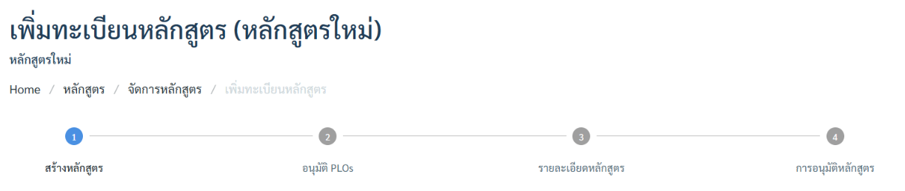

> ⚠️ ลำดับสำคัญ ทั้ง 4 ขั้นต้องทำตามลำดับ ระบบจะไม่เปิดให้ทำขั้นถัดไปจนกว่าขั้นปัจจุบันจะผ่านเงื่อนไข (เช่น ต้องอนุมัติ PLO ก่อน จึงกรอกรายละเอียดหลักสูตรได้)

## ขั้นตอนที่ 1 — สร้างหลักสูตร

1. ไปที่เมนู จัดการหลักสูตร
1. คลิกปุ่ม เพิ่มหลักสูตร

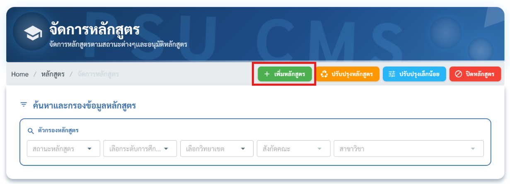

1. กรอกข้อมูลพื้นฐานหลักสูตร

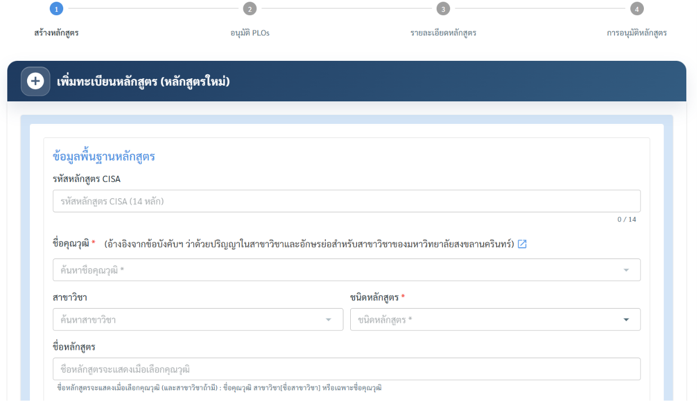

1. ตรวจทานความถูกต้องก่อนบันทึก


### ข้อมูลที่ต้องกรอกในขั้นตอนนี้

**ข้อมูลพื้นฐานหลักสูตร**

| ฟิลด์ | รายละเอียด |
| --- | --- |
| รหัสหลักสูตร CISA | กรอกรหัส CISA 14 หลัก |
| ชื่อคุณวุฒิ * | เลือกชื่อคุณวุฒิ (อ้างอิงจากข้อบังคับฯ ว่าด้วยปริญญาในสาขาวิชาและอักษรย่อสำหรับสาขาวิชาของมหาวิทยาลัยสงขลานครินทร์) |
| สาขาวิชา | เลือกสาขาวิชา (ถ้ามี) |
| ชนิดหลักสูตร * | เลือกชนิดหลักสูตร |
| ชื่อหลักสูตร | แสดงอัตโนมัติหลังเลือกชื่อคุณวุฒิ และสาขาวิชา (ถ้ามี) |
| ชื่อปริญญา | แสดงอัตโนมัติหลังเลือกชื่อคุณวุฒิ และสาขาวิชา (ถ้ามี) |
| วิทยาเขต * | เลือกวิทยาเขตที่เปิดสอน |
| สังกัดคณะ * | เลือกคณะที่สังกัด |
| สาขาวิชา/กลุ่มสาขาวิชาของส่วนงาน * | เลือกสาขาวิชา/กลุ่มสาขาวิชาของส่วนงาน (ภาควิชา) |

**สังกัดหน่วยงานบริหารจัดการหลักสูตร**

| ฟิลด์ | รายละเอียด |
| --- | --- |
| หน่วยงานบริหารจัดการ * | เลือกคณะที่เป็นหน่วยงานบริหารจัดการหลักสูตร |

**การจำแนกหลักสูตรและเกณฑ์มาตรฐาน**

| ฟิลด์ | รายละเอียด |
| --- | --- |
| ประเภทการจัดทำหลักสูตร | จะปรากฏเป็นหลักสูตรใหม่ หรือ หลักสูตรปรับปรุง ตามการจัดทำได้แก่ เพิ่มหลักสูตร จะได้หลักสูตรใหม่ และปรับปรุงหลักสูตร จะได้หลักสูตรปรับปรุง |
| ประเภทหลักสูตร * | เลือกประเภท หลักสูตรปกติ หรือ หลักสูตรsandbox |
| ระดับการศึกษา * | จะปรากฏอัตโนมัติตาม ระดับการศึกษาของชื่อคุณวุฒิ |
| เกณฑ์มาตรฐานหลักสูตรที่บังคับใช้ * | เลือกเกณฑ์มาตรฐานหลักสูตรที่บังคับใช้ * |
| ปีหน้าปก * | กรอกปีที่จะระบุบนหน้าปกของหลักสูตร |
| กลุ่มวิชาเอก / วิชาโท / กลุ่มสาขาวิชา | กรอกเฉพาะหลักสูตรที่มีการแบ่งกลุ่มวิชาเอก / วิชาโท / กลุ่มสาขาวิชา (ถ้ามี) |
| กลุ่มสาขา * | เลือกกลุ่มสาขา ได้แก่ วิทยาศาสตร์และเทคโนโลยี, วิทยาศาสตร์และสุขภาพ, มนุษยศาสตร์และสังคมศาสตร์ |

> ⚠️ ข้อมูล PLOs (ผลลัพธ์การเรียนรู้) จะสามารถกรอกข้อมูล PLOs ได้หลังจากบันทึกข้อมูลพื้นฐานหลักสูตรนี้ ที่หน้าการอนุมัติ PLOs ขั้นตอนต่อไป

1. คลิก บันทึก เพื่อสร้างหลักสูตร เมื่อบันทึกสำเร็จ ระบบจะสร้างรายการหลักสูตรในสถานะเริ่มต้นเป็น "จัดเตรียมข้อมูล"

## ขั้นตอนที่ 2 — การอนุมัติ PLOs

PLO (Program Learning Outcomes) คือผลลัพธ์การเรียนรู้ที่คาดหวังว่านักศึกษาจะได้รับเมื่อสำเร็จการศึกษา เป็น "หัวใจ" ของหลักสูตร เพราะข้อมูลส่วนอื่น (รายวิชา การประเมิน กลยุทธ์การสอน) จะอ้างอิงกลับมาที่ PLOs เสมอ

1. เข้าสู่ขั้นตอนที่ 2 การอนุมัติ PLOs โดยที่หน้าจัดการหลักสูตร แท็บการอนุมัติ PLOs จะมีรายการหลักสูตรที่ได้ทำการสร้างมาข้างต้น ให้กดปุ่มแก้ไขข้อมูล PLOs เพื่อกรอกข้อมูล PLOs ของหลักสูตรนี้

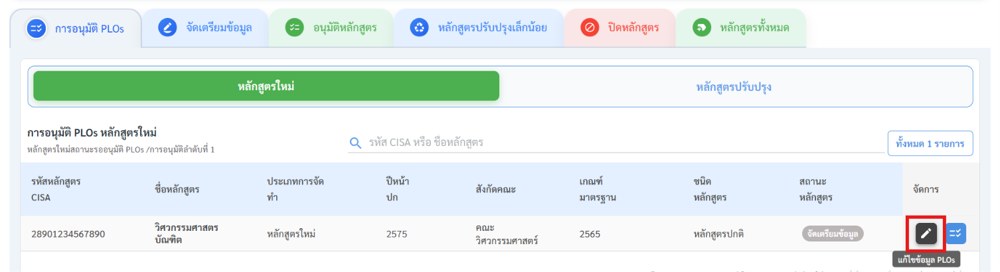

1. เลือก รูปแบบการจัดชุด PLOs
1. แบบชุดเดียว : ทั้งหลักสูตรใช้ PLO ชุดเดียวร่วมกัน
1. แบบมากกว่าหนึ่งชุด : มี PLO หลายชุดแยกกัน แสดงเป็นแท็บ แต่ละชุดผูกกับกลุ่มวิชาเอก/วิชาโท/กลุ่มสาขาวิชาได้

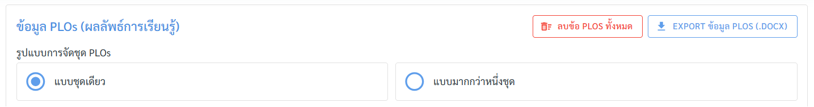

1. กดเพิ่มรายการ PLOs แต่ละข้อ โดยจะรันรหัส PLOs ให้แบบอัตโนมัติ

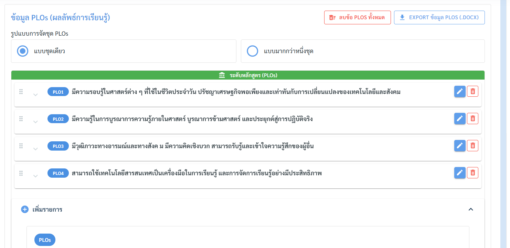

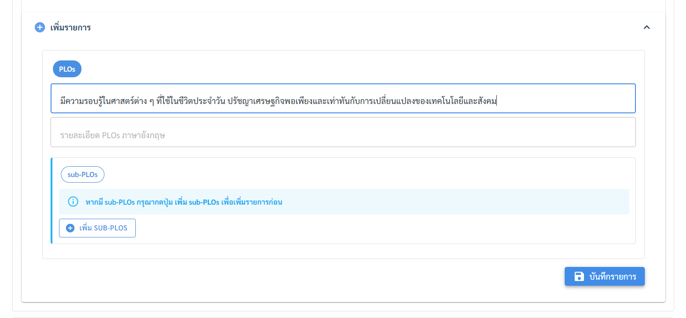

1. หากเป็นหลักสูตรที่ กลุ่มวิชาเอก/วิชาโท/กลุ่มสาขาวิชา จะมีช่อง กลุ่มวิชาเอก/วิชาโท/กลุ่มสาขาวิชา ปรากฏ ให้เลือก เพื่อให้ข้อ PLOs นั้นอยู่ภายใต้ระดับวิชาเอกเป็นรหัส MLOs


1. หากมีข้อย่อย sub-PLOs สามารถกดเพิ่ม sub-PLOs เพื่อกรอกได้
1. สามารถลากเพื่อเลื่อนสลับข้อ PLOs และข้อย่อย sub-PLOs ได้ในตาราง

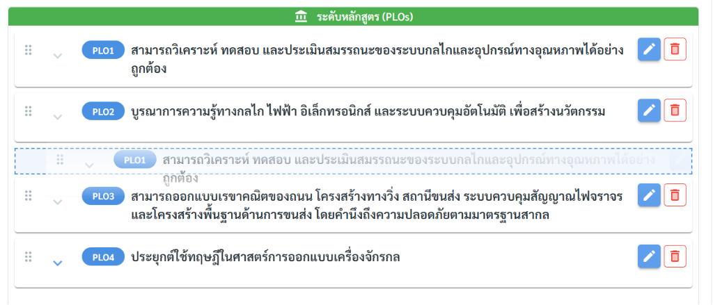

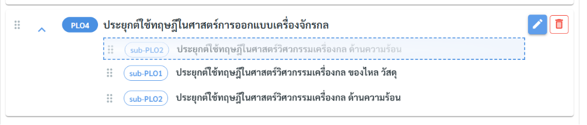

1. กรอก วันที่กลั่นกรองหลักสูตร ประธานและกรรมการ
1. จากนั้นกด บันทึกข้อมูล

> ℹ️ เมื่อสร้างหลักสูตรใหม่ ระบบตั้งค่าเริ่มต้นเป็น แบบชุดเดียว และสร้างชุดแรกให้อัตโนมัติ
เลือก แบบมากกว่าหนึ่งชุด ขณะที่มีอยู่ชุดเดียว → ระบบสร้าง ชุดที่ 2 ขึ้นมาให้อัตโนมัติ และแสดงปุ่ม "เพิ่มชุด PLOs" สำหรับเพิ่มชุดถัดไป

> ⚠️ ต้องการเปลี่ยนกลับเป็น แบบชุดเดียว ขณะที่มีหลายชุด → ต้อง ลบชุดที่เกินให้เหลือชุดเดียวก่อน ไม่เช่นนั้นระบบจะเตือน "กรุณาลบชุด PLO ที่เกินมาให้เหลือชุดเดียว ก่อนเปลี่ยนเป็นชนิดแบบชุดเดียว" (หากเหลือชุดเดียวแล้ว ระบบจะปรับชนิดกลับเป็นชุดเดียวให้เอง)

1. จะสามารถ Export ข้อมูล PLOs ทั้งหมดเป็นไฟล์ word ได้ที่ปุ่ม Export ข้อมูล PLOs (.docx)


1. จากนั้นจึง กลับมาที่หน้าการอนุมัติ PLOs
1. เข้าสู่หน้า อนุมัติ PLOs โดยการกดปุ่ม อนุมัติ PLOs

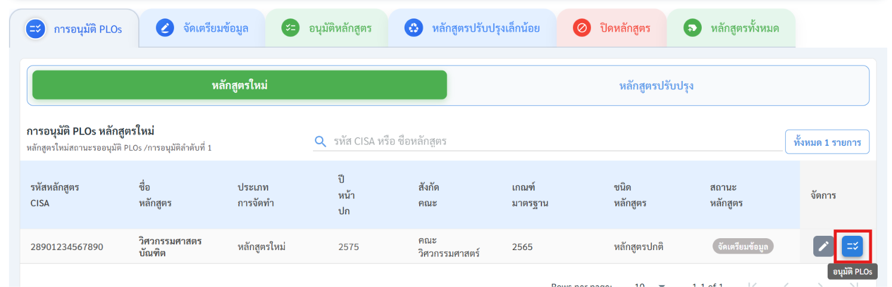

1. จะปรากฏข้อมูล PLOs ที่ได้กรอกไว้ข้างต้นทั้งหมด

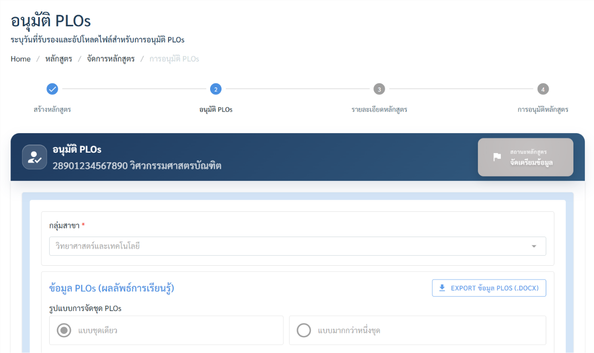


1. จากนั้นต้องกรอกวันที่รับรอง PLOs และแนบไฟล์ PLOs เพื่ออนุมัติ


1. หลังการกด บันทึกข้อมูล รายการหลักสูตรจะเข้าสู่ขั้นตอนที่ 3 รายละเอียดหลักสูตร ในแท็บจัดเตรียมข้อมูล
1. กดที่ปุ่ม แก้ไข เพื่อกรอกรายละเอียดหลักสูตร ตามข้อมูลในแต่ละแท็บ


## ขั้นตอนที่ 3 — รายละเอียดหลักสูตร

กรอกข้อมูลรายละเอียดหลักสูตรผ่าน 8 หมวดหมู่หลัก (แสดงเป็นแท็บด้านบน) แต่ละหมวดยังแบ่งเป็นแท็บย่อยอีกชั้น

แต่ละแท็บมีจุดสถานะ (วงกลม) แสดงความสมบูรณ์ของข้อมูล

1. วงกลมสีเขียว + เครื่องหมายถูก = กรอกข้อมูลที่บังคับครบแล้ว

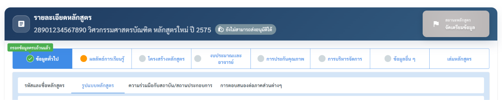

1. วงกลมสีส้ม = ยังกรอกไม่ครบ


1. วงกลมสีเทา = ยังไม่ได้กรอก

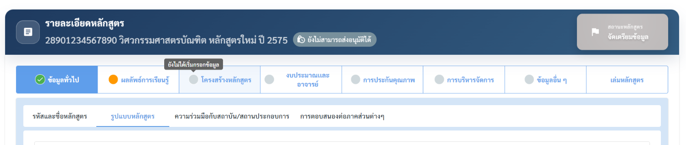

แนวทางการกรอกที่แนะนำ กรอกจากหมวดที่ 1 ไล่ไปตามลำดับ เพราะข้อมูลในหมวดต้น ๆ (เช่น รายวิชา และ PLO)  จะถูกอ้างอิงในหมวดหลัง (เช่น การ mapping และกลยุทธ์การสอน)การกรอกข้ามไปมาอาจทำให้ตัวเลือก
 ในแท็บหลังว่างเปล่า

**การบันทึก ต้องกดบันทึกในแต่ละแท็บย่อยที่กรอกเสร็จเท่านั้น**

### หมวดที่ 1 — ข้อมูลทั่วไป

แบ่งเป็น 4 แท็บย่อย

| แท็บย่อย | ข้อมูลที่กรอก |
| --- | --- |
| รหัสและชื่อหลักสูตร | รหัส CISA, ชื่อหลักสูตร, ชื่อปริญญา, สังกัด, ปีหน้าปก |
| รูปแบบหลักสูตร | รูปแบบการเรียน จำนวนหน่วยกิต โครงสร้างหลักสูตรโดยย่อ |
| ความร่วมมือกับสถาบัน/สถานประกอบการ | ข้อมูล MOU หรือความร่วมมือกับหน่วยงานภายนอก |
| การตอบสนองต่อภาคส่วนต่างๆ | ความสอดคล้องกับแผนยุทธศาสตร์ชาติ แผนมหาวิทยาลัย SDG ฯลฯ |

### หมวดที่ 2 — ผลลัพธ์การเรียนรู้

แบ่งเป็น 3 แท็บย่อย

| แท็บย่อย | ข้อมูลที่กรอก |
| --- | --- |
| ปรัชญา และวัตถุประสงค์ | ปรัชญาหลักสูตร วัตถุประสงค์ คุณลักษณะบัณฑิตที่พึงประสงค์ |
| ผลลัพธ์การเรียนรู้ | PLO ทั้งหมดของหลักสูตร (ดึงมาจากขั้นตอนการอนุมัติ PLOs หลังจากการสร้างหลักสูตร) |
| ระบบการจัดการศึกษา | รูปแบบการจัดการเรียนการสอน |

### หมวดที่ 3 — โครงสร้างหลักสูตร

แบ่งเป็น 4 แท็บย่อย — เป็นหมวดที่ใช้เวลามากที่สุด เพราะเป็นแกนวิชาการของหลักสูตร

| แท็บย่อย | ข้อมูลที่กรอก | ลำดับแนะนำ |
| --- | --- | --- |
| จัดการรายวิชา | รายวิชาทั้งหมดในหลักสูตร พร้อมรหัส ชื่อ หน่วยกิต | ทำเป็นอันดับแรกเนื่องจากเป็นข้อมูลสำหรับใช้ในแท็บต่อไป |
| แผนการศึกษา | แผนการศึกษา โครงสร้างหลักสูตร แผนการเรียน แผนการรับนักศึกษา และการ Mapping ระหว่างชุด PLOs กับแผนการศึกษา | ทำหลังจากมีรายวิชาครบ |
| PLO รายวิชา | ตาราง Mapping ระหว่าง PLOs กับรายวิชาแต่ละวิชา | ทำเมื่อมีรายวิชาครบทั้งหมดในโครงสร้างหลักสูตร |
| กลยุทธ์และวิธีการสอน | วิธีการสอน วิธีการประเมิน แยกตามผลลัพธ์การเรียนรู้ | ทำเป็นอันดับสุดท้าย |

### หมวดที่ 4 — งบประมาณและอาจารย์

แบ่งเป็น 3 แท็บย่อย

| แท็บย่อย | ข้อมูลที่กรอก |
| --- | --- |
| งบประมาณตามแผน | แผนงบประมาณรายปีสำหรับการดำเนินหลักสูตร |
| อาจารย์ประจำหลักสูตร | รายชื่อ คุณวุฒิ และตำแหน่งของอาจารย์ประจำหลักสูตร |
| อาจารย์ผู้สอน | รายชื่ออาจารย์ผู้สอนรายวิชาต่างๆ ในหลักสูตร |

> ⚠️ ระบบจะตรวจ คุณสมบัติอาจารย์ประจำหลักสูตร ตามเกณฑ์ (ได้แก่ จำนวนอาจารย์ผู้รับผิดชอบขั้นต่ำ คุณวุฒิ ตำแหน่งทางวิชาการ และผลงานทางวิชาการ 5 ปีย้อนหลัง) หากมีอาจารย์ที่ไม่ผ่านเกณฑ์ ระบบจะแจ้งเตือนไม่สามารถเพิ่มเข้าตาราง "อาจารย์ประจำหลักสูตร" ได้

### หมวดที่ 5 — การประกันคุณภาพ

แบ่งเป็น 2–3 แท็บย่อย

| แท็บย่อย | ข้อมูลที่กรอก |
| --- | --- |
| การใช้เกณฑ์ประกันคุณภาพ | ได้รับการประเมินมาตรฐานหลักสูตรจากองค์กรภายนอก เช่น AUN-QA, ABET |
| ตัวชี้วัด/ผลลัพธ์ (OKR) | ตัวชี้วัดความสำเร็จของหลักสูตร |
| การรับรองโดยสภาวิชาชีพ | แสดงแท็บนี้เฉพาะหลักสูตรที่มีการเลือกว่า มีการรับรองจากสภาวิชาชีพ |

### หมวดที่ 6 — การบริหารจัดการ

แบ่งเป็น 2 แท็บย่อย

| แท็บย่อย | ข้อมูลที่กรอก |
| --- | --- |
| กรรมการและหน่วยงานบริหารหลักสูตร | รายชื่อคณะกรรมการบริหารหลักสูตร โดยตำแหน่งบริหารหลักสูตรที่จำเป็นต้องมีในตารางได้แก่ ประธาน และ ผู้ประสานงาน , หน่วยงานบริหารจัดการหลักสูตร จะได้มาจากข้อมูลการสร้างหลักสูตรเริ่มต้น |
| การเปิดสอน | วิทยาเขต คณะ ประเภทเวลาเรียน ประเภทเวลาเรียน ระบบชั้นเรียน  และรูปแบบการเปิดสอน - การปิดสอน |

### หมวดที่ 7 — ข้อมูลอื่น ๆ

แบ่งเป็น 3 แท็บย่อย

| แท็บย่อย | ข้อมูลที่กรอก |
| --- | --- |
| ข้อมูลประชาสัมพันธ์ | จุดเด่นหลักสูตร โอกาสการทำงาน ข้อมูลสำหรับเผยแพร่ในการประชาสัมพันธ์หลักสูตร |
| Skill Transcript | ทักษะและสมรรถนะที่นักศึกษาจะได้รับ |
| ค่าธรรมเนียมการศึกษา | อัตราค่าธรรมเนียมตลอดหลักสูตร หรือค่าธรรมเนียมแยกตาม กลุ่มวิชาเอก/กลุ่มสาขาวิชา (ถ้ามี) |

### หมวดที่ 8 — เล่มหลักสูตร

แบ่งเป็น 3 แท็บย่อย — เป็นปลายทางที่นำข้อมูลทั้งหมดมาประกอบเป็นเอกสาร

| แท็บย่อย | ข้อมูลที่กรอก |
| --- | --- |
| เล่มหลักสูตร | ดาวน์โหลดเล่มหลักสูตรที่ดึงข้อมูลจากการกรอกทั้งหมด |
| เล่มเผยแพร่ | ดาวน์โหลดเล่มหลักสูตรฉบับเผยแพร่ต่อสาธารณะ |
| เล่มคู่มือการศึกษา | ดาวน์โหลดเล่มคู่มือสำหรับนักศึกษา |

การดาวน์โหลดเล่มหลักสูตร ระบบจะสร้างเล่มหลักสูตรในรูปแบบไฟล์ Word จากข้อมูลที่กรอกไว้ในหมวด 1–7 โดยอัตโนมัติ จึงควรกรอกข้อมูลให้ครบและถูกต้องก่อน เพราะเอกสารจะดึงค่าจากฟิลด์เหล่านั้นมาเติมในเล่ม ยิ่งข้อมูลครบ เอกสารที่ได้ก็ยิ่งสมบูรณ์

เมื่อกรอกรายละเอียดครบแล้วเข้าสู่ขั้นตอนถัดไป “การส่งอนุมัติหลักสูตร”

## ขั้นตอนที่ 4 — การส่งหลักสูตรเข้าสู่กระบวนการอนุมัติ

เมื่อกรอกข้อมูลรายละเอียดหลักสูตรในขั้นตอนที่ 3 ครบเรียบร้อยแล้ว ผู้จัดทำหลักสูตรจำเป็นต้อง ส่งหลักสูตร เข้าสู่กระบวนการอนุมัติ ด้วยตนเอง ระบบจะไม่ส่งให้โดยอัตโนมัติ

### 1. การตรวจสอบความครบถ้วนของข้อมูล

ระบบมีตัวบ่งชี้ความสมบูรณ์ของข้อมูล 2 ระดับ ได้แก่

| ระดับ | ตำแหน่ง | การแสดงผล |
| --- | --- | --- |
| รายแท็บ และสถานะบนหัวข้อชื่อหลักสูตร | ในหน้าฟอร์มรายละเอียดหลักสูตร (ในขั้นตอนที่ 3) | ทุกหมวด/แท็บมีจุดสถานะ (วงกลม) ต้องเป็นสี เขียวพร้อมเครื่องหมายถูกใน |
| ภาพรวมทั้งหลักสูตร | ในตารางหน้า จัดการหลักสูตร | ระบบรวมสถานะทุกแท็บเป็นค่าความครบถ้วนรวม (ครบทุกแท็บ / ยังไม่ครบ) ซึ่งใช้ควบคุมการเปิด-ปิดปุ่มส่งอนุมัติ |

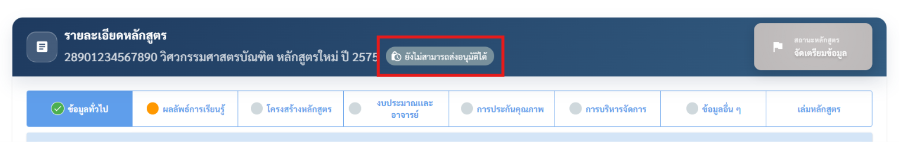

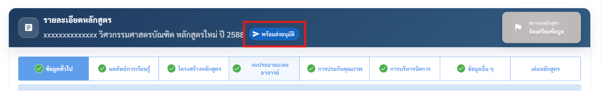

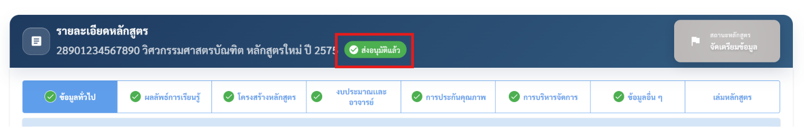

> ⚠️ หลักสูตรจะส่งอนุมัติได้ก็ต่อเมื่อ ทุกแท็บมีสถานะครบ (เขียว) ครบทั้งหมด เท่านั้น หากยังมีแท็บใดเป็นสีเทา ระบบจะยังไม่เปิดให้ส่ง

### 2. ตำแหน่งและสถานะของปุ่ม "ส่งอนุมัติ"


ปุ่มส่งอนุมัติอยู่ในคอลัมน์ปุ่มการดำเนินการ (ด้านขวาของแต่ละแถวหลักสูตร) ในตารางหน้า จัดการหลักสูตร โดยหน้าตาและความหมายของปุ่มจะเปลี่ยนตามสถานะของหลักสูตร ดังนี้

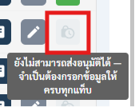

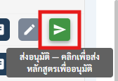

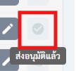

| สัญลักษณ์ปุ่ม | สถานะ | ความหมาย (ข้อความเมื่อชี้เมาส์) |
| --- | --- | --- |
| (สีเทา, กดไม่ได้) | ข้อมูลยังไม่ครบ | "ยังไม่สามารถส่งอนุมัติได้ — จำเป็นต้องกรอกข้อมูลให้ครบทุกแท็บ" |
| (สีเขียว, กดได้) | ข้อมูลครบ พร้อมส่ง | "ส่งอนุมัติ — คลิกเพื่อส่งหลักสูตรเพื่ออนุมัติ" |
| (สีเทา, เครื่องหมายถูกในวงกลม, กดไม่ได้) | ส่งอนุมัติแล้ว | "ส่งอนุมัติแล้ว" |

### 3. การส่งอนุมัติ

ตรวจสอบให้แน่ใจว่าทุกแท็บของหลักสูตรมีสถานะครบ (ปุ่มเปลี่ยนเป็นสีเขียว ) คลิกปุ่ม ส่งอนุมัติ ที่แถวของหลักสูตรนั้น

ระบบแสดงกล่องยืนยัน "ยืนยันการส่งข้อมูลหลักสูตรเพื่ออนุมัติ?" คลิกปุ่ม ส่งอนุมัติ เพื่อยืนยัน

เมื่อสำเร็จ ระบบแจ้ง "ส่งข้อมูลหลักสูตรเพื่ออนุมัติเรียบร้อยแล้ว" และเปลี่ยนสถานะการดำเนินการของหลักสูตรเป็น "ส่งอนุมัติแล้ว" (ปุ่มเปลี่ยนเป็นไอคอนถูก ✅)

หลังการส่งอนุมัติ หลักสูตรจะเข้าสู่ ขั้นตอนที่ 5 — การอนุมัติหลักสูตร ซึ่งเป็นกระบวนการพิจารณาอนุมัติแบบหลายระดับตามที่อธิบายด้านล่าง การส่งอนุมัติเป็นการยืนยันว่าข้อมูลหลักสูตรพร้อมเข้าสู่การพิจารณาอย่างเป็นทางการแล้ว

## ขั้นตอนที่ 5 — การอนุมัติหลักสูตร

หลักสูตรจะเข้าสู่กระบวนการอนุมัติ แบ่งออกเป็น 8 ลำดับการอนุมัติ สำหรับหลักสูตรใหม่และหลักสูตรปรับปรุง แสดงผ่าน 7 แท็บ (ลำดับ 2 และ 3 รวมไว้ในแท็บเดียว)

| แท็บ | ลำดับการอนุมัติ | ผู้พิจารณา / หน่วยงาน |
| --- | --- | --- |
| แท็บ 1 | ลำดับ 1 | คณะอนุกรรมการกลั่นกรอง PLOs |
| แท็บ 2 | ลำดับ 2 และ 3 (รวมไว้ในแท็บเดียว) | คณะกรรมการประจำคณะ / ส่วนงาน และ คณะกรรมการวิชาการวิทยาเขต |
| แท็บ 3 | ลำดับ 4 | คณะกรรมการนโยบายการพัฒนาทรัพยากรมนุษย์และการจัดการศึกษา |
| แท็บ 4 | ลำดับ 5 | **สภามหาวิทยาลัย** — เป็นจุดที่สถานะหลักสูตรเปลี่ยนเป็น "หลักสูตรปีหน้าปกปัจจุบัน" อัตโนมัติเมื่ออนุมัติผ่าน และเป็นขั้นที่ต้องแนบเล่มหลักสูตรฉบับสภามหาวิทยาลัยอนุมัติ (Word + PDF) |
| แท็บ 5 | ลำดับ 6 | สป.อว. |
| แท็บ 6 | ลำดับ 7 | ก.พ. รับรองคุณวุฒิ |
| แท็บ 7 | ลำดับ 8 | ก.ค.ศ. รับรองคุณวุฒิ |

**ข้อมูลที่ต้องกรอกในแต่ละแท็บอนุมัติ**

1. คราวประชุมครั้งที่ * — ระบุครั้งและวันที่ของการประชุมที่พิจารณาเห็นชอบในลำดับนั้น
1. เอกสารแนบ/มติที่เกี่ยวข้อง (ขึ้นกับลำดับการอนุมัติ)
1. ในลำดับสภามหาวิทยาลัยอนุมัติ (ลำดับ 5) ต้องแนบ เล่มหลักสูตรฉบับสภามหาวิทยาลัยอนุมัติ ทั้งไฟล์ Word และ PDF
**การอ่านสถานะแท็บ**

1. [เขียว] แท็บสีเขียว = กรอกข้อมูลครบและบันทึกแล้ว
1. [เทา] แท็บสีเทา = ยังไม่ได้ดำเนินการ
1. สถานะปัจจุบันของหลักสูตรแสดงที่มุมขวาบนของหน้า

> ⚠️ จุดสำคัญที่ควรจำ: เมื่อกระบวนการอนุมัติผ่าน ลำดับการอนุมัติที่ 5 (สภามหาวิทยาลัยอนุมัติ) ระบบจะเปลี่ยนสถานะหลักสูตรเป็น "หลักสูตรปีหน้าปกปัจจุบัน" โดยอัตโนมัติ และหากเป็นการ "ปรับปรุง" หลักสูตรรุ่นเดิม (รุ่นแม่) ทั้งหมดจะถูกเปลี่ยนเป็นสถานะ "หลักสูตรเดิม" พร้อมกัน นั่นแปลว่าตั้งแต่ลำดับนี้เป็นต้นไป หลักสูตรเริ่ม "ใช้งานจริง" แม้ลำดับการอนุมัติหลังจากนั้น (ลำดับ 6–8: สป.อว., ก.พ., ก.ค.ศ.) จะยังไม่เสร็จสมบูรณ์

บางหลักสูตรอาจมีการล็อกแท็บหลังผ่านการอนุมัติสภาฯ (feature เฉพาะที่เปิดใช้บางสถาบัน) เพื่อป้องกันการแก้ไขข้อมูลที่อนุมัติไปแล้ว หากพบว่าแก้ไม่ได้หลังอนุมัติ ให้ใช้กระบวนการ "ปรับปรุงเล็กน้อย" แทน
