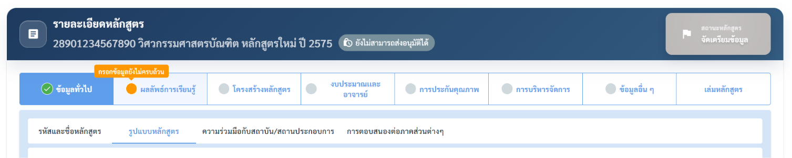

# การกรอกข้อมูลรายละเอียดหลักสูตร สำหรับผู้จัดทำหลักสูตร (เจ้าหน้าที่ระดับคณะ)

## รายละเอียดหลักสูตร

กรอกข้อมูลรายละเอียดหลักสูตรผ่าน 8 หมวดหมู่หลัก (แสดงเป็นแท็บด้านบน) แต่ละหมวดยังแบ่งเป็นแท็บย่อยอีกชั้น

แต่ละแท็บมีจุดสถานะ (วงกลม) แสดงความสมบูรณ์ของข้อมูล

1. **🟢** วงกลมสีเขียว + เครื่องหมายถูก = กรอกข้อมูลที่บังคับครบแล้ว

2. 🟡 วงกลมสีส้ม = ยังกรอกไม่ครบ

2. ⚪วงกลมสีเทา = ยังไม่ได้กรอก

## **ความคืบหน้าการจัดเตรียมข้อมูลหลักสูตร**


**ความคืบหน้า ของหลักสูตร คิดจากอะไร?**

ระบบแสดง **เปอร์เซ็นต์ความสมบูรณ์** ของแต่ละหลักสูตรในหน้าจัดการหลักสูตร โดยคิดจาก **จำนวนแท็บที่เป็นสีเขียว** (นับเป็นแท็บ ไม่ได้นับทีละฟิลด์)

* **หลักสูตรทั่วไป:** % = (จำนวนแท็บที่เขียว ในหมวดที่ 1–7) ÷ **7** × 100 — โดย **หมวดที่ 8 เล่มหลักสูตร ไม่ถูกนับ** ดังนั้นแท็บเขียวครบทั้ง 7 หมวด = **100%**
* **หลักสูตร Sandbox:** ใช้เฉพาะแท็บที่เปิดใช้งาน (active) เป็นตัวหาร
* แต่ละหมวดนับเป็น "เขียว / ไม่เขียว" เท่านั้น — จะเป็นสีเขียวเมื่อกรอก **ฟิลด์บังคับครบตามเงื่อนไขของหมวดนั้น** (ดูเงื่อนไขในกล่อง 🟢 ของแต่ละหมวดด้านล่าง)

หลักสูตรจะ **ส่งอนุมัติได้เมื่อครบ 100%** (ทุกหมวดที่นับเป็นสีเขียวครบ)


<figure><figcaption></figcaption></figure>

<figure><figcaption></figcaption></figure>


แนวทางการกรอกที่แนะนำ กรอกจากหมวดที่ 1 ไล่ไปตามลำดับ เพราะข้อมูลในหมวดต้น ๆ (เช่น รายวิชา และ PLO) จะถูกอ้างอิงในหมวดหลัง (เช่น การ mapping และกลยุทธ์การสอน)



**การบันทึก ต้องกดบันทึกในแต่ละแท็บย่อยที่กรอกเสร็จเท่านั้น**


> 📌 **ฟิลด์ที่มีเครื่องหมาย** <mark style="color:red;">\*</mark> **ในคอลัมน์ "บังคับกรอก" คือ ฟิลด์ที่ต้องกรอกเพื่อให้แท็บเปลี่ยนเป็นสีเขียว** ฟิลด์อื่นกรอกเพิ่มได้เพื่อความสมบูรณ์ของเล่มหลักสูตร แต่ไม่บังคับสำหรับสถานะแท็บ

### หมวดที่ 1 — ข้อมูลทั่วไป

แบ่งเป็น 4 แท็บย่อย


แท็บ **"ข้อมูลทั่วไป"** นี้จะเป็น **🟢**<mark style="color:green;">**สีเขียว**</mark> เมื่&#xE2D;**:** กรอกข้อมูลหลักสูตรครบในแท็บย่อย **รหัสและชื่อหลักสูตร** **+ รูปแบบหลักสูตร + การตอบสนองต่อภาคส่วนต่างๆ** - ส่วนแท็บ "ความร่วมมือกับสถาบัน/สถานประกอบการ" ไม่บังคับ


<table><thead><tr><th width="208.60003662109375">แท็บย่อย</th><th width="412.6363525390625">ฟิลด์</th><th align="center">บังคับกรอก</th></tr></thead><tbody><tr><td><strong>🟢</strong> <strong>รหัสและชื่อหลักสูตร</strong></td><td>รหัสหลักสูตร CISA (14 หลัก)</td><td align="center"><h3></h3></td></tr><tr><td></td><td>ชื่อคุณวุฒิ</td><td align="center"><h3><mark style="color:red;">*</mark></h3></td></tr><tr><td></td><td>สาขาวิชา</td><td align="center"><h3><mark style="color:red;">*</mark></h3></td></tr><tr><td></td><td>ชนิดหลักสูตร</td><td align="center"><h3><mark style="color:red;">*</mark></h3></td></tr><tr><td></td><td>ชื่อหลักสูตร (ปรากฏอัตโนมัติ)</td><td align="center"><h3></h3></td></tr><tr><td></td><td>ชื่อปริญญา (ปรากฏอัตโนมัติ)</td><td align="center"><h3></h3></td></tr><tr><td></td><td>วิทยาเขต</td><td align="center"><h3><mark style="color:red;">*</mark></h3></td></tr><tr><td></td><td>สังกัดคณะ</td><td align="center"><h3><mark style="color:red;">*</mark></h3></td></tr><tr><td></td><td>ภาควิชา/กลุ่มสาขาวิชาของส่วนงาน (เมื่อคณะมีภาควิชา)</td><td align="center"><h3><mark style="color:red;">*</mark></h3></td></tr><tr><td></td><td>ประเภทการจัดทำหลักสูตร</td><td align="center"><h3><mark style="color:red;">*</mark></h3></td></tr><tr><td></td><td>หลักสูตรอ้างอิง (ปรากฏอัตโนมัติ)</td><td align="center"></td></tr><tr><td></td><td>ประเภทมาตรฐานหลักสูตร</td><td align="center"><h3><mark style="color:red;">*</mark></h3></td></tr><tr><td></td><td>ระดับการศึกษา (ปรากฏอัตโนมัติ)</td><td align="center"><h3></h3></td></tr><tr><td></td><td>เกณฑ์มาตรฐานหลักสูตรที่บังคับใช้</td><td align="center"><h3><mark style="color:red;">*</mark></h3></td></tr><tr><td></td><td>ปีหน้าปก (พ.ศ.)</td><td align="center"><h3><mark style="color:red;">*</mark></h3></td></tr><tr><td></td><td>กลุ่มวิชาเอก/วิชาโท/กลุ่มสาขาวิชา (ถ้ามี)</td><td align="center"></td></tr><tr><td><strong>🟢</strong> <strong>รูปแบบหลักสูตร</strong></td><td>รูปแบบหลักสูตรปริญญาตรี (ปรากฏในระดับการศึกษาปริญญาตรีเท่านั้น)</td><td align="center"><h3><mark style="color:red;">*</mark></h3></td></tr><tr><td></td><td>ประเภทการบริหารจัดการหลักสูตร</td><td align="center"><h3><mark style="color:red;">*</mark></h3></td></tr><tr><td></td><td>การเป็น Multidisciplinary / Interdisciplinary</td><td align="center"><h3><mark style="color:red;">*</mark></h3></td></tr><tr><td></td><td>จำนวนปีที่ถึงรอบการปรับปรุงหลักสูตร</td><td align="center"><h3><mark style="color:red;">*</mark></h3></td></tr><tr><td></td><td>มีการรับรองโดยสภาวิชาชีพ/องค์กรอื่นๆ</td><td align="center"><h3><mark style="color:red;">*</mark></h3></td></tr><tr><td></td><td>การให้ปริญญา</td><td align="center"><h3><mark style="color:red;">*</mark></h3></td></tr><tr><td></td><td>ปีการศึกษาที่เปิดสอนครั้งแรก</td><td align="center"><h3><mark style="color:red;">*</mark></h3></td></tr><tr><td></td><td>ภาคการศึกษาที่เปิดสอนครั้งแรก</td><td align="center"><h3><mark style="color:red;">*</mark></h3></td></tr><tr><td></td><td>ปีการศึกษาที่เริ่มรับนักศึกษา (พ.ศ.)</td><td align="center"><h3><mark style="color:red;">*</mark></h3></td></tr><tr><td></td><td>ภาคการศึกษาที่เริ่มรับนักศึกษา</td><td align="center"><h3><mark style="color:red;">*</mark></h3></td></tr><tr><td></td><td>ISCED (Broad / Narrow / Detailed Field)</td><td align="center"><h3><mark style="color:red;">*</mark></h3></td></tr><tr><td></td><td>ภาษาที่ใช้สอน</td><td align="center"><h3><mark style="color:red;">*</mark></h3></td></tr><tr><td></td><td>กลุ่มสาขา</td><td align="center"><h3><mark style="color:red;">*</mark></h3></td></tr><tr><td><strong>ความร่วมมือกับสถาบัน/สถานประกอบการ</strong> (เพิ่มทีละรายการ)</td><td>ขอบเขตความร่วมมือ</td><td align="center"></td></tr><tr><td></td><td>ชื่อสถาบัน/สถานประกอบการ</td><td align="center"><h3><mark style="color:red;">*</mark></h3></td></tr><tr><td></td><td>วันที่เริ่มใช้</td><td align="center"><h3><mark style="color:red;">*</mark></h3></td></tr><tr><td></td><td>วันหมดอายุ</td><td align="center"></td></tr><tr><td></td><td>เป็นหลักสูตรร่วมผลิต</td><td align="center"><h3><mark style="color:red;">*</mark></h3></td></tr><tr><td></td><td>ประเภทความร่วมมือ (MOU)</td><td align="center"><h3><mark style="color:red;">*</mark></h3></td></tr><tr><td></td><td>แนบไฟล์ MOU/MOA</td><td align="center"><h3><mark style="color:red;">*</mark></h3></td></tr><tr><td></td><td>รูปแบบความร่วมมือทางวิชาการ</td><td align="center"><h3><mark style="color:red;">*</mark></h3></td></tr><tr><td></td><td>รูปแบบการให้ปริญญา</td><td align="center"><h3><mark style="color:red;">*</mark></h3></td></tr><tr><td></td><td>รายละเอียดความร่วมมือ</td><td align="center"><h3><mark style="color:red;">*</mark></h3></td></tr><tr><td><strong>🟢 การตอบสนองต่อภาคส่วนต่างๆ</strong> (เพิ่มทีละรายการ)</td><td>ยุทธศาสตร์มหาวิทยาลัย (อย่างน้อย 1 รายการ)</td><td align="center"><h3><mark style="color:red;">*</mark></h3></td></tr><tr><td></td><td>ยุทธศาสตร์ชาติ (อย่างน้อย 1 รายการ)</td><td align="center"><h3><mark style="color:red;">*</mark></h3></td></tr><tr><td></td><td>นโยบายพัฒนากำลังคนของชาติ (อย่างน้อย 1 รายการ)</td><td align="center"><h3><mark style="color:red;">*</mark></h3></td></tr><tr><td></td><td>การรองรับเป้าหมายการพัฒนาที่ยั่งยืน SDGs (อย่างน้อย 1 รายการ)</td><td align="center"><h3><mark style="color:red;">*</mark></h3></td></tr></tbody></table>

### หมวดที่ 2 — ผลลัพธ์การเรียนรู้

แบ่งเป็น 3 แท็บย่อย


แท็บ **"ผลลัพธ์การเรียนรู้"** นี้จะเป็น **🟢**<mark style="color:green;">**สีเขียว**</mark> เมื่&#xE2D;**:** กรอกข้อมูลครบในแท็บย่อย **ปรัชญาและวัตถุประสงค์ + ระบบการจัดการศึกษา** - ส่วนแท็บ "ผลลัพธ์การเรียนรู้ (PLOs)" มีข้อตั้งต้นไว้แล้วสำหรับดูข้อมูล PLOsเท่านั้น


<table><thead><tr><th>แท็บย่อย</th><th width="425.3636474609375">ฟิลด์</th><th align="center">บังคับกรอก</th></tr></thead><tbody><tr><td><strong>🟢 ปรัชญา และวัตถุประสงค์</strong></td><td>ปรัชญาของหลักสูตร</td><td align="center"><h3><mark style="color:red;">*</mark></h3></td></tr><tr><td></td><td>วัตถุประสงค์ของหลักสูตร</td><td align="center"><h3><mark style="color:red;">*</mark></h3></td></tr><tr><td><strong>ผลลัพธ์การเรียนรู้ (PLOs)</strong></td><td>รูปแบบการจัดชุด PLOs (ชุดเดียว / มากกว่าหนึ่งชุด)</td><td align="center"></td></tr><tr><td></td><td>กลุ่มวิชาเอก/วิชาโท/กลุ่มสาขาวิชา (กรณีหลายชุด)</td><td align="center"></td></tr><tr><td></td><td>รายละเอียด PLOs ภาษาไทย</td><td align="center"></td></tr><tr><td></td><td>รายละเอียด PLOs ภาษาอังกฤษ</td><td align="center"></td></tr><tr><td></td><td>รายละเอียด sub-PLOs (ไทย/อังกฤษ)</td><td align="center"></td></tr><tr><td></td><td>หมายเหตุ PLOs</td><td align="center"></td></tr><tr><td><strong>🟢 ระบบการจัดการศึกษา</strong></td><td>ระบบการจัดการศึกษา</td><td align="center"><h3><mark style="color:red;">*</mark></h3></td></tr><tr><td></td><td>จำนวนภาคการศึกษาต่อปี</td><td align="center"><h3><mark style="color:red;">*</mark></h3></td></tr><tr><td></td><td>แบบชั้นเรียน (ปรากฏอัตโนมัติ)</td><td align="center"><h3><mark style="color:red;">*</mark></h3></td></tr><tr><td></td><td>รูปแบบการจัดการเรียนการสอน</td><td align="center"><h3><mark style="color:red;">*</mark></h3></td></tr><tr><td></td><td>การจัดการเรียนการสอนภาคฤดูร้อน</td><td align="center"><h3><mark style="color:red;">*</mark></h3></td></tr><tr><td></td><td>วัน-เวลาในการดำเนินการเรียนการสอน</td><td align="center"><h3><mark style="color:red;">*</mark></h3></td></tr></tbody></table>

### หมวดที่ 3 — โครงสร้างหลักสูตร

แบ่งเป็น 5 แท็บย่อย — เป็นหมวดที่ใช้เวลามากที่สุด เพราะเป็นแกนวิชาการของหลักสูตร (แนะนำกรอกตามลำดับ: จัดการรายวิชา → แผนการศึกษา → PLOs รายวิชา → กลยุทธ์และวิธีการสอน → PLOs & K A S)


แท็บ **"โครงสร้างหลักสูตร"** นี้จะเป็น **🟢**<mark style="color:green;">**สีเขียว**</mark> เมื่&#xE2D;**:**&#xE21;ี**แผนการศึกษา (กรอกหน่วยกิตรวม + ระยะเวลาการศึกษาทุกแผน) · เพิ่มหมวดวิชาในโครงสร้าง · หน่วยกิตในหมวด/กลุ่มครบตามหน่วยกิตรวม** · **ทุกรายวิชาต้องมี CLO + PLO รายวิชา** - (แท็บ กลยุทธ์การสอน และ PLOs & K A S ไม่นับในเงื่อนไขแท็บเขียว แต่จำเป็นต่อความสมบูรณ์ของเล่ม)


| แท็บย่อย                                                | ฟิลด์                                                                 |                 บังคับกรอก                 |
| ------------------------------------------------------- | --------------------------------------------------------------------- | :----------------------------------------: |
| **🟢จัดการรายวิชา** (เพิ่มทีละวิชา หรือนำเข้า)          | หน่วยงานบริหารจัดการหลักสูตร (เลือกก่อนกำหนดรหัสวิชา)                 | <h3><mark style="color:red;">*</mark></h3> |
|                                                         | รหัสวิชา                                                              | <h3><mark style="color:red;">*</mark></h3> |
|                                                         | ประเภทวิชา                                                            | <h3><mark style="color:red;">*</mark></h3> |
|                                                         | ชื่อรายวิชา (ไทย/อังกฤษ)                                              | <h3><mark style="color:red;">*</mark></h3> |
|                                                         | คำอธิบายรายวิชา (ไทย/อังกฤษ)                                          | <h3><mark style="color:red;">*</mark></h3> |
|                                                         | จำนวนหน่วยกิต                                                         | <h3><mark style="color:red;">*</mark></h3> |
|                                                         | รูปแบบหน่วยกิต                                                        | <h3><mark style="color:red;">*</mark></h3> |
|                                                         | ชั่วโมงบรรยาย/ปฏิบัติ/ศึกษาด้วยตนเอง                                  | <h3><mark style="color:red;">*</mark></h3> |
|                                                         | ประเภทห้องเรียน                                                       | <h3><mark style="color:red;">*</mark></h3> |
|                                                         | ตัวเลือก Active Learning / WIL / Module                               | <h3><mark style="color:red;">*</mark></h3> |
|                                                         | CLOs — รายละเอียด (ไทย) (ทุกรายวิชาต้องมีอย่างน้อย 1 ข้อ)             | <h3><mark style="color:red;">*</mark></h3> |
|                                                         | CLOs — รหัส / รายละเอียด (อังกฤษ)                                     | <h3><mark style="color:red;">*</mark></h3> |
|                                                         | รายวิชาที่ต้องเรียนก่อน                                               |                                            |
|                                                         | การอนุมัติ/เปิด-ปิดรายวิชา (วันที่อนุมัติ ฯลฯ)                        | <h3><mark style="color:red;">*</mark></h3> |
| **🟢แผนการศึกษา**                                       | ชื่อแผนการศึกษา                                                       | <h3><mark style="color:red;">*</mark></h3> |
|                                                         | จำนวนหน่วยกิตรวม                                                      | <h3><mark style="color:red;">*</mark></h3> |
|                                                         | ระยะเวลาการศึกษา (ปี)                                                 | <h3><mark style="color:red;">*</mark></h3> |
|                                                         | ระยะเวลาที่ขอขยายได้ (ปี)                                             | <h3><mark style="color:red;">*</mark></h3> |
|                                                         | คุณสมบัติผู้เข้าศึกษา                                                 | <h3><mark style="color:red;">*</mark></h3> |
|                                                         | ชุด PLOs ของแผนนี้                                                    | <h3><mark style="color:red;">*</mark></h3> |
|                                                         | โครงสร้างหมวดวิชา — ชื่อหมวดวิชา                                      | <h3><mark style="color:red;">*</mark></h3> |
|                                                         | โครงสร้างหมวดวิชา — จำนวนหน่วยกิต (รวมแล้วครบตามหน่วยกิตรวม)          | <h3><mark style="color:red;">*</mark></h3> |
|                                                         | กลุ่ม/กลุ่มย่อย, หน่วยกิตกลุ่ม, กลุ่ม GE                              | <h3><mark style="color:red;">*</mark></h3> |
|                                                         | ประเภทโครงสร้าง / ประเภทแผนการศึกษา                                   | <h3><mark style="color:red;">*</mark></h3> |
|                                                         | แผนการเรียนรายชั้นปี-ภาคการศึกษา                                      | <h3><mark style="color:red;">*</mark></h3> |
|                                                         | แผนการรับนักศึกษา (จำนวนรับต่อปี)                                     | <h3><mark style="color:red;">*</mark></h3> |
| **🟢PLO รายวิชา**                                       | ตาราง Mapping ความรับผิดชอบระหว่าง PLOs กับรายวิชาแต่ละวิชา           | <h3><mark style="color:red;">*</mark></h3> |
| **🟢 กลยุทธ์และวิธีการสอน (ไม่นับในเงื่อนไขแท็บเขียว)** | กลยุทธ์/วิธีการสอน และวิธีการวัดและประเมินผล แยกตามผลลัพธ์การเรียนรู้ | <h3><mark style="color:red;">*</mark></h3> |
|                                                         | เกณฑ์การสำเร็จการศึกษา (ลำดับข้อ, รายละเอียด)                         | <h3><mark style="color:red;">*</mark></h3> |
| **🟢 PLOs & K/A/S**                                     | **จัดการคลัง K/A/S**                                                  | <h3><mark style="color:red;">*</mark></h3> |
|                                                         | **PLOs K/A/S**                                                        | <h3><mark style="color:red;">*</mark></h3> |

#### รายละเอียดแท็บ "จัดการรายวิชา" (โครงสร้างเชิงลึก)

รายวิชาที่กรอกในแท็บนี้เป็น **รายวิชาของหลักสูตรนี้โดยเฉพาะ** (ไม่ใช่รายวิชากลาง/GenEd จากคลังส่วนกลาง) แต่ยังใช้ **รหัสประเภทวิชาชุดเดียวกัน** และแบบฟอร์ม 4 แท็บย่อยแบบเดียวกับรายวิชากลาง

**รายการรายวิชาในหลักสูตร** — แสดงเฉพาะรายวิชาที่หลักสูตรนี้เป็นเจ้าของ มีช่องค้นหารหัสวิชา/ชื่อวิชา และคอลัมน์: รหัสวิชา · ชื่อรายวิชา (พร้อมปีที่เปิดสอนครั้งแรกถ้ามี) · ประเภทวิชา · หน่วยกิต · **ใช้งานร่วม/แชร์** (สวิตช์เปิด/ปิดให้หลักสูตรอื่นนำไปใช้ร่วม) · จัดการ (ดูรายละเอียดวิชา/แก้ไข/ลบ)

> ⚠️ รายวิชาที่ยังไม่มี CLOs จะมีป้ายเตือนกำกับไว้ที่แถวนั้น เนื่องจากรายวิชาที่ไม่มี CLO จะ**อนุมัติเปิดใช้งานไม่ได้**

**เพิ่ม/แก้ไขรายวิชา** — กดปุ่ม **"เพิ่มวิชาในหลักสูตร"** เปิดฟอร์มแบ่ง 4 แท็บย่อยเหมือนรายวิชากลาง (ข้อมูลรายวิชา · รายวิชาที่บังคับเรียนก่อน/ควบ · CLOs รายวิชา · ข้อมูลการเปิดสอนและการอนุมัติ) โดยมีข้อแตกต่าง

* หากหลักสูตรมี **หน่วยงานบริหารจัดการหลักสูตรมากกว่า 1 หน่วยงาน** ต้อง**เลือกหน่วยงานก่อนกำหนดรหัสวิชา** เพราะเลขรหัสวิชาตัวหน้าจะเปลี่ยนตามหน่วยงานที่เลือก
* แท็บ "ข้อมูลการเปิดสอนและการอนุมัติ" จะ**ไม่มีช่องวันที่อนุมัติแยก** เพราะรายวิชานี้ไม่ผ่านกระบวนการอนุมัติกลาง (ถือเป็นส่วนหนึ่งของการกรอกข้อมูลหลักสูตร)
* ถ้ายังไม่กรอก CLOs แล้วกดบันทึก ระบบจะเตือนให้ยืนยันก่อนว่าจะ **"บันทึกโดยไม่มี CLOs"** หรือไม่
* นำเข้าเป็นชุดได้ผ่านเมนู **"นำเข้าข้อมูล"** — แยกเป็น **นำเข้ารายวิชา Excel** และ **นำเข้า CLOs Excel**

**การเปิดให้หลักสูตรอื่นใช้งานร่วม** — เปิดสวิตช์ **"ใช้งานร่วม/แชร์"** เพื่อให้หลักสูตรอื่นนำรายวิชานี้ไปใช้ร่วมได้ทันที หากปิดสวิตช์ขณะมีหลักสูตรอื่นใช้งานอยู่แล้ว ระบบจะถามยืนยันก่อน โดยแจ้งจำนวนหลักสูตรอื่นที่ใช้อยู่ให้ทราบ

**การลบรายวิชา** — ลบได้เฉพาะรายวิชาที่หลักสูตรนี้เป็นเจ้าของ ถ้ายังใช้อยู่ในหมวดวิชา/แผนการเรียนของหลักสูตรนี้เอง ต้องถอนออกจากหมวดก่อนจึงจะลบได้ และถ้าถูกหลักสูตรอื่นใช้งานอยู่ (ผ่านการแชร์) จะ**ลบไม่ได้เลย**จนกว่าหลักสูตรอื่นจะเลิกใช้ รองรับการเลือกหลายรายการแล้วลบพร้อมกัน โดยระบบจะข้ามรายวิชาที่ยังถูกใช้งานอยู่โดยอัตโนมัติ

#### รายละเอียดแท็บ "แผนการศึกษา" (โครงสร้างเชิงลึก)

หนึ่งหลักสูตรมีได้หลายแผนการศึกษา และถ้าหลักสูตรแบ่งวิชาเอก จะมีแท็บแยกตามวิชาเอก โครงสร้างของแต่ละแผนเป็นลำดับชั้น **หมวดวิชา → กลุ่ม → กลุ่มย่อย → รายวิชา**

**วิธีเข้าไปแก้ไขโครงสร้าง** — ในตารางรายการ "แผนการศึกษา" แต่ละแถวจะมีปุ่ม **"โครงสร้าง"** (เปิดหน้าจัดการโครงสร้าง) และปุ่ม **"โครงสร้างหลักสูตร"** (ขยายแถวเพื่อดูแบบฝัง/inline) — ถ้าหลักสูตรมีการแบ่ง**เอกเดี่ยว/เอก-โท** (ดูหัวข้อ "ตัวเลือกโครงสร้างของแผน" ด้านล่าง) ต้องเพิ่มตัวเลือกโครงสร้างของวิชาเอกนั้นก่อน แล้วกดปุ่ม "โครงสร้าง" บนการ์ดของวิชาเอกที่ต้องการแทน

**หน้าจอโครงสร้าง** เปิดเป็นแท็บ **"โครงสร้างหลักสูตร : {ชื่อแผน}"** แยกหนึ่งแท็บต่อหนึ่งแผน/วิชาเอก โดยด้านบนสุดเป็นการ์ดข้อมูลแผน (อ่านอย่างเดียว — จำนวนหน่วยกิตรวม, ระยะเวลาการศึกษา, ระยะเวลาที่ขยายได้ ดึงมาจากตอนสร้าง/แก้ไขแผน) และการ์ด **"สรุปหน่วยกิตหมวดวิชา"** ที่คำนวณสดจากทุกหมวดวิชาในแผน แสดง 3 ตัวเลข (จำนวนหน่วยกิตรวม / เพิ่มแล้ว / คงเหลือ-หรือเกิน) พร้อมแถบความคืบหน้า — เป็น**สีเขียว**เมื่อหน่วยกิตที่จัดไว้ครบพอดีตามแผน และเป็น**สีแดง**เมื่อยังไม่ครบหรือเกิน

**ลำดับชั้นของโครงสร้าง**

| ระดับ         | สิ่งที่กำหนด                                                                                           |
| ------------- | ------------------------------------------------------------------------------------------------------ |
| **หมวดวิชา**  | ชื่อหมวดวิชา · จำนวนหน่วยกิตของหมวด · ตัวเลือก "หมวด Audit / ไม่นับหน่วยกิต" · ตัวเลือก "ไม่ระบุรายวิชาในหมวดนี้ (นับเครดิตเต็มจำนวนอัตโนมัติ)" |
| **กลุ่ม**     | เลือกกลุ่ม (หรือปล่อยเป็น "ไม่ระบุกลุ่ม") · หน่วยกิตกลุ่ม · ตัวเลือก "ไม่ระบุรายวิชาในกลุ่มนี้" · รายวิชา/กลุ่มย่อยในกลุ่ม                                                     |
| **กลุ่มย่อย** | กลุ่มย่อยหลัก · Minor (เลือกได้หลายรายการ ซ้อนใต้กลุ่มย่อยหลัก) · หน่วยกิตกลุ่มย่อย                                         |
| **กลุ่ม GE** (เฉพาะหมวดศึกษาทั่วไป) | ประเภทกลุ่ม GE · กลุ่ม GE · หน่วยกิต (ระบุเป็นช่วง ต่ำสุด/สูงสุด ได้)                                  |

**ระดับหมวดวิชา**

* กด **"เพิ่มหมวดวิชา"** ท้ายรายการเพื่อเพิ่มหมวดใหม่ แต่ละหมวดมีกรอบ **"ตั้งค่าหมวดวิชา"** ให้กรอก:
  * **ชื่อหมวดวิชา** — เลือกจากรายการที่ระบบกำหนดไว้ (เช่น หมวดวิชาศึกษาทั่วไป, หมวดวิชาเฉพาะ, หมวดวิชาเลือกเสรี ฯลฯ) **ชื่อหมวดซ้ำกันภายในแผนเดียวกันไม่ได้** — เลือกไปแล้วจะไม่ปรากฏให้เลือกซ้ำในหมวดอื่นของแผนเดียวกัน
  * **จำนวนหน่วยกิต** — หน่วยกิตรวมของหมวดนี้ (ปิดแก้ไขอัตโนมัติถ้าติ๊ก "หมวด Audit")
  * เมื่อกรอกชื่อ+หน่วยกิตแล้วต้องกด **"บันทึกหมวดวิชา"** ก่อนจึงจะเพิ่มกลุ่ม/รายวิชาในหมวดนั้นได้ (ปุ่มเพิ่มกลุ่ม/เพิ่มรายวิชาจะขึ้นคำแนะนำให้บันทึกหมวดก่อนถ้ายังไม่ได้บันทึก)
  * **"ลบหมวดวิชา"** ลบทั้งหมวดพร้อมกลุ่ม/รายวิชาภายใน (มีกล่องยืนยัน)
  * ถ้าชื่อหมวดมีคำว่า **"ศึกษาทั่วไป"** ระบบจะรู้จำเป็น**หมวด GE โดยอัตโนมัติ** และเปลี่ยนปุ่ม/ตัวเลือกเพิ่มรายวิชาในหมวดนั้นทั้งหมดให้เป็นชุดของ GE (เพิ่มกลุ่มสาระ GE / เพิ่มกลุ่มย่อย) แทนปุ่มเพิ่มรายวิชาทั่วไป
  * นอกจากเพิ่มรายวิชาผ่านกลุ่มแล้ว หมวดวิชายังมีปุ่มลัด **"เพิ่มรายวิชาในหลักสูตร" / "เพิ่มวิชาศึกษาทั่วไป" / "เพิ่มกลุ่มสาระ GE"** อยู่ท้ายหมวดโดยตรง — กดแล้วรายวิชาจะถูกจัดเข้ากลุ่ม **"ไม่ระบุกลุ่ม"** ให้อัตโนมัติ โดยหน่วยกิตจะหักออกจากหน่วยกิตคงเหลือของหมวดโดยตรง (ไม่ต้องสร้าง/ตั้งชื่อกลุ่มเอง)

**ระดับกลุ่ม**

* กด **"เพิ่มกลุ่ม"** ในหมวด (ต้องบันทึกหมวดวิชาก่อน) จะสร้างการ์ดกลุ่มใหม่ ให้เลือก:
  * **กลุ่ม** — เลือกจากรายการกลุ่มที่ยังไม่ถูกใช้ในหมวดเดียวกัน (แต่ละกลุ่มใช้ได้ครั้งเดียวต่อหมวด)
  * **หน่วยกิตกลุ่ม** — บังคับกรอกเมื่อเลือกกลุ่มจริงแล้ว (ถ้าเป็น "ไม่ระบุกลุ่ม" ไม่ต้องกรอก เพราะยึดหน่วยกิตคงเหลือของหมวดแทน) กำหนดหน่วยกิตเป็น **0 ได้เฉพาะกรณีเป็นกลุ่ม Audit/ไม่นับหน่วยกิต** เท่านั้น
  * กด **"บันทึกกลุ่ม"** เพื่อยืนยัน หรือไอคอนถังขยะเพื่อ **"ลบกลุ่ม"**
  * ตัวเลือก **"ไม่ระบุรายวิชาในกลุ่มนี้ (นับเครดิตเต็มจำนวนอัตโนมัติ)"** — ใช้เมื่อไม่ต้องการลงรายละเอียดรายวิชาในกลุ่มนี้ ระบบจะนับหน่วยกิตเต็มตามที่ตั้งไว้ให้อัตโนมัติ ติ๊กได้เฉพาะตอนกลุ่มยังไม่มีรายวิชา/กลุ่มย่อยอยู่ (ถ้ามีอยู่แล้วต้องลบออกก่อนถึงจะติ๊กได้)
* ในกลุ่มมีตาราง **"รายวิชาในกลุ่ม"** พร้อมช่องค้นหารหัส/ชื่อวิชาในกลุ่มนั้น คอลัมน์: รหัสวิชา · ชื่อรายวิชา (ไทย) · ประเภทวิชา · หน่วยกิต · ประเภทห้องเรียน · จัดการ (แก้ไข/ลบ) — แถวที่เป็นกลุ่มย่อย/กลุ่มสาระ GE จะมีปุ่มลูกศรขยายเพื่อดูรายวิชาข้างในกลุ่มย่อยนั้น
* ปุ่มเพิ่มท้ายตารางจะต่างกันตามประเภทหมวด:
  * **หมวดทั่วไป (ไม่ใช่ GE):** "เพิ่มรายวิชาในหลักสูตร" (รายวิชาปกติ/มีหน่วยกิต) · "เพิ่มวิชาศึกษาทั่วไป" (ถ้าหมวดนี้อนุญาตให้ใส่รายวิชาประเภท G ปนอยู่ได้) · "เพิ่มกลุ่มย่อย"
  * **หมวด GE:** "เพิ่มกลุ่มสาระ GE" · "เพิ่มกลุ่มย่อย"
  * ปุ่มเหล่านี้จะถูกปิดใช้งานพร้อมคำอธิบาย (ไอคอน ℹ️ ใต้ปุ่ม) เมื่อยังกรอกหน่วยกิตกลุ่มไม่ครบ หรือยังไม่ได้บันทึกกลุ่ม

**ระดับกลุ่มย่อยและ Minor**

* กด **"เพิ่มกลุ่มย่อย"** เพื่อกำหนดกลุ่มย่อยหลักภายในกลุ่ม พร้อมหน่วยกิตกลุ่มย่อย
* กลุ่มย่อยแต่ละอันสามารถมี **Minor ซ้อนอยู่ข้างใต้ได้หลายรายการ** (แสดงเป็นแถวย่อยเยื้องเข้ามา มีไอคอนลูกศรกำกับ) ใช้ไอคอน **"เพิ่ม Sub minor"** เพื่อเพิ่ม และมีปุ่มแก้ไข/ลบแยกต่อ Minor แต่ละรายการ
* ปุ่มแก้ไข/ลบของกลุ่มย่อยและ Minor อยู่ที่คอลัมน์ "จัดการ" ของแต่ละแถวเช่นกัน

**กลุ่มสาระ GE (เฉพาะหมวดศึกษาทั่วไป)**

* กำหนด **ประเภทกลุ่ม GE**, **กลุ่ม GE**, และ **หน่วยกิต** — หน่วยกิตของกลุ่มสาระ GE ระบุเป็น**ช่วง (ต่ำสุด–สูงสุด)** ได้ ไม่จำเป็นต้องเป็นตัวเลขตายตัวเหมือนกลุ่มทั่วไป
* ภายในกลุ่มสาระ GE ยังสามารถเพิ่ม **"วิชาในกลุ่มย่อย"** หรือ **"Sub minor"** ซ้อนต่อได้อีกชั้น ตามโครงสร้างวิชาศึกษาทั่วไปที่หลักสูตรกำหนด

**การคำนวณหน่วยกิต (สรุปจากของจริงในระบบ)**

* หน่วยกิตที่ใช้ของ**หมวด** = 0 ถ้าเป็นหมวด Audit; = จำนวนหน่วยกิตเต็มของหมวด ถ้าติ๊ก "ไม่ระบุรายวิชา"; นอกนั้น = **ผลรวมหน่วยกิตที่ใช้ของทุกกลุ่มในหมวดนั้น**
* หน่วยกิตที่ใช้ของ**กลุ่ม** = ผลรวมหน่วยกิตของรายวิชา + กลุ่มย่อย/กลุ่มสาระ GE ที่อยู่ในกลุ่มนั้น (ตัวเลขนี้จะไปรวมเป็นหน่วยกิตของหมวด และรวมต่อเป็นหน่วยกิตรวมของทั้งแผนในการ์ด "สรุปหน่วยกิตหมวดวิชา" ด้านบนหน้าจอ)

**ตัวเลือกโครงสร้างของแผน (เอกเดี่ยว / เอก-โท)**

หลักสูตรที่มีการแบ่งวิชาเอกภายในแผนเดียวกัน ต้องเพิ่ม **"ตัวเลือกโครงสร้างของแผน"** ก่อนจะเริ่มกำหนดโครงสร้าง — แต่ละตัวเลือก (เช่น เอกเดี่ยว, เอก-โท) จะมีโครงสร้างหมวดวิชา/กลุ่ม/รายวิชา**แยกเป็นอิสระจากกัน** พร้อมปุ่ม **"โครงสร้าง"**, **"แผนการเรียน"**, **"คัดลอก"**, แก้ไข, และลบ ของตัวเองในแต่ละการ์ด

* กด **"เพิ่มตัวเลือกโครงสร้าง"** แล้วเลือกประเภทจาก dropdown (มาจากตาราง lookup ประเภทโครงสร้าง)
* ถ้าแผนยังไม่เคยเพิ่มตัวเลือกใด ๆ เลย ระบบจะให้เลือก **"ไม่ระบุเอกย่อย"** แทน ซึ่งหมายถึงใช้โครงสร้างเดียวระดับแผนโดยตรง ไม่แยกเอก — สลับกลับไปกลับมาระหว่างสองโหมดนี้ได้ตราบใดที่ยังไม่มีข้อมูลโครงสร้างผูกอยู่
* ตัวเลือกโครงสร้างจะ**ลบไม่ได้ถ้ามีหมวด/กลุ่ม/รายวิชาอยู่แล้ว** ต้องลบข้อมูลโครงสร้างภายในให้หมดก่อน

**เครื่องมือคัดลอก (ลดเวลากรอกซ้ำ)**

* **"คัดลอก"** ต่อแผน/ตัวเลือกโครงสร้าง — คัดลอกโครงสร้างหมวดวิชาทั้งหมดของแผนหรือวิชาเอกนั้นไปเป็นต้นแบบเริ่มต้นของแผน/วิชาเอกอื่น
* **"คัดลอกข้อมูลทั้งวิชาเอก"** (ปรากฏเมื่อหลักสูตรมีการแบ่งวิชาเอก) — คัดลอกทุกแผนการศึกษาที่อยู่ภายใต้วิชาเอกหนึ่งไปพร้อมกันในครั้งเดียว เหมาะเมื่อวิชาเอกใหม่มีโครงสร้างคล้ายกับวิชาเอกที่มีอยู่แล้วเกือบทั้งหมด


**หน่วยกิตต้องครบ:** ผลรวมหน่วยกิตในหมวด/กลุ่ม/รายวิชา ต้องรวมได้ครบตาม "จำนวนหน่วยกิตรวม" ของแผน แท็บจึงจะเป็นสีเขียว (ระบบมีข้อความช่วยเตือนหน่วยกิตที่ยังขาด/เกิน)


#### หมวดวิชา 0 หน่วยกิต (Audit / ไม่นับหน่วยกิต)

นอกจากตัวเลือก "ไม่ระบุรายวิชาในหมวดนี้" แล้ว แต่ละ **หมวดวิชา** ยังมีติ๊กเลือก **"หมวด Audit / ไม่นับหน่วยกิต"** สำหรับหมวดที่ต้องเรียนแต่ไม่นับเป็นหน่วยกิตของหลักสูตร (เช่น กิจกรรมเสริมหลักสูตร วิชาปรับพื้นฐาน)

* เมื่อติ๊ก **"หมวด Audit"** ระบบจะ **ล็อกจำนวนหน่วยกิตของหมวดเป็น 0** โดยอัตโนมัติ (ช่องจำนวนหน่วยกิตจะถูกปิดการแก้ไข) และปิดการใช้ตัวเลือก "ไม่ระบุรายวิชาในหมวดนี้" ไปพร้อมกัน (ใช้พร้อมกันไม่ได้)
* หมวด Audit **ยังคงเพิ่มรายวิชาเข้าไปในหมวดได้ตามปกติ** เพียงแต่หน่วยกิตของรายวิชาเหล่านั้นจะ**ไม่ถูกนำไปนับรวม**ในสรุปหน่วยกิตของแผนการศึกษา
* ในระดับ **กลุ่ม** ก็ใช้หลักการเดียวกัน — กลุ่มใดที่กำหนด **หน่วยกิตกลุ่ม = 0** ระบบจะถือว่ากลุ่มนั้นเป็นกลุ่ม Audit โดยอัตโนมัติ (ไม่ต้องติ๊กแยก) ทำให้เพิ่มได้เฉพาะรายวิชาแบบไม่นับหน่วยกิตในกลุ่มนั้น
* ถ้าหมวด/กลุ่มมีรายวิชาอยู่แล้ว ระบบจะเตือนให้ยืนยันก่อนเปลี่ยนเป็นโหมด Audit หรือ "ไม่ระบุรายวิชา" เนื่องจากรายวิชาเดิมจะยังถูกเก็บไว้แต่จะไม่ถูกนำมาคำนวณหน่วยกิตอีกต่อไป


**สรุปความแตกต่าง:** "หมวด Audit / ไม่นับหน่วยกิต" = หน่วยกิตหมวด **ล็อกเป็น 0** แต่ยังกรอกรายชื่อรายวิชาได้ตามปกติ ส่วน "ไม่ระบุรายวิชาในหมวดนี้" = **นับเครดิตเต็มจำนวนอัตโนมัติ**ตามที่กำหนด โดยไม่ต้องลงรายละเอียดรายวิชาเลย — ใช้ได้ทีละอย่างต่อหนึ่งหมวด


* **แผนการเรียน** — จัดรายวิชาลงแต่ละชั้นปีและภาคการศึกษา
* **แผนการรับนักศึกษา** — โครงการปกติ / โครงการพิเศษ · ปีการศึกษา · จำนวนรับต่อปี · จำนวนรวม
* **ประเภทโครงสร้าง** — เอกเดี่ยว / เอก-โท (แสดงเมื่อหลักสูตรมีการแบ่งวิชาเอก/โท)
* **เกณฑ์การสำเร็จการศึกษา** — เพิ่ม/แก้ไขเกณฑ์เป็นข้อ ๆ (ลำดับข้อ · รายละเอียด)
* **เครื่องมือคัดลอก** — ปุ่ม "คัดลอกข้อมูลทั้งวิชาเอก" และ "คัดลอกข้อมูลแผน" เพื่อลอกโครงสร้าง/แผนจากวิชาเอกหรือแผนอื่นมาตั้งต้น

#### แท็บย่อย: PLOs & K A S

K A S = **K**nowledge (ความรู้) / **A**ttitude (ทัศนคติ) / **S**kill (ทักษะ) — มี 2 โหมด สลับด้วยปุ่ม toggle ด้านบน (ไม่นับในเงื่อนไขแท็บเขียว)

| โหมด                 | สิ่งที่ทำ                                                                                      |
| -------------------- | ---------------------------------------------------------------------------------------------- |
| **จัดการคลัง K/A/S** | สร้าง/แก้ไขรายการ Knowledge, Attitude, Skill เก็บเป็นคลังกลางของหลักสูตร                       |
| **PLOs K/A/S**       | จับคู่รายการ K/A/S แต่ละตัวเข้ากับ PLO ของหลักสูตร (แก้ที่คลังแล้วกลับมาแมพจะเห็นรายการล่าสุด) |

### หมวดที่ 4 — งบประมาณและอาจารย์

แบ่งเป็น 3 แท็บย่อย


แท็บ **"งบประมาณและอาจารย์"** นี้จะเป็น **🟢**<mark style="color:green;">**สีเขียว**</mark> เมื่&#xE2D;**:** มีอาจารย์ผู้รับผิดชอบหลักสูตรครบจำนวนขั้นต่ำ (ปริญญาตรี 5 คน / บัณฑิตศึกษา 3 คน) **+ กรอกงบประมาณ** — (หลักสูตร Sandbox: มีอาจารย์อย่างน้อย 1 คนก็ถือว่าครบ) ส่วนแท็บอาจารย์ผู้สอนไม่นับในเงื่อนไขแท็บสีเขียว


<table><thead><tr><th>แท็บย่อย</th><th width="239.20001220703125">ฟิลด์</th><th align="center">บังคับกรอก</th></tr></thead><tbody><tr><td><strong>🟢งบประมาณตามแผน</strong></td><td>ตารางแผนงบประมาณรายปี (หมวดงบประมาณ และจำนวนเงินรายปี)</td><td align="center"><h3><mark style="color:red;">*</mark></h3></td></tr><tr><td><strong>🟢อาจารย์ประจำหลักสูตร</strong> (เพิ่มทีละคน)</td><td>อาจารย์ผู้รับผิดชอบหลักสูตร - ครบจำนวนขั้นต่ำ (ป.ตรี 5 / บัณฑิต 3 คน)</td><td align="center"><h3><mark style="color:red;">*</mark></h3></td></tr><tr><td></td><td>ค้นหาอาจารย์ (ด้วยชื่อ หรือ นามสกุล)</td><td align="center"><h3><mark style="color:red;">*</mark></h3></td></tr><tr><td></td><td>เลขบัตรประชาชน (13 หลัก) (ปรากฏอัตโนมัติ)</td><td align="center"></td></tr><tr><td></td><td>ตำแหน่งทางวิชาการ (ปรากฏอัตโนมัติ)</td><td align="center"></td></tr><tr><td></td><td>สถานะทางหลักสูตร</td><td align="center"><h3><mark style="color:red;">*</mark></h3></td></tr><tr><td></td><td>วุฒิการศึกษา, ปีที่จบ, ชื่อหลักสูตร, สาขาวิชา, ชื่อสถาบัน (ปรากฏอัตโนมัติ)</td><td align="center"></td></tr><tr><td></td><td>
ขอบเขตงานวิจัย

ภาระงานสอนในหลักสูตร วันที่เริ่ม/สิ้นสุดการรับผิดชอบ
</td><td align="center"><h3><mark style="color:red;">*</mark></h3></td></tr><tr><td><strong>อาจารย์ผู้สอน</strong></td><td>ค้นหาอาจารย์, ชื่อ-สกุล, ระดับการศึกษา ·</td><td align="center"></td></tr><tr><td></td><td>(อาจารย์พิเศษ/ภายนอก) เลขที่คำสั่งแต่งตั้ง, วันที่แต่งตั้ง/สิ้นสุด</td><td align="center"></td></tr></tbody></table>

### หมวดที่ 5 — การประกันคุณภาพ

แบ่งเป็น 3 แท็บย่อย


แท็บ **"การประกันคุณภาพ"** นี้จะเป็น **🟢**<mark style="color:green;">**สีเขียว**</mark> เมื่&#xE2D;**:**&#xE23;ะบุการใช้เกณฑ์ประกันคุณภาพ (มี QA ภายนอก หรือระบุว่าไม่มี) **+ ตอบ OKR ครบทุกข้อ + ระบุ CWIE ครบ + ระบุ S-Curve** — แท็บการรับรองสภาวิชาชีพไม่นับในเงื่อนไขแท็บสีเขียว


<table><thead><tr><th>แท็บย่อย</th><th width="289.60003662109375">ฟิลด์</th><th align="center">บังคับกรอก</th></tr></thead><tbody><tr><td><strong>🟢การใช้เกณฑ์ประกันคุณภาพ</strong></td><td>ระบุการใช้เกณฑ์ประกันคุณภาพ (มี/ไม่มี การประเมินจากองค์กรภายนอก</td><td align="center"><h3><mark style="color:red;">*</mark></h3></td></tr><tr><td></td><td>ชื่อเกณฑ์การประกันคุณภาพ</td><td align="center"><h3><mark style="color:red;">*</mark></h3></td></tr><tr><td></td><td>รูปแบบการรับรอง</td><td align="center"><h3><mark style="color:red;">*</mark></h3></td></tr><tr><td></td><td>ปีที่เริ่ม-ปีสิ้นสุดรับรอง หรือ วันที่เริ่ม-สิ้นสุดรับรอง</td><td align="center"><h3><mark style="color:red;">*</mark></h3></td></tr><tr><td></td><td>แนบไฟล์การประกันคุณภาพหลักสูตร</td><td align="center"></td></tr><tr><td><strong>🟢 ตัวชี้วัด/ผลลัพธ์ (OKR)</strong></td><td>ตอบรายการ OKR ครบทุกข้อ</td><td align="center"><h3><mark style="color:red;">*</mark></h3></td></tr><tr><td></td><td>
การเป็นหลักสูตร CWIE

(ระดับ CWIE + รูปแบบการจัดหลักสูตร CWIE)
</td><td align="center"><h3><mark style="color:red;">*</mark></h3></td></tr><tr><td></td><td>ความสอดคล้องกับการเป็น S-Curve</td><td align="center"><h3><mark style="color:red;">*</mark></h3></td></tr><tr><td><strong>การรับรองโดยสภาวิชาชีพ</strong> (แสดงเฉพาะหลักสูตรที่ระบุว่ามีการรับรอง)</td><td>ชื่อหน่วยงาน (ไทย/อังกฤษ) · ปี (พ.ศ.) · แนบไฟล์การรับรองสภาวิชาชีพ</td><td align="center"></td></tr></tbody></table>

### หมวดที่ 6 — การบริหารจัดการ

แบ่งเป็น 2 แท็บย่อย


แท็บ **"การบริหารจัดการ"** นี้จะเป็น **🟢**<mark style="color:green;">**สีเขียว**</mark> เมื่&#xE2D;**:** มีกรรมการตำแหน่ง **ประธาน + ผู้ประสานงาน** + กรอก **การเปิดสอน**


| แท็บย่อย                               | ฟิลด์                                                                                            |                 บังคับกรอก                 |
| -------------------------------------- | ------------------------------------------------------------------------------------------------ | :----------------------------------------: |
| **🟢กรรมการและหน่วยงานบริหารหลักสูตร** | กรรมการตำแหน่ง **ประธาน**                                                                        | <h3><mark style="color:red;">*</mark></h3> |
|                                        | กรรมการตำแหน่ง **ผู้ประสานงาน**                                                                  | <h3><mark style="color:red;">*</mark></h3> |
|                                        | 
กรรมการท่านอื่น

ตำแหน่งบริหาร · ชื่อ-สกุล
                                           |                                            |
|                                        | อีเมล (ปรากฏอัตโนมัติ)                                                                           | <h3><mark style="color:red;">*</mark></h3> |
|                                        | หมายเลขโทรศัพท์ **(บังคับกรอกกรณีเป็น ผู้ประสานงาน)**                                            | <h3><mark style="color:red;">*</mark></h3> |
|                                        | 
ชื่อหน่วยงานบริหารจัดการหลักสูตร

(ดึงมาจากตอนสร้างหลักสูตร)
                         | <h3><mark style="color:red;">*</mark></h3> |
| **🟢การเปิดสอน**                       | การเปิดสอน (วิทยาเขต · คณะ · ประเภทเวลาเรียน · ระบบชั้นเรียน · ภาค/ปีการศึกษา · วันที่อนุมัติ)   | <h3><mark style="color:red;">*</mark></h3> |
|                                        | 
การปิดสอน

ภาคการศึกษา/ปีการศึกษาที่ปิดสอน <strong>(ไม่บังคับกรอกการปิดสอน)</strong>
 |                                            |

### หมวดที่ 7 — ข้อมูลอื่นๆ

แบ่งเป็น 3 แท็บย่อย


แท็บ **"ข้อมูลอื่นๆ"** นี้จะเป็น **🟢**<mark style="color:green;">**สีเขียว**</mark> เมื่&#xE2D;**:** มีการกรอก **ข้อมูลประชาสัมพันธ์ครบ (จุดเด่นไทย/อังกฤษ · โอกาสการทำงานไทย/อังกฤษ · คุณลักษณะบัณฑิต · Keyword ไทย/อังกฤษ)** โดย Skill Transcript และค่าธรรมเนียมการศึกษา ไม่นับในเงื่อนไขแท็บสีเขียว


| แท็บย่อย                                             | ฟิลด์                                                                           |                 บังคับกรอก                 |
| ---------------------------------------------------- | ------------------------------------------------------------------------------- | :----------------------------------------: |
| **🟢ข้อมูลประชาสัมพันธ์**                            | จุดเด่นและเอกลักษณ์ของหลักสูตร (ภาษาไทย)                                        | <h3><mark style="color:red;">*</mark></h3> |
|                                                      | จุดเด่นและเอกลักษณ์ของหลักสูตร (ภาษาอังกฤษ)                                     | <h3><mark style="color:red;">*</mark></h3> |
|                                                      | โอกาสในการทำงานและอาชีพของบัณฑิต (ภาษาไทย)                                      | <h3><mark style="color:red;">*</mark></h3> |
|                                                      | โอกาสในการทำงานและอาชีพของบัณฑิต (ภาษาอังกฤษ)                                   | <h3><mark style="color:red;">*</mark></h3> |
|                                                      | คุณลักษณะบัณฑิต (เลือกทั่วไป/ตามวิชาชีพ อย่างน้อย 1 พร้อมรายละเอียด)            | <h3><mark style="color:red;">*</mark></h3> |
|                                                      | Keyword (ภาษาไทย)                                                               | <h3><mark style="color:red;">*</mark></h3> |
|                                                      | Keyword (ภาษาอังกฤษ)                                                            | <h3><mark style="color:red;">*</mark></h3> |
| **Skill Transcript (ไม่นับในเงื่อนไขแท็บเขียว)**     | รหัสทักษะ · ทักษะ (ไทย) · Skill (อังกฤษ) · ระดับสมรรถนะ (ไทย/อังกฤษ)            |                                            |
| **ค่าธรรมเนียมการศึกษา (ไม่นับในเงื่อนไขแท็บเขียว)** | ค่าธรรมเนียมกลางของหลักสูตร · ตารางค่าธรรมเนียมรายละเอียด · แนบไฟล์ค่าธรรมเนียม |                                            |

### หมวดที่ 8 — เล่มหลักสูตร

แบ่งเป็น 3 แท็บย่อย — เป็นปลายทางที่นำข้อมูลทั้งหมดมาประกอบเป็นเอกสาร


**แท็บนี้จะไม่มีสถานะสีเขียว** ไม่นับรวมในเงื่อนไขแท็บเขียว (เป็นหน้าสำหรับส่งออก/ดาวน์โหลดเอกสาร)


<table><thead><tr><th width="284">แท็บย่อย</th><th>ฟิลด์</th></tr></thead><tbody><tr><td><strong>เล่มหลักสูตร</strong></td><td>ดาวน์โหลด เล่มหลักสูตร (สร้างจากข้อมูลที่กรอก)</td></tr><tr><td></td><td>ดาวน์โหลด เล่มหลักสูตร ฉบับสภามหาวิทยาลัยอนุมัติ (Word)</td></tr><tr><td></td><td>ดาวน์โหลด เล่มหลักสูตร ฉบับสภามหาวิทยาลัยอนุมัติ (PDF)</td></tr><tr><td></td><td>ดาวน์โหลด เล่มหลักสูตร ฉบับ สป.อว. รับรอง (PDF)</td></tr><tr><td><strong>เล่มเผยแพร่</strong></td><td>ดาวน์โหลด/แนบไฟล์เล่มหลักสูตรฉบับเผยแพร่ต่อสาธารณะ</td></tr><tr><td><strong>เล่มคู่มือการศึกษา (Edumanual)</strong></td><td>ดาวน์โหลด/แนบไฟล์เล่มคู่มือสำหรับนักศึกษา</td></tr></tbody></table>

การดาวน์โหลดเล่มหลักสูตร ระบบจะสร้างเล่มหลักสูตรในรูปแบบไฟล์ Word จากข้อมูลที่กรอกไว้ในหมวด 1–7 โดยอัตโนมัติ จึงควรกรอกข้อมูลให้ครบและถูกต้องก่อน เพราะเอกสารจะดึงค่าจากฟิลด์เหล่านั้นมาเติมในเล่ม ยิ่งข้อมูลครบ เอกสารที่ได้ก็ยิ่งสมบูรณ์

เมื่อกรอกรายละเอียดครบแล้วเข้าสู่ขั้นตอนถัดไป “การส่งอนุมัติหลักสูตร”
