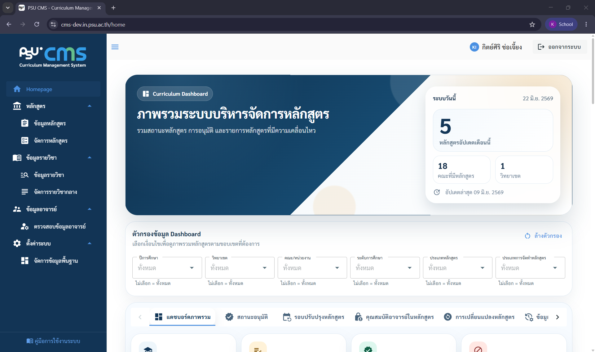
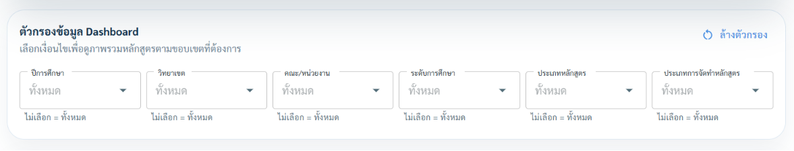

# 3. หน้า Dashboard (Homepage)

หน้าแรกของระบบแสดงภาพรวมสถานะหลักสูตรทั้งหมด เป็นจุดเริ่มต้นที่ดีสำหรับ "ดูว่ามีอะไรต้องทำ" ก่อนเข้าไปทำงานเชิงลึก

## ข้อมูลที่แสดงบน Dashboard

**ส่วนสถิติด้านบน (การ์ดตัวเลข)**

1. จำนวนหลักสูตรที่อัปเดตในเดือนปัจจุบัน
2. จำนวนคณะที่มีหลักสูตรในระบบ
3. จำนวนวิทยาเขตที่เปิดสอน
4. วันที่อัปเดตข้อมูลล่าสุด ตัวเลขเหล่านี้ช่วยให้เห็น "ความเคลื่อนไหว" ภาพรวม

**ตัวกรอง Dashboard**

สามารถเลือกดูข้อมูลตามขอบเขตที่ต้องการ เช่น กรองตามวิทยาเขต คณะ ระดับการศึกษา หรือประเภทหลักสูตร เพื่อให้ภาพรวมตรงกับหน้าที่ความรับผิดชอบของผู้ใช้เมื่อเปลี่ยนตัวกรองการ์ดตัวเลขและทุกแท็บด้านล่างจะคำนวณใหม่ ตามขอบเขตที่เลือก

> หมายเหตุ: ผู้ใช้จะสามารถเห็นข้อมูล Dashboard ได้ตามคณะที่สังกัดอยู่เท่านั้น หากสังกัดหลายคณะจะสามาถใช้ ตัวกรอง เพื่อเลือกดูข้อมูลตามขอบเขตที่ต้องการได้

**แท็บข้อมูลต่างๆ บน Dashboard**

| แท็บ                       | เนื้อหา                                   | ใช้ติดตามอะไร                                                                                                               |
| -------------------------- | ----------------------------------------- | --------------------------------------------------------------------------------------------------------------------------- |
| ภาพรวม                     | สรุปจำนวนหลักสูตรแยกตามสถานะต่างๆ         | จำนวนหลักสูตรตามระดับการศึกษา ,วิทยาเขต , คณะ และแผนภาพแนวโน้มจำนวนหลักสูตรตามปีการศึกษา                                    |
| สถานะการอนุมัติ            | ความคืบหน้าการอนุมัติหลักสูตร             | จำนวนหลักสูตรที่อนุมัติถึงขั้นล่าสุด แยกตามขั้นที่ 1-8                                                                      |
| รอบการปรับปรุงหลักสูตร     | หลักสูตรที่ใกล้ถึงรอบการทบทวน             | หลักสูตรที่เหลือระยะเวลาอีก 1 ปีก่อนครบอายุหลักสูตร ตามปีการศึกษาที่เลือกหรือปีปัจจุบัน                                     |
| คุณสมบัติอาจารย์ในหลักสูตร | หลักสูตรที่มีอาจารย์ไม่ผ่านเกณฑ์คุณสมบัติ | การตรวจสอบคุณสมบัติของอาจารย์ประจำหลักสูตรและอาจารย์ผู้รับผิดชอบหลักสูตร ด้านวุฒิการศึกษา ตำแหน่งวิชาการ และผลงานทางวิชาการ |
| การเปลี่ยนแปลงหลักสูตร     | ประวัติการแก้ไขและปรับปรุงหลักสูตร        | ดูข้อมูลการสรุปความเคลื่อนไหวของหลักสูตรประจำปี                                                                             |
