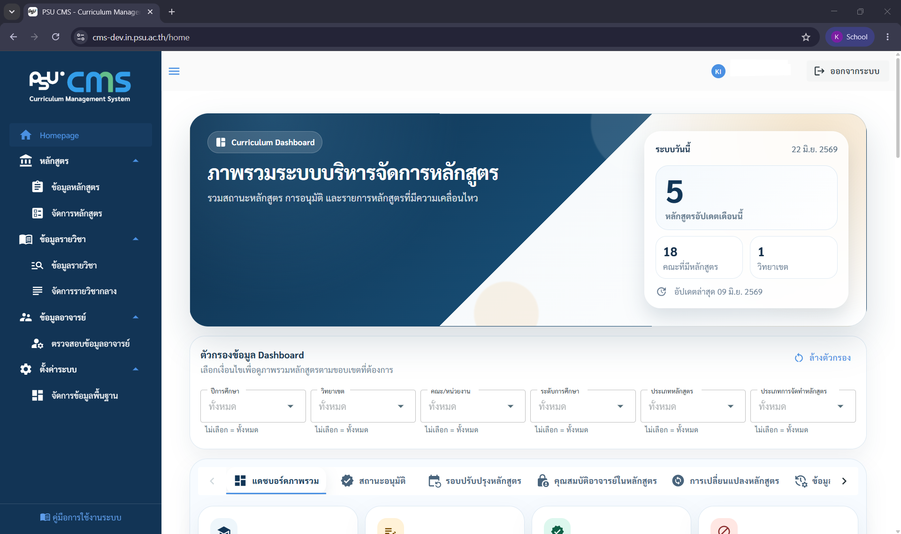
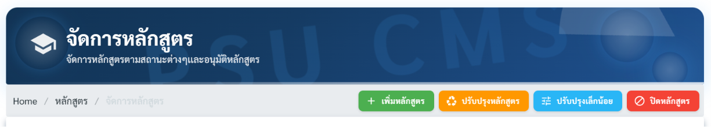

# 2. เมนูและหน้าจอหลัก

เมนูทั้งหมดอยู่ที่แถบด้านซ้ายของหน้าจอ แบ่งออกเป็น 4 กลุ่มหลัก เมื่อคลิกเมนูกลุ่ม ระบบจะกางรายการเมนูย่อยให้เลือก

> หมายเหตุ: เมนูที่มองเห็นได้ขึ้นอยู่กับสิทธิ์การใช้งานที่ได้รับ บางเมนูอาจไม่ปรากฏสำหรับผู้ใช้บางกลุ่ม

## โครงสร้างหน้าจอโดยรวม

หน้าจอแบ่งเป็น 3 ส่วนหลัก

1. แถบเมนูซ้าย (Sidebar): สลับไปมาระหว่างหน้าต่าง ๆ ย่อ/ขยายได้ บนจอมือถือจะซ่อนไว้และเปิดด้วยปุ่มเมนู (☰)
2. แถบด้านบน (Top bar): แสดงชื่อผู้ใช้ การแจ้งเตือน และปุ่มออกจากระบบ
3. พื้นที่ทำงานตรงกลาง: เนื้อหาของหน้าที่เลือก ระบบรองรับการใช้งานบนมือถือและแท็บเล็ต (Responsive) ตาราง ฟอร์ม และหน้าอนุมัติจะปรับการจัดวางให้เหมาะกับขนาดจอโดยอัตโนมัติ

## กลุ่มเมนู "หลักสูตร"

| เมนู           | ใช้ทำอะไร                                                            |
| -------------- | -------------------------------------------------------------------- |
| ข้อมูลหลักสูตร | ดูและค้นหาข้อมูลหลักสูตรทุกรายการในระบบ (โหมดอ่านอย่างเดียวเป็นหลัก) |
| จัดการหลักสูตร | หน้าหลักสำหรับดำเนินการกับหลักสูตร (สร้าง/ปรับปรุง/ปิด/ติดตามสถานะ)  |

ภายใต้เมนู จัดการหลักสูตร มี 4 การดำเนินการหลัก เข้าใจความต่างก่อนเลือกให้ถูกประเภท เพราะแต่ละแบบมีจำนวนขั้นอนุมัติไม่เท่ากัน

| การดำเนินการ     | เมื่อไหร่ควรใช้                                                                      | ผลต่อโครงสร้าง                             |
| ---------------- | ------------------------------------------------------------------------------------ | ------------------------------------------ |
| เพิ่มหลักสูตร    | สร้างหลักสูตรใหม่ที่ยังไม่เคยมีในระบบ                                                | สร้างใหม่ทั้งหมด                           |
| ปรับปรุงหลักสูตร | ปรับปรุงหลักสูตรที่มีอยู่แล้วอย่างมีนัยสำคัญ เช่น เปลี่ยนโครงสร้าง จำนวนหน่วยกิต PLO | สร้างหลักสูตร "รุ่นใหม่" ที่แทนที่รุ่นเดิม |
| ปรับปรุงเล็กน้อย | แก้ไขรายละเอียดปลีกย่อยที่ไม่กระทบสาระสำคัญ                                          | แก้ในหลักสูตรเดิม ไม่สร้างรุ่นใหม่         |
| ปิดหลักสูตร      | ดำเนินกระบวนการปิดหลักสูตรอย่างเป็นทางการ                                            | เปลี่ยนสถานะเป็นปิด/ระงับรับ               |

## กลุ่มเมนู "ข้อมูลรายวิชา"

| เมนู              | ใช้ทำอะไร                                           |
| ----------------- | --------------------------------------------------- |
| ข้อมูลรายวิชา     | ดูรายละเอียดรายวิชาทั้งหมดที่มีในระบบ               |
| จัดการรายวิชากลาง | เพิ่ม แก้ไข รายวิชากลางที่ใช้ร่วมกันระหว่างหลักสูตร |

## กลุ่มเมนู "ข้อมูลอาจารย์"

| เมนู                 | ใช้ทำอะไร                                    |
| -------------------- | -------------------------------------------- |
| ตรวจสอบข้อมูลอาจารย์ | ดูข้อมูลอาจารย์ ตรวจสอบคุณวุฒิ และภาระการสอน |
