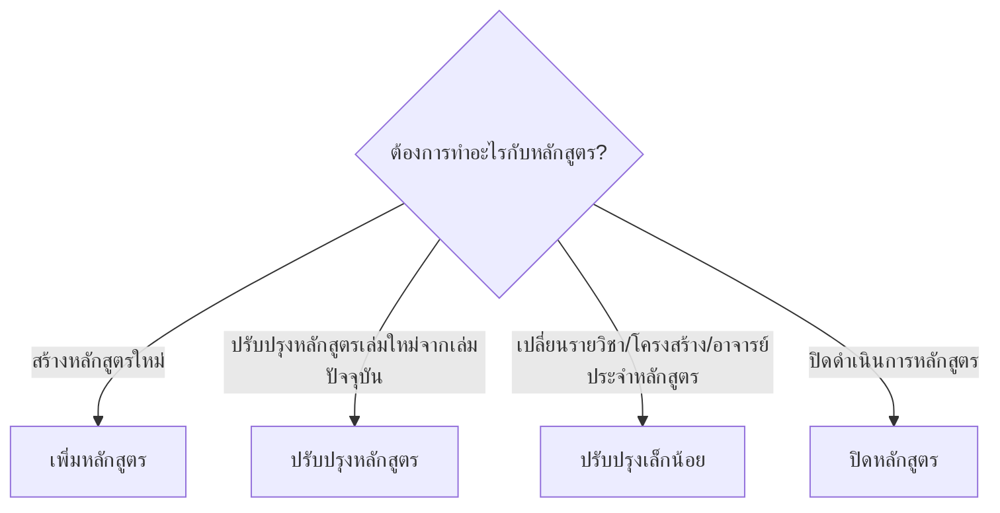

# 1. ภาพรวมระบบ

**ระบบบริหารจัดการหลักสูตร (Curriculum Management System: CMS)**

คือระบบกลางสำหรับบริหารจัดการข้อมูลหลักสูตรการศึกษาของสถาบัน ครอบคลุมตั้งแต่การสร้างหลักสูตรใหม่ การปรับปรุง ไปจนถึงการปิดหลักสูตร โดยมีกระบวนการอนุมัติหลักสูตรในหลายระดับ

## ระบบนี้ทำอะไรได้บ้าง

| ความสามารถ        | รายละเอียด                                                                |
| ----------------- | ------------------------------------------------------------------------- |
| ดูข้อมูลหลักสูตร  | ค้นหาและดูข้อมูลหลักสูตรทุกสถานะ กรองตามคณะ ระดับการศึกษา หรือวิทยาเขต    |
| เพิ่มหลักสูตรใหม่ | สร้างหลักสูตรใหม่พร้อมกำหนด PLO และส่งกระบวนการอนุมัติ                    |
| ปรับปรุงหลักสูตร  | ปรับปรุงหลักสูตรที่มีอยู่แล้ว พร้อมส่งอนุมัติ                             |
| ปรับปรุงเล็กน้อย  | แก้ไขข้อมูลหลักสูตรในส่วนที่ไม่กระทบโครงสร้างหลัก                         |
| ปิดหลักสูตร       | ดำเนินกระบวนการปิดหลักสูตรอย่างเป็นทางการ                                 |
| จัดการรายวิชา     | ดูและจัดการรายวิชากลางที่ใช้ในหลักสูตร                                    |
| ตรวจสอบอาจารย์    | ตรวจสอบข้อมูลและคุณวุฒิอาจารย์ผู้สอน                                      |
| Dashboard ภาพรวม  | ติดตามสถานะหลักสูตร การอนุมัติหลักสูตร และรายการที่มีความเคลื่อนไหวล่าสุด |
| ออกเล่มหลักสูตร   | สร้างเล่มหลักสูตรในรูปแบบ Word/PDF จากข้อมูลที่กรอกไว้                    |

## เลือกกระบวนการที่ต้องการ

## ผู้ใช้งานและบทบาท

ระบบรองรับผู้ใช้หลายบทบาท แต่ละบทบาทเห็นเมนูและทำสิ่งต่าง ๆ ได้ไม่เท่ากัน ตัวอย่างบทบาททั่วไป

| บทบาท                                  | หน้าที่หลักในระบบ                                                                                                              |
| -------------------------------------- | ------------------------------------------------------------------------------------------------------------------------------ |
| ผู้จัดทำหลักสูตร (เจ้าหน้าที่ระดับคณะ) | กรอกข้อมูลหลักสูตร ส่งขออนุมัติหลักสูตร การขอปรับปรุงเล็กน้อย และขอปิดหลักสูตร                                                 |
| ผู้ดูแลระบบ (Admin)                    | สร้างหลักสูตรใหม่ ปรับปรุงหลักสูตร ตั้งค่าข้อมูลพื้นฐานของระบบ และดูแลข้อมูลกลาง รวมทั้งกรอกข้อมูลการอนุมัติหลักสูตรทุกขั้นตอน |

> ⚠️ หากเข้าระบบแล้วไม่พบเมนูที่คาดว่าจะมี ส่วนใหญ่เกิดจาก สิทธิ์ของผู้ใช้งาน ให้ติดต่อผู้ดูแลระบบเพื่อขอสิทธิ์การมองเห็นเมนู
