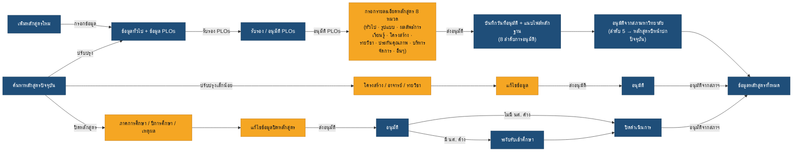

# ภาพรวมกระบวนการทั้งหมด (Overview CMS Process)

แผนภาพนี้สรุปกระบวนการหลักทั้งหมดของระบบ CMS ตั้งแต่การเพิ่ม/ปรับปรุง/ปิดหลักสูตร ไปจนถึงการอนุมัติ

> 🟦 **สีน้ำเงิน** = ผู้ดูแลระบบ (Admin) &#x20;· 🟧 **สีเหลือง** = ผู้จัดทำหลักสูตร (เจ้าหน้าที่ระดับคณะ)

## อ่านแผนภาพนี้อย่างไร

* **Admin (น้ำเงิน)** เริ่มด้วย "เพิ่มหลักสูตรใหม่" หรือ "ค้นหาหลักสูตรปัจจุบัน" (เพื่อปรับปรุง) → กรอกข้อมูล PLOs และรับรอง/อนุมัติ PLOs
* **ผู้จัดทำ (เหลือง)** กรอก **รายละเอียดหลักสูตร 8 หมวด** ให้ครบ แล้ว **ส่งอนุมัติ**
* **Admin** บันทึกวันที่อนุมัติ + แนบไฟล์ในแต่ละลำดับ จนถึง **สภามหาวิทยาลัย (ลำดับ 5)** สถานะเปลี่ยนเป็น "หลักสูตรปีหน้าปกปัจจุบัน" อัตโนมัติ แล้วเข้าสู่ "ข้อมูลหลักสูตรทั้งหมด"
* **ปรับปรุงเล็กน้อย** และ **ปิดหลักสูตร** เป็นเส้นทางแยก โดยผู้จัดทำแก้ไข/กรอกข้อมูล → ส่งอนุมัติ → Admin อนุมัติ (การปิดหลักสูตร: ถ้ายังมีนักศึกษาค้าง จะเข้าสู่ "ระงับรับเข้าศึกษา" ก่อน แล้วจึง "ปิดดำเนินการ")
