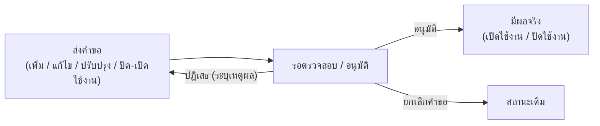

# 9. การจัดการรายวิชา

## 9.1 ดูข้อมูลรายวิชา

1. คลิกเมนู ข้อมูลรายวิชา
2. ค้นหารายวิชาโดยใช้ช่องค้นหาหรือตัวกรอง (รหัสวิชา / ชื่อวิชา)
3. คลิกที่รายวิชาเพื่อดูรายละเอียด

<figure><figcaption></figcaption></figure>

**ข้อมูลที่ดูได้ในรายละเอียดรายวิชา**

| แท็บ                 | เนื้อหา                                                 |
| -------------------- | ------------------------------------------------------- |
| ข้อมูลรายวิชา        | รหัส ชื่อ หน่วยกิต คำอธิบายรายวิชา ภาษาที่สอน           |
| เงื่อนไขการลงทะเบียน | รายวิชาที่ต้องเรียนก่อน (Pre-requisite)                 |
| CLO                  | Course Learning Outcomes ผลลัพธ์การเรียนรู้ระดับรายวิชา |
| อาจารย์ผู้สอน        | รายชื่ออาจารย์ที่รับผิดชอบรายวิชา                       |
| ประวัติการแก้ไข      | บันทึกการเปลี่ยนแปลงทั้งหมดของรายวิชา                   |
| การอนุมัติ           | สถานะและประวัติการอนุมัติรายวิชา                        |

<figure><figcaption></figcaption></figure>

<figure><figcaption></figcaption></figure>

**การดูสังกัดรายวิชา :** กดที่ปุ่มไอคอน **สังกัด/หลักสูตรที่ใช้งาน**

<figure><figcaption></figcaption></figure>

## 9.2 รายวิชา GenEd (มหาวิทยาลัย)

รายวิชากลาง คือคลังรายวิชามาตรฐานที่หลายหลักสูตรนำไปใช้ร่วมกันได้ ช่วยให้รหัส ชื่อ หน่วยกิต และคำอธิบายของวิชาเดียวกันตรงกันทุกที่ เข้าถึงได้จากเมนู **จัดการรายวิชากลาง** ซึ่งแบ่งเป็น 2 แท็บหลัก โดยแท็บนี้คือ**รายวิชาศึกษาทั่วไป (General Education) ระดับมหาวิทยาลัย ที่ทุกหลักสูตรใช้ร่วมกัน**

<figure><figcaption></figcaption></figure>

### การค้นหาและตัวกรอง

| ตัวกรอง       | รายละเอียด                                                       |
| -------------- | ------------------------------------------------------------------ |
| ค้นหา         | พิมพ์ **รหัสวิชา** หรือ **ชื่อวิชา**                               |
| กลุ่ม GenEd   | กรองตามกลุ่มวิชา GenEd (เช่น GE1, GE8 ฯลฯ)                        |
| วิทยาเขต      | เลือกได้ **หลายวิทยาเขตพร้อมกัน** หรือกด "ทุกวิทยาเขต"            |
| สถานะ         | **ใช้งาน** หรือ **ปิดใช้งาน**                                      |

**คอลัมน์ในตาราง:** รหัสวิชา · ชื่อรายวิชา (พร้อมปีที่เปิดสอนครั้งแรก) · ประเภทวิชา/กลุ่ม GenEd · วิทยาเขต · หน่วยกิต · จัดการ

ด้านบนตารางจะแสดงจำนวนรายวิชาที่พบเทียบกับจำนวนรายวิชาที่อนุมัติแล้วทั้งหมด (เช่น "พบ 12 จากทั้งหมด 340 รายการ") เพื่อให้รู้ว่าตัวกรองที่ตั้งไว้ครอบคลุมแค่ไหน

### เพิ่มรายวิชา GenEd ใหม่

กดปุ่ม **"เพิ่มรายวิชา GenEd"** จะเปิดฟอร์มเพิ่มรายวิชา แบ่งเป็น **4 แท็บย่อย**

| แท็บย่อย                          | ฟิลด์ที่กรอก                                                                                                                                                                                          |
| --------------------------------- | ------------------------------------------------------------------------------------------------------------------------------------------------------------------------------------------------- |
| **ข้อมูลรายวิชา**                 | กลุ่มวิชา GenEd · วิทยาเขต · รหัสวิชา (ระบบเติมตัวหน้ารหัสอัตโนมัติตามกลุ่ม GenEd ที่เลือก) · ประเภทวิชา · ชื่อรายวิชา (ไทย/อังกฤษ) · คำอธิบายรายวิชา (ไทย/อังกฤษ) · จำนวนหน่วยกิต · รูปแบบหน่วยกิต · ชั่วโมงบรรยาย/ปฏิบัติ/ศึกษาด้วยตนเอง · ประเภทห้องเรียน |
| **รายวิชาที่บังคับเรียนก่อน/ควบ** | กำหนดรายวิชาที่ต้องเรียนมาก่อน (Pre-requisite) · รายวิชาที่ต้องสอบผ่านมาก่อน (Must-pass) · รายวิชาที่ต้องเรียนควบคู่กัน (Concurrent) — ค้นหาจากรายวิชากลางที่มีอยู่แล้ว                              |
| **CLOs รายวิชา**                  | เพิ่มรายการ CLO (Course Learning Outcomes) ทีละข้อ — รายละเอียด (ไทย/อังกฤษ) ระบบจะรันรหัส CLO ให้อัตโนมัติ                                                                                          |
| **ข้อมูลการเปิดสอนและการอนุมัติ** | วันที่อนุมัติ · วันที่เปิดสอนครั้งแรก (ภาคเรียน/ปีการศึกษา) · (กรณีปิดใช้งาน) วันที่ปิดใช้งาน · ภาคเรียน/ปีการศึกษาที่ปิดใช้งาน                                                                      |

> ℹ️ **รหัสวิชาต้องไม่ซ้ำ** ระบบตรวจสอบให้อัตโนมัติขณะพิมพ์ และแจ้งเตือนทันทีถ้ารหัสนั้นถูกใช้แล้ว ไม่ว่าจะเป็นรายวิชาของหลักสูตรใดหรือรายวิชากลางคณะใดก็ตาม

> ℹ️ นำเข้าจาก Excel ในแท็บนี้ทำได้เฉพาะ **CLOs** เท่านั้น (ปุ่ม "นำเข้า CLOs Excel") ส่วนการเพิ่มรายวิชา GenEd ใหม่ต้องกรอกทีละรายการผ่านฟอร์มด้านบน

### รหัสประเภทวิชา

ฟิลด์ **ประเภทวิชา** ในแท็บ "ข้อมูลรายวิชา" (ใช้ร่วมกันทั้งรายวิชา GenEd และรายวิชาบริการ/รายวิชากลางคณะ) กำหนดว่ารายวิชานั้นคิดหน่วยกิตและลงทะเบียนข้ามภาคการศึกษาได้อย่างไร

<table><thead><tr><th width="181.727294921875">รหัส</th><th>ชื่อประเภท</th><th>ความหมาย</th></tr></thead><tbody><tr><td>A</td><td>วิชาทั่วไปไม่ใช่หน่วยกิต</td><td>รายวิชา Audit ไม่คำนวณหน่วยกิต ลงทะเบียนได้เต็มหน่วยกิตในภาคการศึกษาเดียว</td></tr><tr><td>B</td><td>ทั่วไปเลือกหน่วยกิต</td><td>รายวิชา Credit คำนวณหน่วยกิต ที่สามารถแยกลงทะเบียนในแต่ละภาคการศึกษาได้</td></tr><tr><td>C</td><td>วิชาสหกิจศึกษา</td><td>รายวิชาสหกิจศึกษา</td></tr><tr><td>G</td><td>วิชาทั่วไป</td><td>รายวิชา Credit คำนวณหน่วยกิต ลงทะเบียนได้เต็มหน่วยกิตในภาคการศึกษาเดียว</td></tr><tr><td>J</td><td>วิชาฝึกงาน</td><td>รายวิชาฝึกงาน</td></tr><tr><td>P</td><td>วิชาโครงงาน</td><td>รายวิชาโครงงาน</td></tr><tr><td>S</td><td>วิชาที่ลงทะเบียนภาคการศึกษาละ 1 หน่วยกิต</td><td>รายวิชา Credit 1 หน่วยกิต ที่สามารถลงซ้ำในแต่ละภาคการศึกษาได้</td></tr><tr><td>T</td><td>วิชาวิทยานิพนธ์</td><td>รายวิชาวิทยานิพนธ์ Credit คำนวณหน่วยกิต ซึ่งสามารถแบ่งหน่วยกิตลงทะเบียนตามภาคการศึกษาได้</td></tr><tr><td>X</td><td>วิชาสารนิพนธ์</td><td>รายวิชาสารนิพนธ์ Credit คำนวณหน่วยกิต ซึ่งสามารถแบ่งหน่วยกิตลงทะเบียนตามภาคการศึกษาได้</td></tr><tr><td>Y</td><td>หัวข้อพิเศษ</td><td>รายวิชา Credit ที่สามารถเปลี่ยนชื่อตามภาคการศึกษาได้</td></tr><tr><td>Z</td><td>ลงทะเบียนมากกว่า 1 ภาคการศึกษา</td><td>รายวิชาที่ลงทะเบียนซ้ำตามหน่วยกิตได้ทุกภาคการศึกษา</td></tr></tbody></table>

### การดำเนินการกับรายวิชาแต่ละรายการ

ปุ่ม/เมนู "จัดการ" ในแต่ละแถวจะเปลี่ยนไปตามสถานะปัจจุบันของรายวิชา

| ปุ่ม / เมนู                        | ใช้ทำอะไร                                                                                 |
| ---------------------------------- | ----------------------------------------------------------------------------------------- |
| **ดูรายละเอียดวิชา**               | เปิดดูข้อมูลรายวิชาแบบอ่านอย่างเดียว                                                      |
| **แก้ไข**                          | แก้ไขข้อมูลรายวิชาที่มีอยู่โดยตรง (ไม่สร้างเวอร์ชันใหม่)                                  |
| **ปรับปรุงรายวิชา**                | สร้าง **คำขอปรับปรุง** เป็นเวอร์ชันใหม่ของรายวิชา ต้องผ่านการตรวจสอบ/อนุมัติก่อนมีผลจริง  |
| **ปิดใช้งาน**                      | ส่งคำขอปิดใช้งานรายวิชา (แถวจะแสดงป้าย "รอยืนยันการปิดใช้งาน" ระหว่างรอ)                  |
| **เปิดรายวิชา / ยื่นขอเปิดใช้งาน** | ส่งคำขอเปิดใช้งานรายวิชาที่ถูกปิดไว้กลับมาใช้ใหม่ (แถวจะแสดงป้าย "รอยืนยันการเปิดใช้งาน") |
| **ยกเลิกคำขอปิด / ยกเลิกคำขอเปิด** | ยกเลิกคำขอปิด/เปิดใช้งานที่ส่งไปแล้ว ก่อนได้รับการอนุมัติ                                 |
| **ลบรายวิชา**                      | ลบรายวิชาออกจากระบบ (มีกล่องยืนยัน — ลบไม่ได้หากยังมีหลักสูตรใช้งานอยู่)                  |

**การดำเนินการแบบกลุ่ม (หลายรายการพร้อมกัน)** — กดเมนู **"เลือกเพื่อดำเนินการ"** แล้วเลือก

* **เลือกรายการเพื่อลบ** — ติ๊กเลือกหลายรายวิชา แล้วกดปุ่ม **"ลบที่เลือก"** เพื่อลบพร้อมกัน
* **เลือกเพื่อปรับปรุง** — ติ๊กเลือกได้สูงสุด **10 รายวิชาต่อครั้ง** แล้วกดปุ่ม **"ปรับปรุงที่เลือก"** เพื่อสร้างคำขอปรับปรุงพร้อมกันหลายรายวิชาในคราวเดียว

### แผงรายวิชารออนุมัติ (ติดตามคำขอของตัวเอง)

ทางด้านขวาของตารางมีแผง **"รายวิชารออนุมัติ"** (กดไอคอน ◀ เพื่อเปิด/ปิด) ใช้สำหรับ**ติดตามคำขอที่ตัวเองยื่นไว้**และยังไม่เสร็จสิ้น แบ่งเป็น 5 กลุ่ม

<table data-search="true"><thead><tr><th>กลุ่ม</th><th>หมายถึง</th></tr></thead><tbody><tr><td>🟢 <strong>รออนุมัติการเปิด</strong></td><td>คำขอเพิ่มรายวิชาใหม่ ที่ยังไม่ได้ตรวจ/อนุมัติ</td></tr><tr><td>🔵 <strong>รออนุมัติการแก้ไข</strong></td><td>รายวิชาที่เคยอนุมัติแล้ว แต่ถูกแก้ไขและส่งกลับเข้าสู่กระบวนการตรวจสอบอีกครั้ง</td></tr><tr><td>🔷 <strong>รออนุมัติการปรับปรุง</strong></td><td>คำขอ "ปรับปรุงรายวิชา" ที่สร้างเวอร์ชันใหม่ รอตรวจสอบ/อนุมัติ</td></tr><tr><td>🔴 <strong>รออนุมัติการปิดใช้งาน</strong></td><td>คำขอปิดใช้งานรายวิชา รอการยืนยัน</td></tr><tr><td>🟡 <strong>รออนุมัติการเปิดใช้งาน</strong></td><td>คำขอเปิดใช้งานรายวิชาที่เคยปิดไว้ รอการยืนยัน</td></tr></tbody></table>

แต่ละรายการในแผงนี้กดเมนู **⋮** เพื่อ **ดูรายละเอียด**, **แก้ไขคำขอ**, หรือ **ยกเลิกการดำเนินการ/ยกเลิกคำขอ** ได้โดยตรง (เหมาะสำหรับดูสถานะคำขอของตัวเอง ไม่ใช่หน้าจอสำหรับอนุมัติ)

### การตรวจสอบและอนุมัติ (สำหรับผู้มีสิทธิ์อนุมัติ)

ผู้ที่มีสิทธิ์อนุมัติจะเห็นปุ่ม **"อนุมัติรายวิชา GenEd"** อยู่บนแถบเครื่องมือ (มีตัวเลขสีแดงแจ้งจำนวนรายการค้างอยู่บนปุ่ม) กดแล้วจะเปิดหน้าจอตรวจสอบแยกเป็น **5 แท็บ** ตามประเภทคำขอ (อนุมัติเปิดรายวิชา / อนุมัติการแก้ไข / อนุมัติการปิดใช้งาน / อนุมัติการเปิดใช้งาน / อนุมัติการปรับปรุง) แต่ละแท็บมีช่องค้นหาและตัวกรองของตัวเอง (กลุ่ม GenEd, สังกัดคณะ, วิทยาเขต) พร้อมปุ่ม **"ตรวจสอบ"** ต่อแถวเพื่อเปิดดูรายละเอียดคำขอก่อนตัดสินใจอนุมัติหรือปฏิเสธ (พร้อมระบุเหตุผล)

> ℹ️ กรณีเป็นคำขอ **"ปรับปรุงรายวิชา"** ปุ่ม "ตรวจสอบ" จะเปิดหน้าจอ**เปรียบเทียบข้อมูลเดิมกับข้อมูลใหม่**ให้เห็นความแตกต่างชัดเจน ก่อนตัดสินใจอนุมัติ

> ⚠️ **ผลกระทบเป็นวงกว้าง:** เนื่องจากรายวิชากลางถูกอ้างอิงจากหลายหลักสูตร การแก้ไขรหัส ชื่อ หรือหน่วยกิตจะกระทบทุกหลักสูตรที่ใช้รายวิชานั้น ก่อนแก้ควรตรวจสอบว่ามีหลักสูตรใดใช้อยู่บ้าง (ดูได้จากปุ่ม **สังกัด/หลักสูตรที่ใช้งาน**) และยืนยันว่าการเปลี่ยนแปลงนี้สมควรมีผลกับทุกหลักสูตร หากต้องการเปลี่ยนเฉพาะหลักสูตรเดียว ควรพิจารณาสร้างรายวิชาแยกแทน

> ℹ️ รายวิชาที่ยังมีหลักสูตรใช้งานอยู่ อาจ **ลบไม่ได้** (ระบบจะแจ้ง "ไม่สามารถลบรายวิชาได้") ต้องนำออกจากหลักสูตรที่ใช้ก่อน

## 9.3 รายวิชาบริการ / รายวิชากลางคณะ

รายวิชาบริการ/รายวิชากลางคณะ คือ**รายวิชาที่คณะเปิดเป็นรายวิชากลาง/บริการ ให้หลักสูตรหรือคณะอื่นนำไปใช้ร่วม** เข้าถึงจากเมนู **จัดการรายวิชากลาง** เช่นเดียวกับรายวิชา GenEd แต่เป็นแท็บที่สอง

<figure><figcaption></figcaption></figure>

### การค้นหาและตัวกรอง

| ตัวกรอง                           | รายละเอียด                                                |
| ---------------------------------- | ------------------------------------------------------------ |
| ค้นหา                             | พิมพ์ **รหัสวิชา** หรือ **ชื่อวิชา**                          |
| คณะ                               | พิมพ์ค้นหาคณะที่เป็นเจ้าของรายวิชา (ช่องแบบพิมพ์ค้นหา)       |
| สาขาวิชา/กลุ่มสาขาวิชาของส่วนงาน  | กรองตามภาควิชา (ตัวเลือกจะเปลี่ยนตามคณะที่เลือกไว้)          |
| วิทยาเขต                          | เลือกได้ **หลายวิทยาเขตพร้อมกัน** หรือกด "ทุกวิทยาเขต"       |
| สถานะ                             | **ใช้งาน** หรือ **ปิดใช้งาน**                                 |

**คอลัมน์ในตาราง:** รหัสวิชา · ชื่อรายวิชา · สังกัด/คณะ · ประเภทวิชา · หน่วยกิต · จัดการ

### เพิ่มรายวิชากลางคณะใหม่

กดปุ่ม **"เพิ่มรายวิชากลางคณะ"** จะเปิดฟอร์มเพิ่มรายวิชา แบ่งเป็น **4 แท็บย่อย**

| แท็บย่อย                          | ฟิลด์ที่กรอก                                                                                                                                                                                                          |
| --------------------------------- | ---------------------------------------------------------------------------------------------------------------------------------------------------------------------------------------------------------------------- |
| **ข้อมูลรายวิชา**                 | คณะเจ้าของวิชา · สาขาวิชา/กลุ่มสาขาวิชาของส่วนงาน · วิทยาเขต · รหัสวิชา · ประเภทวิชา · ชื่อรายวิชา (ไทย/อังกฤษ) · คำอธิบายรายวิชา (ไทย/อังกฤษ) · จำนวนหน่วยกิต · รูปแบบหน่วยกิต · ชั่วโมงบรรยาย/ปฏิบัติ/ศึกษาด้วยตนเอง · ประเภทห้องเรียน |
| **รายวิชาที่บังคับเรียนก่อน/ควบ** | กำหนดรายวิชาที่ต้องเรียนมาก่อน (Pre-requisite) · รายวิชาที่ต้องสอบผ่านมาก่อน (Must-pass) · รายวิชาที่ต้องเรียนควบคู่กัน (Concurrent) — ค้นหาจากรายวิชากลางที่มีอยู่แล้ว                                              |
| **CLOs รายวิชา**                  | เพิ่มรายการ CLO (Course Learning Outcomes) ทีละข้อ — รายละเอียด (ไทย/อังกฤษ) ระบบจะรันรหัส CLO ให้อัตโนมัติ                                                                                                          |
| **ข้อมูลการเปิดสอนและการอนุมัติ** | วันที่อนุมัติ · วันที่เปิดสอนครั้งแรก (ภาคเรียน/ปีการศึกษา) · (กรณีปิดใช้งาน) วันที่ปิดใช้งาน · ภาคเรียน/ปีการศึกษาที่ปิดใช้งาน                                                                                      |

> ℹ️ **รหัสวิชาต้องไม่ซ้ำ** ระบบตรวจสอบให้อัตโนมัติขณะพิมพ์ และแจ้งเตือนทันทีถ้ารหัสนั้นถูกใช้แล้ว ไม่ว่าจะเป็นรายวิชาของหลักสูตรใดหรือรายวิชา GenEd ใดก็ตาม (ดูความหมายรหัสประเภทวิชาแต่ละตัวได้ที่ตาราง [รหัสประเภทวิชา](#รหัสประเภทวิชา) ด้านบน)

> ℹ️ นำเข้าจาก Excel ในแท็บนี้ทำได้ทั้ง **รายวิชาใหม่จำนวนมากพร้อมกัน** (ปุ่ม "นำเข้ารายวิชากลาง Excel" — ดาวน์โหลด Template แล้วกรอกก่อนอัปโหลด) และ **CLOs** (ปุ่ม "นำเข้า CLOs Excel")

### การดำเนินการกับรายวิชาแต่ละรายการ

ปุ่ม/เมนู "จัดการ" ในแต่ละแถวจะเปลี่ยนไปตามสถานะปัจจุบันของรายวิชา เช่นเดียวกับรายวิชา GenEd

| ปุ่ม / เมนู                        | ใช้ทำอะไร                                                                                 |
| ---------------------------------- | ----------------------------------------------------------------------------------------- |
| **ดูรายละเอียดวิชา**               | เปิดดูข้อมูลรายวิชาแบบอ่านอย่างเดียว                                                      |
| **แก้ไข**                          | แก้ไขข้อมูลรายวิชาที่มีอยู่โดยตรง (ไม่สร้างเวอร์ชันใหม่)                                  |
| **ปรับปรุงรายวิชา**                | สร้าง **คำขอปรับปรุง** เป็นเวอร์ชันใหม่ของรายวิชา ต้องผ่านการตรวจสอบ/อนุมัติก่อนมีผลจริง  |
| **ปิดใช้งาน**                      | ส่งคำขอปิดใช้งานรายวิชา (แถวจะแสดงป้าย "รอยืนยันการปิดใช้งาน" ระหว่างรอ)                  |
| **เปิดรายวิชา / ยื่นขอเปิดใช้งาน** | ส่งคำขอเปิดใช้งานรายวิชาที่ถูกปิดไว้กลับมาใช้ใหม่ (แถวจะแสดงป้าย "รอยืนยันการเปิดใช้งาน") |
| **ยกเลิกคำขอปิด / ยกเลิกคำขอเปิด** | ยกเลิกคำขอปิด/เปิดใช้งานที่ส่งไปแล้ว ก่อนได้รับการอนุมัติ                                 |
| **ลบรายวิชา**                      | ลบรายวิชาออกจากระบบ (มีกล่องยืนยัน — ลบไม่ได้หากยังมีหลักสูตรใช้งานอยู่)                  |

**การดำเนินการแบบกลุ่ม (หลายรายการพร้อมกัน)** — กดเมนู **"เลือกเพื่อดำเนินการ"** แล้วเลือก

* **เลือกรายการเพื่อลบ** — ติ๊กเลือกหลายรายวิชา แล้วกดปุ่ม **"ลบที่เลือก"** เพื่อลบพร้อมกัน
* **เลือกเพื่อปรับปรุง** — ติ๊กเลือกได้สูงสุด **10 รายวิชาต่อครั้ง** แล้วกดปุ่ม **"ปรับปรุงที่เลือก"** เพื่อสร้างคำขอปรับปรุงพร้อมกันหลายรายวิชาในคราวเดียว

### แผงรายวิชารออนุมัติ (ติดตามคำขอของตัวเอง)

เหมือนกับแท็บ GenEd — ทางด้านขวาของตารางมีแผง **"รายวิชารออนุมัติ"** (กดไอคอน ◀ เพื่อเปิด/ปิด) ใช้สำหรับ**ติดตามคำขอที่ตัวเองยื่นไว้**และยังไม่เสร็จสิ้น แบ่งเป็น 5 กลุ่มเดียวกัน (รออนุมัติการเปิด / แก้ไข / ปรับปรุง / ปิดใช้งาน / เปิดใช้งาน) แต่ละรายการกดเมนู **⋮** เพื่อ **ดูรายละเอียด**, **แก้ไขคำขอ**, หรือ **ยกเลิกการดำเนินการ/ยกเลิกคำขอ** ได้โดยตรง

### การตรวจสอบและอนุมัติ (สำหรับผู้มีสิทธิ์อนุมัติ)

ผู้ที่มีสิทธิ์อนุมัติจะเห็นปุ่ม **"อนุมัติรายวิชากลาง"** อยู่บนแถบเครื่องมือ (มีตัวเลขสีแดงแจ้งจำนวนรายการค้างอยู่บนปุ่ม) กดแล้วจะเปิดหน้าจอตรวจสอบแยกเป็น **5 แท็บ** ตามประเภทคำขอ (อนุมัติเปิดรายวิชา / อนุมัติการแก้ไข / อนุมัติการปิดใช้งาน / อนุมัติการเปิดใช้งาน / อนุมัติการปรับปรุง) เหมือนกับฝั่ง GenEd พร้อมปุ่ม **"ตรวจสอบ"** ต่อแถวเพื่อเปิดดูรายละเอียดคำขอก่อนตัดสินใจอนุมัติหรือปฏิเสธ (พร้อมระบุเหตุผล) — กรณีเป็นคำขอ **"ปรับปรุงรายวิชา"** จะเปิดหน้าจอเปรียบเทียบข้อมูลเดิมกับข้อมูลใหม่เช่นเดียวกัน

> ⚠️ **ผลกระทบเป็นวงกว้าง:** เนื่องจากรายวิชากลางถูกอ้างอิงจากหลายหลักสูตร การแก้ไขรหัส ชื่อ หรือหน่วยกิตจะกระทบทุกหลักสูตรที่ใช้รายวิชานั้น ก่อนแก้ควรตรวจสอบว่ามีหลักสูตรใดใช้อยู่บ้าง (ดูได้จากปุ่ม **สังกัด/หลักสูตรที่ใช้งาน**) และยืนยันว่าการเปลี่ยนแปลงนี้สมควรมีผลกับทุกหลักสูตร หากต้องการเปลี่ยนเฉพาะหลักสูตรเดียว ควรพิจารณาสร้างรายวิชาแยกแทน

> ℹ️ รายวิชาที่ยังมีหลักสูตรใช้งานอยู่ อาจ **ลบไม่ได้** (ระบบจะแจ้ง "ไม่สามารถลบรายวิชาได้") ต้องนำออกจากหลักสูตรที่ใช้ก่อน

> ℹ️ นอกจากรายวิชากลางในหน้านี้ แต่ละหลักสูตรยังสามารถมี **รายวิชาของตัวเอง** ที่สร้างเฉพาะหลักสูตรนั้นได้ ผ่านแท็บ **"จัดการรายวิชา"** ในหมวดที่ 3 โครงสร้างหลักสูตร ขณะกรอกรายละเอียดหลักสูตร — ดูวิธีใช้งานได้ที่หน้า [การกรอกข้อมูลรายละเอียดหลักสูตร](curriculum-form.md)
