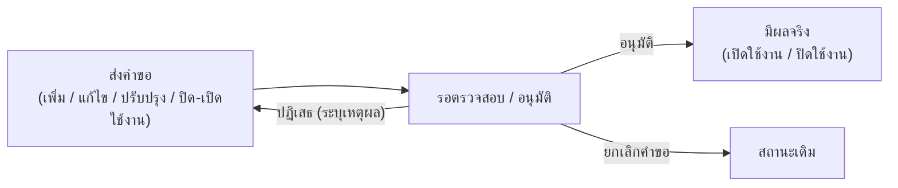

# 9. การจัดการรายวิชา

## 9.1 ดูข้อมูลรายวิชา

1. คลิกเมนู ข้อมูลรายวิชา
2. ค้นหารายวิชาโดยใช้ช่องค้นหาหรือตัวกรอง (รหัสวิชา / ชื่อวิชา)
3. คลิกที่รายวิชาเพื่อดูรายละเอียด

<figure><figcaption></figcaption></figure>

**ข้อมูลที่ดูได้ในรายละเอียดรายวิชา**

| แท็บ                 | เนื้อหา                                                 |
| -------------------- | ------------------------------------------------------- |
| ข้อมูลรายวิชา        | รหัส ชื่อ หน่วยกิต คำอธิบายรายวิชา ภาษาที่สอน           |
| เงื่อนไขการลงทะเบียน | รายวิชาที่ต้องเรียนก่อน (Pre-requisite)                 |
| CLO                  | Course Learning Outcomes ผลลัพธ์การเรียนรู้ระดับรายวิชา |
| อาจารย์ผู้สอน        | รายชื่ออาจารย์ที่รับผิดชอบรายวิชา                       |
| ประวัติการแก้ไข      | บันทึกการเปลี่ยนแปลงทั้งหมดของรายวิชา                   |
| การอนุมัติ           | สถานะและประวัติการอนุมัติรายวิชา                        |

<figure><figcaption></figcaption></figure>

<figure><figcaption></figcaption></figure>

**การดูสังกัดรายวิชา :** กดที่ปุ่มไอคอน **สังกัด/หลักสูตรที่ใช้งาน**

<figure><figcaption></figcaption></figure>

## 9.2 จัดการรายวิชากลาง

รายวิชากลาง คือคลังรายวิชามาตรฐานที่หลายหลักสูตรนำไปใช้ร่วมกันได้ ช่วยให้รหัส ชื่อ หน่วยกิต และคำอธิบายของวิชาเดียวกันตรงกันทุกที่ เมื่อคลิกเมนู **จัดการรายวิชากลาง** จะพบหน้าจัดการที่แบ่งเป็น **2 แท็บหลัก** ตามประเภทของรายวิชา ดังนี้

<figure><figcaption></figcaption></figure>

<figure><figcaption></figcaption></figure>

### รายวิชา GenEd (มหาวิทยาลัย)

รายวิชาศึกษาทั่วไป (General Education) ระดับมหาวิทยาลัย ที่ทุกหลักสูตรใช้ร่วมกัน

**ตัวกรอง**

| ตัวกรอง                   | รายละเอียด                           |
| -------------------------- | -------------------------------------- |
| ค้นหา                     | พิมพ์ **รหัสวิชา** หรือ **ชื่อวิชา**   |
| ประเภทวิชา / กลุ่ม GenEd  | กรองตามประเภทวิชา หรือกลุ่ม GenEd      |
| วิทยาเขต                  | เลือกวิทยาเขต (หรือ "ทุกวิทยาเขต")     |
| สถานะ                     | **ใช้งาน** หรือ **ปิดใช้งาน**          |

**คอลัมน์ในตาราง:** รหัสวิชา · ชื่อรายวิชา · ประเภทวิชา/กลุ่ม GenEd · วิทยาเขต · หน่วยกิต · จัดการ

**เพิ่มรายวิชา GenEd ใหม่** — กดปุ่ม **"เพิ่มรายวิชา GenEd"** จะเปิดฟอร์มเพิ่มรายวิชา แบ่งเป็น **4 แท็บย่อย**

| แท็บย่อย                          | ฟิลด์ที่กรอก                                                                                                                                                                                          |
| --------------------------------- | -------------------------------------------------------------------------------------------------------------------------------------------------------------------------------------------------- |
| **ข้อมูลรายวิชา**                 | กลุ่มวิชา GenEd · วิทยาเขต · รหัสวิชา · ประเภทวิชา · ชื่อรายวิชา (ไทย/อังกฤษ) · คำอธิบายรายวิชา (ไทย/อังกฤษ) · จำนวนหน่วยกิต · รูปแบบหน่วยกิต · ชั่วโมงบรรยาย/ปฏิบัติ/ศึกษาด้วยตนเอง · ประเภทห้องเรียน |
| **รายวิชาที่บังคับเรียนก่อน/ควบ** | กำหนดรายวิชาที่ต้องเรียนมาก่อน (Pre-requisite) · รายวิชาที่ต้องสอบผ่านมาก่อน (Must-pass) · รายวิชาที่ต้องเรียนควบคู่กัน (Concurrent) — ค้นหาจากรายวิชากลางที่มีอยู่แล้ว                              |
| **CLOs รายวิชา**                  | เพิ่มรายการ CLO (Course Learning Outcomes) ทีละข้อ — รายละเอียด (ไทย/อังกฤษ) ระบบจะรันรหัส CLO ให้อัตโนมัติ                                                                                          |
| **ข้อมูลการเปิดสอนและการอนุมัติ** | วันที่อนุมัติ · วันที่เปิดสอนครั้งแรก (ภาคเรียน/ปีการศึกษา) · (กรณีปิดใช้งาน) วันที่ปิดใช้งาน · ภาคเรียน/ปีการศึกษาที่ปิดใช้งาน                                                                      |

> ℹ️ นำเข้าจาก Excel ในแท็บนี้ทำได้เฉพาะ **CLOs** เท่านั้น (ปุ่ม "นำเข้า CLOs Excel") ส่วนการเพิ่มรายวิชา GenEd ใหม่ต้องกรอกทีละรายการ

### รายวิชาบริการ / รายวิชากลางคณะ

รายวิชาที่คณะเปิดเป็นรายวิชากลาง/บริการ ให้หลักสูตรหรือคณะอื่นนำไปใช้ร่วม

**ตัวกรอง**

| ตัวกรอง                           | รายละเอียด                       |
| ---------------------------------- | ----------------------------------- |
| ค้นหา                             | พิมพ์ **รหัสวิชา** หรือ **ชื่อวิชา** |
| ประเภทวิชา                        | กรองตามประเภทวิชา                  |
| สังกัด / คณะ                      | กรองตามคณะที่เป็นเจ้าของรายวิชา    |
| สาขาวิชา/กลุ่มสาขาวิชาของส่วนงาน  | กรองตามภาควิชา                     |
| วิทยาเขต                          | เลือกวิทยาเขต (หรือ "ทุกวิทยาเขต") |
| สถานะ                             | **ใช้งาน** หรือ **ปิดใช้งาน**       |

**คอลัมน์ในตาราง:** รหัสวิชา · ชื่อรายวิชา · สังกัด/คณะ · ประเภทวิชา · หน่วยกิต · จัดการ

**เพิ่มรายวิชากลางคณะใหม่** — กดปุ่ม **"เพิ่มรายวิชากลางคณะ"** จะเปิดฟอร์มเพิ่มรายวิชา แบ่งเป็น **4 แท็บย่อย**

| แท็บย่อย                          | ฟิลด์ที่กรอก                                                                                                                                                                                                          |
| --------------------------------- | ---------------------------------------------------------------------------------------------------------------------------------------------------------------------------------------------------------------------- |
| **ข้อมูลรายวิชา**                 | คณะเจ้าของวิชา · สาขาวิชา/กลุ่มสาขาวิชาของส่วนงาน · วิทยาเขต · รหัสวิชา · ประเภทวิชา · ชื่อรายวิชา (ไทย/อังกฤษ) · คำอธิบายรายวิชา (ไทย/อังกฤษ) · จำนวนหน่วยกิต · รูปแบบหน่วยกิต · ชั่วโมงบรรยาย/ปฏิบัติ/ศึกษาด้วยตนเอง · ประเภทห้องเรียน |
| **รายวิชาที่บังคับเรียนก่อน/ควบ** | กำหนดรายวิชาที่ต้องเรียนมาก่อน (Pre-requisite) · รายวิชาที่ต้องสอบผ่านมาก่อน (Must-pass) · รายวิชาที่ต้องเรียนควบคู่กัน (Concurrent) — ค้นหาจากรายวิชากลางที่มีอยู่แล้ว                                              |
| **CLOs รายวิชา**                  | เพิ่มรายการ CLO (Course Learning Outcomes) ทีละข้อ — รายละเอียด (ไทย/อังกฤษ) ระบบจะรันรหัส CLO ให้อัตโนมัติ                                                                                                          |
| **ข้อมูลการเปิดสอนและการอนุมัติ** | วันที่อนุมัติ · วันที่เปิดสอนครั้งแรก (ภาคเรียน/ปีการศึกษา) · (กรณีปิดใช้งาน) วันที่ปิดใช้งาน · ภาคเรียน/ปีการศึกษาที่ปิดใช้งาน                                                                                      |

> ℹ️ นำเข้าจาก Excel ในแท็บนี้ทำได้ทั้ง **รายวิชาใหม่จำนวนมากพร้อมกัน** (ปุ่ม "นำเข้ารายวิชากลาง Excel" — ดาวน์โหลด Template แล้วกรอกก่อนอัปโหลด) และ **CLOs** (ปุ่ม "นำเข้า CLOs Excel")

> ℹ️ **รหัสวิชาต้องไม่ซ้ำ** ในทั้งสองแท็บ ระบบตรวจสอบให้อัตโนมัติขณะพิมพ์ และจะแจ้งเตือนทันทีถ้ารหัสนั้นถูกใช้แล้ว ไม่ว่าจะเป็นรายวิชาของหลักสูตรใดหรือรายวิชากลางคณะใดก็ตาม

### รหัสประเภทวิชา

ฟิลด์ **ประเภทวิชา** ในแท็บ "ข้อมูลรายวิชา" กำหนดว่ารายวิชานั้นคิดหน่วยกิตและลงทะเบียนข้ามภาคการศึกษาได้อย่างไร

<table><thead><tr><th width="181.727294921875">รหัส</th><th>ชื่อประเภท</th><th>ความหมาย</th></tr></thead><tbody><tr><td>A</td><td>วิชาทั่วไปไม่ใช่หน่วยกิต</td><td>รายวิชา Audit ไม่คำนวณหน่วยกิต ลงทะเบียนได้เต็มหน่วยกิตในภาคการศึกษาเดียว</td></tr><tr><td>B</td><td>ทั่วไปเลือกหน่วยกิต</td><td>รายวิชา Credit คำนวณหน่วยกิต ที่สามารถแยกลงทะเบียนในแต่ละภาคการศึกษาได้</td></tr><tr><td>C</td><td>วิชาสหกิจศึกษา</td><td>รายวิชาสหกิจศึกษา</td></tr><tr><td>G</td><td>วิชาทั่วไป</td><td>รายวิชา Credit คำนวณหน่วยกิต ลงทะเบียนได้เต็มหน่วยกิตในภาคการศึกษาเดียว</td></tr><tr><td>J</td><td>วิชาฝึกงาน</td><td>รายวิชาฝึกงาน</td></tr><tr><td>P</td><td>วิชาโครงงาน</td><td>รายวิชาโครงงาน</td></tr><tr><td>S</td><td>วิชาที่ลงทะเบียนภาคการศึกษาละ 1 หน่วยกิต</td><td>รายวิชา Credit 1 หน่วยกิต ที่สามารถลงซ้ำในแต่ละภาคการศึกษาได้</td></tr><tr><td>T</td><td>วิชาวิทยานิพนธ์</td><td>รายวิชาวิทยานิพนธ์ Credit คำนวณหน่วยกิต ซึ่งสามารถแบ่งหน่วยกิตลงทะเบียนตามภาคการศึกษาได้</td></tr><tr><td>X</td><td>วิชาสารนิพนธ์</td><td>รายวิชาสารนิพนธ์ Credit คำนวณหน่วยกิต ซึ่งสามารถแบ่งหน่วยกิตลงทะเบียนตามภาคการศึกษาได้</td></tr><tr><td>Y</td><td>หัวข้อพิเศษ</td><td>รายวิชา Credit ที่สามารถเปลี่ยนชื่อตามภาคการศึกษาได้</td></tr><tr><td>Z</td><td>ลงทะเบียนมากกว่า 1 ภาคการศึกษา</td><td>รายวิชาที่ลงทะเบียนซ้ำตามหน่วยกิตได้ทุกภาคการศึกษา</td></tr></tbody></table>

### การดำเนินการกับรายวิชาแต่ละรายการ

ปุ่ม/เมนู "จัดการ" ในแต่ละแถวจะเปลี่ยนไปตามสถานะปัจจุบันของรายวิชา

| ปุ่ม / เมนู                        | ใช้ทำอะไร                                                                                 |
| ---------------------------------- | ----------------------------------------------------------------------------------------- |
| **ดูรายละเอียดวิชา**               | เปิดดูข้อมูลรายวิชาแบบอ่านอย่างเดียว                                                      |
| **แก้ไข**                          | แก้ไขข้อมูลรายวิชาที่มีอยู่โดยตรง (ไม่สร้างเวอร์ชันใหม่)                                  |
| **ปรับปรุงรายวิชา**                | สร้าง **คำขอปรับปรุง** เป็นเวอร์ชันใหม่ของรายวิชา ต้องผ่านการตรวจสอบ/อนุมัติก่อนมีผลจริง  |
| **ปิดใช้งาน**                      | ส่งคำขอปิดใช้งานรายวิชา (แถวจะแสดงป้าย "รอยืนยันการปิดใช้งาน" ระหว่างรอ)                  |
| **เปิดรายวิชา / ยื่นขอเปิดใช้งาน** | ส่งคำขอเปิดใช้งานรายวิชาที่ถูกปิดไว้กลับมาใช้ใหม่ (แถวจะแสดงป้าย "รอยืนยันการเปิดใช้งาน") |
| **ยกเลิกคำขอปิด / ยกเลิกคำขอเปิด** | ยกเลิกคำขอปิด/เปิดใช้งานที่ส่งไปแล้ว ก่อนได้รับการอนุมัติ                                 |
| **ลบรายวิชา**                      | ลบรายวิชาออกจากระบบ (มีกล่องยืนยัน — ลบไม่ได้หากยังมีหลักสูตรใช้งานอยู่)                  |

**การดำเนินการแบบกลุ่ม (หลายรายการพร้อมกัน)** — กดเมนู **"เลือกเพื่อดำเนินการ"** แล้วเลือก

* **เลือกรายการเพื่อลบ** — ติ๊กเลือกหลายรายวิชา แล้วกดปุ่ม **"ลบที่เลือก"** เพื่อลบพร้อมกัน
* **เลือกเพื่อปรับปรุง** — ติ๊กเลือกได้สูงสุด **10 รายวิชาต่อครั้ง** แล้วกดปุ่ม **"ปรับปรุงที่เลือก"** เพื่อสร้างคำขอปรับปรุงพร้อมกันหลายรายวิชาในคราวเดียว

### แผงรายวิชารออนุมัติ (ติดตามคำขอของตัวเอง)

ทางด้านขวาของตารางมีแผง **"รายวิชารออนุมัติ"** (กดไอคอน ◀ เพื่อเปิด/ปิด) ใช้สำหรับ**ติดตามคำขอที่ตัวเองยื่นไว้**และยังไม่เสร็จสิ้น แบ่งเป็น 5 กลุ่ม

<table data-search="true"><thead><tr><th>กลุ่ม</th><th>หมายถึง</th></tr></thead><tbody><tr><td>🟢 <strong>รออนุมัติการเปิด</strong></td><td>คำขอเพิ่มรายวิชาใหม่ ที่ยังไม่ได้ตรวจ/อนุมัติ</td></tr><tr><td>🔵 <strong>รออนุมัติการแก้ไข</strong></td><td>รายวิชาที่เคยอนุมัติแล้ว แต่ถูกแก้ไขและส่งกลับเข้าสู่กระบวนการตรวจสอบอีกครั้ง</td></tr><tr><td>🔷 <strong>รออนุมัติการปรับปรุง</strong></td><td>คำขอ "ปรับปรุงรายวิชา" ที่สร้างเวอร์ชันใหม่ รอตรวจสอบ/อนุมัติ</td></tr><tr><td>🔴 <strong>รออนุมัติการปิดใช้งาน</strong></td><td>คำขอปิดใช้งานรายวิชา รอการยืนยัน</td></tr><tr><td>🟡 <strong>รออนุมัติการเปิดใช้งาน</strong></td><td>คำขอเปิดใช้งานรายวิชาที่เคยปิดไว้ รอการยืนยัน</td></tr></tbody></table>

แต่ละรายการในแผงนี้กดเมนู **⋮** เพื่อ **ดูรายละเอียด**, **แก้ไขคำขอ**, หรือ **ยกเลิกการดำเนินการ/ยกเลิกคำขอ** ได้โดยตรง (เหมาะสำหรับดูสถานะคำขอของตัวเอง ไม่ใช่หน้าจอสำหรับอนุมัติ)

### การตรวจสอบและอนุมัติ (สำหรับผู้มีสิทธิ์อนุมัติ)

ผู้ที่มีสิทธิ์อนุมัติจะเห็นปุ่ม **"อนุมัติรายวิชา GenEd"** หรือ **"อนุมัติรายวิชากลางคณะ"** อยู่บนแถบเครื่องมือ (มีตัวเลขสีแดงแจ้งจำนวนรายการค้างอยู่บนปุ่ม) กดแล้วจะเปิดหน้าจอตรวจสอบแยกเป็น **5 แท็บ** ตามประเภทคำขอ (อนุมัติเปิดรายวิชา / อนุมัติการแก้ไข / อนุมัติการปิดใช้งาน / อนุมัติการเปิดใช้งาน / อนุมัติการปรับปรุง) แต่ละแท็บมีช่องค้นหาและตัวกรองของตัวเอง พร้อมปุ่ม **"ตรวจสอบ"** ต่อแถวเพื่อเปิดดูรายละเอียดคำขอก่อนตัดสินใจอนุมัติหรือปฏิเสธ (พร้อมระบุเหตุผล)

> ℹ️ กรณีเป็นคำขอ **"ปรับปรุงรายวิชา"** ปุ่ม "ตรวจสอบ" จะเปิดหน้าจอ**เปรียบเทียบข้อมูลเดิมกับข้อมูลใหม่**ให้เห็นความแตกต่างชัดเจน ก่อนตัดสินใจอนุมัติ

> ⚠️ **ผลกระทบเป็นวงกว้าง:** เนื่องจากรายวิชากลางถูกอ้างอิงจากหลายหลักสูตร การแก้ไขรหัส ชื่อ หรือหน่วยกิตจะกระทบทุกหลักสูตรที่ใช้รายวิชานั้น ก่อนแก้ควรตรวจสอบว่ามีหลักสูตรใดใช้อยู่บ้าง (ดูได้จากปุ่ม **สังกัด/หลักสูตรที่ใช้งาน**) และยืนยันว่าการเปลี่ยนแปลงนี้สมควรมีผลกับทุกหลักสูตร หากต้องการเปลี่ยนเฉพาะหลักสูตรเดียว ควรพิจารณาสร้างรายวิชาแยกแทน

> ℹ️ รายวิชาที่ยังมีหลักสูตรใช้งานอยู่ อาจ **ลบไม่ได้** (ระบบจะแจ้ง "ไม่สามารถลบรายวิชาได้") ต้องนำออกจากหลักสูตรที่ใช้ก่อน

## 9.3 จัดการรายวิชาทั่วไป (รายวิชาเฉพาะหลักสูตร)

นอกจาก **รายวิชากลาง** (ใช้ร่วมกันหลายหลักสูตร) แล้ว แต่ละหลักสูตรยังสามารถมี **รายวิชาของตัวเอง** ที่สร้างขึ้นเฉพาะหลักสูตรนั้น เรียกว่า **รายวิชาทั่วไป** — จัดการผ่านแท็บย่อย **"จัดการรายวิชา"** ซึ่งอยู่ **ภายในหมวดที่ 3 โครงสร้างหลักสูตร ของหลักสูตรนั้น ๆ โดยตรง** (ไม่ใช่เมนู "จัดการรายวิชากลาง" ส่วนกลาง)

<table><thead><tr><th width="280">ประเด็น</th><th>รายวิชากลาง</th><th>รายวิชาทั่วไป</th></tr></thead><tbody><tr><td><strong>เข้าถึงจาก</strong></td><td>เมนู "จัดการรายวิชากลาง" (ส่วนกลาง)</td><td>แท็บ "จัดการรายวิชา" ในหมวดที่ 3 ของแต่ละหลักสูตร</td></tr><tr><td><strong>เจ้าของ</strong></td><td>ไม่ผูกกับหลักสูตรใดหลักสูตรหนึ่ง</td><td>ผูกกับหลักสูตรที่สร้างขึ้น (เจ้าของ)</td></tr><tr><td><strong>การอนุมัติ</strong></td><td>ต้องผ่านกระบวนการตรวจสอบ/อนุมัติกลาง (แผงรายวิชารออนุมัติ)</td><td>ไม่มีกระบวนการอนุมัติแยก — ถือเป็นส่วนหนึ่งของการกรอกข้อมูลหลักสูตรนั้น</td></tr><tr><td><strong>ใช้ร่วมกับหลักสูตรอื่นได้ไหม</strong></td><td>ใช้ร่วมได้เป็นปกติอยู่แล้ว</td><td>ทำได้ถ้าเปิดตัวเลือก <strong>"ใช้งานร่วม/แชร์"</strong> ในรายวิชานั้น</td></tr></tbody></table>

### รายการรายวิชาในหลักสูตร

หน้าจอแสดงเฉพาะรายวิชาที่ **หลักสูตรนี้เป็นเจ้าของ** เป็นตารางเดียว (ไม่มีแท็บย่อยแยกประเภทแบบรายวิชากลาง) มีช่องค้นหารหัสวิชา/ชื่อวิชา และคอลัมน์ดังนี้

* รหัสวิชา · ชื่อรายวิชา (พร้อมปีที่เปิดสอนครั้งแรกต่อท้ายถ้ามี) · ประเภทวิชา · หน่วยกิต
* **ใช้งานร่วม/แชร์** — สวิตช์เปิด/ปิดว่ารายวิชานี้ให้หลักสูตรอื่นนำไปใช้ร่วมได้หรือไม่
* จัดการ — ดูรายละเอียดวิชา / แก้ไข / เมนู "ลบรายวิชา"

> ⚠️ รายวิชาที่ยังไม่มี CLOs จะมีป้ายเตือน "ยังไม่มี CLOs กรุณากรอกอย่างน้อย 1 รายการ" กำกับไว้ที่แถวนั้น (พื้นแถวจะเป็นสีเหลืองอ่อน) เนื่องจากรายวิชาที่ไม่มี CLO จะ **อนุมัติเปิดใช้งานไม่ได้**

### เพิ่ม/แก้ไขรายวิชาทั่วไป

กดปุ่ม **"เพิ่มวิชาในหลักสูตร"** จะเปิดฟอร์มเดียวกับรายวิชากลาง แบ่งเป็น **4 แท็บย่อย** เหมือนกัน (ข้อมูลรายวิชา · รายวิชาที่บังคับเรียนก่อน/ควบ · CLOs รายวิชา · ข้อมูลการเปิดสอนและการอนุมัติ) โดยมีข้อแตกต่างเล็กน้อย

* หากหลักสูตรมี **หน่วยงานบริหารจัดการหลักสูตรมากกว่า 1 หน่วยงาน** จะต้อง**เลือกหน่วยงานก่อนกำหนดรหัสวิชา** เพราะเลขรหัสวิชาตัวหน้าจะเปลี่ยนไปตามหน่วยงานที่เลือก
* แท็บ "ข้อมูลการเปิดสอนและการอนุมัติ" ของรายวิชาทั่วไปจะ**ไม่มีช่องวันที่อนุมัติแยก** (ต่างจากรายวิชากลางที่ต้องมีวันที่อนุมัติ) เพราะไม่ผ่านกระบวนการอนุมัติกลาง
* ถ้ายังไม่กรอก CLOs แล้วกดบันทึก ระบบจะเตือนให้ยืนยันก่อนว่าจะ **"บันทึกโดยไม่มี CLOs"** หรือไม่

> ℹ️ ฟิลด์ **ประเภทวิชา** ใช้รหัสชุดเดียวกับรายวิชากลาง ดูความหมายแต่ละรหัสได้ที่ตาราง [รหัสประเภทวิชา](#รหัสประเภทวิชา) ด้านบน

**นำเข้าข้อมูลจาก Excel** — ปุ่มเมนู **"นำเข้าข้อมูล"** แยกเป็น 2 รายการ: **นำเข้ารายวิชา Excel** (เพิ่มรายวิชาหลายรายการพร้อมกัน) และ **นำเข้า CLOs Excel** (เพิ่ม CLOs ให้รายวิชาที่มีอยู่แล้วเป็นชุด)

### การเปิดให้หลักสูตรอื่นใช้งานร่วม

สวิตช์ **"ใช้งานร่วม/แชร์"** ต่อแถว ใช้ควบคุมว่าหลักสูตรอื่นจะเห็นและนำรายวิชานี้ไปใช้ร่วมได้หรือไม่

* เปิดสวิตช์ — อนุญาตให้หลักสูตรอื่นนำรายวิชานี้ไปใช้ร่วมได้ทันที
* ปิดสวิตช์ขณะที่มีหลักสูตรอื่นใช้งานอยู่แล้ว — ระบบจะถามยืนยันก่อน โดยแจ้งจำนวนหลักสูตรอื่นที่ใช้อยู่ให้ทราบ

### การลบรายวิชาทั่วไป

* ลบได้เฉพาะรายวิชาที่**หลักสูตรนี้เป็นเจ้าของ**เท่านั้น
* ถ้ารายวิชานั้นถูกใช้อยู่ใน **หมวดวิชา/แผนการเรียนของหลักสูตรนี้เอง** ระบบจะแจ้งให้ถอนออกจากหมวดก่อนจึงจะลบได้
* ถ้ารายวิชานั้นถูกหลักสูตรอื่นใช้งานอยู่ (ผ่านการแชร์) จะ **ลบไม่ได้เลย** จนกว่าหลักสูตรอื่นจะเลิกใช้
* รองรับการ **เลือกหลายรายการแล้วลบพร้อมกัน** — ระบบจะตรวจสอบทีละรายวิชาและ**ข้ามรายวิชาที่ยังถูกใช้งานอยู่โดยอัตโนมัติ** พร้อมสรุปผลว่าลบสำเร็จกี่รายการ/ข้ามไปกี่รายการเมื่อเสร็จสิ้น
