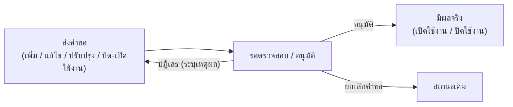

# 9. การจัดการรายวิชา

## 9.1 ดูข้อมูลรายวิชา

1. คลิกเมนู ข้อมูลรายวิชา
2. ค้นหารายวิชาโดยใช้ช่องค้นหาหรือตัวกรอง (รหัสวิชา / ชื่อวิชา)
3. คลิกที่รายวิชาเพื่อดูรายละเอียด

<figure><figcaption></figcaption></figure>

**ข้อมูลที่ดูได้ในรายละเอียดรายวิชา**

| แท็บ                 | เนื้อหา                                                 |
| -------------------- | ------------------------------------------------------- |
| ข้อมูลรายวิชา        | รหัส ชื่อ หน่วยกิต คำอธิบายรายวิชา ภาษาที่สอน           |
| เงื่อนไขการลงทะเบียน | รายวิชาที่ต้องเรียนก่อน (Pre-requisite)                 |
| CLO                  | Course Learning Outcomes ผลลัพธ์การเรียนรู้ระดับรายวิชา |
| อาจารย์ผู้สอน        | รายชื่ออาจารย์ที่รับผิดชอบรายวิชา                       |
| ประวัติการแก้ไข      | บันทึกการเปลี่ยนแปลงทั้งหมดของรายวิชา                   |
| การอนุมัติ           | สถานะและประวัติการอนุมัติรายวิชา                        |

<figure><figcaption></figcaption></figure>

<figure><figcaption></figcaption></figure>

**การดูสังกัดรายวิชา :** กดที่ปุ่มไอคอน **สังกัด/หลักสูตรที่ใช้งาน**

<figure><figcaption></figcaption></figure>

## 9.2 จัดการรายวิชากลาง

รายวิชากลาง คือคลังรายวิชามาตรฐานที่หลายหลักสูตรนำไปใช้ร่วมกันได้ ช่วยให้รหัส ชื่อ หน่วยกิต และคำอธิบายของวิชาเดียวกันตรงกันทุกที่ เมื่อคลิกเมนู **จัดการรายวิชากลาง** จะพบหน้าจัดการที่แบ่งรายวิชาออกเป็น 2 ประเภทหลัก (แท็บด้านบน)

### ประเภทของรายวิชากลาง

<table><thead><tr><th width="316.72723388671875">ประเภท</th><th>คืออะไร</th></tr></thead><tbody><tr><td><strong>รายวิชา GenEd (มหาวิทยาลัย)</strong></td><td>รายวิชาศึกษาทั่วไป (General Education) ระดับมหาวิทยาลัย ที่ทุกหลักสูตรใช้ร่วมกัน</td></tr><tr><td><strong>รายวิชาบริการ / รายวิชากลางคณะ</strong></td><td>รายวิชาที่คณะเปิดเป็นรายวิชากลาง/บริการ ให้หลักสูตรหรือคณะอื่นนำไปใช้ร่วม</td></tr></tbody></table>

<figure><figcaption></figcaption></figure>

<figure><figcaption></figcaption></figure>

### การค้นหาและตัวกรอง

| ตัวกรอง                                    | รายละเอียด                                                          |
| ------------------------------------------- | -------------------------------------------------------------------- |
| ค้นหา                                       | พิมพ์ **รหัสวิชา** หรือ **ชื่อวิชา**                                 |
| ประเภทวิชา / กลุ่ม GenEd                    | กรองตามประเภทวิชา หรือกลุ่ม GenEd                                    |
| สังกัด / คณะ (เฉพาะแท็บรายวิชากลางคณะ)      | กรองตามคณะที่เป็นเจ้าของรายวิชา                                      |
| สาขาวิชา/กลุ่มสาขาวิชาของส่วนงาน            | กรองตามภาควิชา (เฉพาะแท็บรายวิชากลางคณะ)                             |
| วิทยาเขต                                    | เลือกวิทยาเขต (หรือ "ทุกวิทยาเขต")                                   |
| สถานะ                                       | **ใช้งาน** หรือ **ปิดใช้งาน**                                        |

**คอลัมน์ในตารางรายวิชา**

* **รายวิชา GenEd:** รหัสวิชา · ชื่อรายวิชา · ประเภทวิชา/กลุ่ม GenEd · วิทยาเขต · หน่วยกิต · จัดการ
* **รายวิชากลางคณะ:** รหัสวิชา · ชื่อรายวิชา · สังกัด/คณะ · ประเภทวิชา · หน่วยกิต · จัดการ

### เพิ่มรายวิชากลางใหม่

กดปุ่ม **เพิ่มรายวิชา** จะเปิดฟอร์มแยกกันตามประเภท (GenEd หรือรายวิชากลางคณะ) โดยฟอร์มแบ่งเป็น **4 แท็บย่อย**

| แท็บย่อย | ฟิลด์ที่กรอก |
| --- | --- |
| **ข้อมูลรายวิชา** | (GenEd) กลุ่มวิชา GenEd · (กลางคณะ) คณะเจ้าของวิชา · สาขาวิชา/กลุ่มสาขาวิชาของส่วนงาน · วิทยาเขต รหัสวิชา · ประเภทวิชา · ชื่อรายวิชา (ไทย/อังกฤษ) · คำอธิบายรายวิชา (ไทย/อังกฤษ) · จำนวนหน่วยกิต · รูปแบบหน่วยกิต · ชั่วโมงบรรยาย/ปฏิบัติ/ศึกษาด้วยตนเอง · ประเภทห้องเรียน |
| **รายวิชาที่บังคับเรียนก่อน/ควบ** | กำหนดรายวิชาที่ต้องเรียนมาก่อน (Pre-requisite) · รายวิชาที่ต้องสอบผ่านมาก่อน (Must-pass) · รายวิชาที่ต้องเรียนควบคู่กัน (Concurrent) — ค้นหาจากรายวิชากลางที่มีอยู่แล้ว |
| **CLOs รายวิชา** | เพิ่มรายการ CLO (Course Learning Outcomes) ทีละข้อ — รายละเอียด (ไทย/อังกฤษ) ระบบจะรันรหัส CLO ให้อัตโนมัติ |
| **ข้อมูลการเปิดสอนและการอนุมัติ** | วันที่อนุมัติ · วันที่เปิดสอนครั้งแรก (ภาคเรียน/ปีการศึกษา) · (กรณีปิดใช้งาน) วันที่ปิดใช้งาน · ภาคเรียน/ปีการศึกษาที่ปิดใช้งาน |

> ℹ️ **รหัสวิชาต้องไม่ซ้ำ** ระบบตรวจสอบให้อัตโนมัติขณะพิมพ์ และจะแจ้งเตือนทันทีถ้ารหัสนั้นถูกใช้แล้ว ไม่ว่าจะเป็นรายวิชาของหลักสูตรใดหรือรายวิชากลางคณะใดก็ตาม

### การดำเนินการกับรายวิชาแต่ละรายการ

ปุ่ม/เมนู "จัดการ" ในแต่ละแถวจะเปลี่ยนไปตามสถานะปัจจุบันของรายวิชา

| ปุ่ม / เมนู | ใช้ทำอะไร |
| --- | --- |
| **ดูรายละเอียดวิชา** | เปิดดูข้อมูลรายวิชาแบบอ่านอย่างเดียว |
| **แก้ไข** | แก้ไขข้อมูลรายวิชาที่มีอยู่โดยตรง (ไม่สร้างเวอร์ชันใหม่) |
| **ปรับปรุงรายวิชา** | สร้าง **คำขอปรับปรุง** เป็นเวอร์ชันใหม่ของรายวิชา ต้องผ่านการตรวจสอบ/อนุมัติก่อนมีผลจริง |
| **ปิดใช้งาน** | ส่งคำขอปิดใช้งานรายวิชา (แถวจะแสดงป้าย "รอยืนยันการปิดใช้งาน" ระหว่างรอ) |
| **เปิดรายวิชา / ยื่นขอเปิดใช้งาน** | ส่งคำขอเปิดใช้งานรายวิชาที่ถูกปิดไว้กลับมาใช้ใหม่ (แถวจะแสดงป้าย "รอยืนยันการเปิดใช้งาน") |
| **ยกเลิกคำขอปิด / ยกเลิกคำขอเปิด** | ยกเลิกคำขอปิด/เปิดใช้งานที่ส่งไปแล้ว ก่อนได้รับการอนุมัติ |
| **ลบรายวิชา** | ลบรายวิชาออกจากระบบ (มีกล่องยืนยัน — ลบไม่ได้หากยังมีหลักสูตรใช้งานอยู่) |

**การดำเนินการแบบกลุ่ม (หลายรายการพร้อมกัน)** — กดเมนู **"เลือกเพื่อดำเนินการ"** แล้วเลือก

* **เลือกรายการเพื่อลบ** — ลบรายวิชาหลายรายการพร้อมกัน
* **เลือกเพื่อปรับปรุง** — สร้างคำขอปรับปรุงหลายรายวิชาพร้อมกัน (Bulk Revise)

**นำเข้าข้อมูลจาก Excel** — ปุ่ม **นำเข้าข้อมูล** ใช้สำหรับเพิ่มรายวิชาจำนวนมากพร้อมกัน (ดาวน์โหลด Template แล้วกรอกก่อนอัปโหลด) รองรับทั้งข้อมูลรายวิชาและ CLOs

**เปรียบเทียบเวอร์ชัน** — ปุ่ม **เปรียบเทียบ (Compare)** ใช้ดูความแตกต่างระหว่างรายวิชาเวอร์ชันเดิมกับเวอร์ชันที่ขอปรับปรุง ก่อนตัดสินใจอนุมัติ

### แผงรายวิชารออนุมัติ

ทางด้านขวาของตารางมีแผง **"รายวิชารออนุมัติ"** (กดไอคอน ◀ เพื่อเปิด/ปิด) แสดงคำขอที่ยังไม่เสร็จสิ้นทั้งหมด แบ่งเป็น 5 กลุ่ม

| กลุ่ม | หมายถึง |
| --- | --- |
| 🟢 **รออนุมัติการเปิด** | คำขอเพิ่มรายวิชาใหม่ ที่ยังไม่ได้ตรวจ/อนุมัติ |
| 🔵 **รออนุมัติการแก้ไข** | รายวิชาที่เคยอนุมัติแล้ว แต่ถูกแก้ไขและส่งกลับเข้าสู่กระบวนการตรวจสอบอีกครั้ง |
| 🔷 **รออนุมัติการปรับปรุง** | คำขอ "ปรับปรุงรายวิชา" ที่สร้างเวอร์ชันใหม่ รอตรวจสอบ/อนุมัติ |
| 🔴 **รออนุมัติการปิดใช้งาน** | คำขอปิดใช้งานรายวิชา รอการยืนยัน |
| 🟡 **รออนุมัติการเปิดใช้งาน** | คำขอเปิดใช้งานรายวิชาที่เคยปิดไว้ รอการยืนยัน |

แต่ละรายการในแผงนี้กดเมนู **⋮** เพื่อ **ดูรายละเอียด**, **แก้ไขคำขอ**, หรือ **ยกเลิกการดำเนินการ/ยกเลิกคำขอ** ได้โดยตรง

> ⚠️ **ผลกระทบเป็นวงกว้าง:** เนื่องจากรายวิชากลางถูกอ้างอิงจากหลายหลักสูตร การแก้ไขรหัส ชื่อ หรือหน่วยกิตจะกระทบทุกหลักสูตรที่ใช้รายวิชานั้น ก่อนแก้ควรตรวจสอบว่ามีหลักสูตรใดใช้อยู่บ้าง (ดูได้จากปุ่ม **สังกัด/หลักสูตรที่ใช้งาน**) และยืนยันว่าการเปลี่ยนแปลงนี้สมควรมีผลกับทุกหลักสูตร หากต้องการเปลี่ยนเฉพาะหลักสูตรเดียว ควรพิจารณาสร้างรายวิชาแยกแทน

> ℹ️ รายวิชาที่ยังมีหลักสูตรใช้งานอยู่ อาจ **ลบไม่ได้** (ระบบจะแจ้ง "ไม่สามารถลบรายวิชาได้") ต้องนำออกจากหลักสูตรที่ใช้ก่อน
