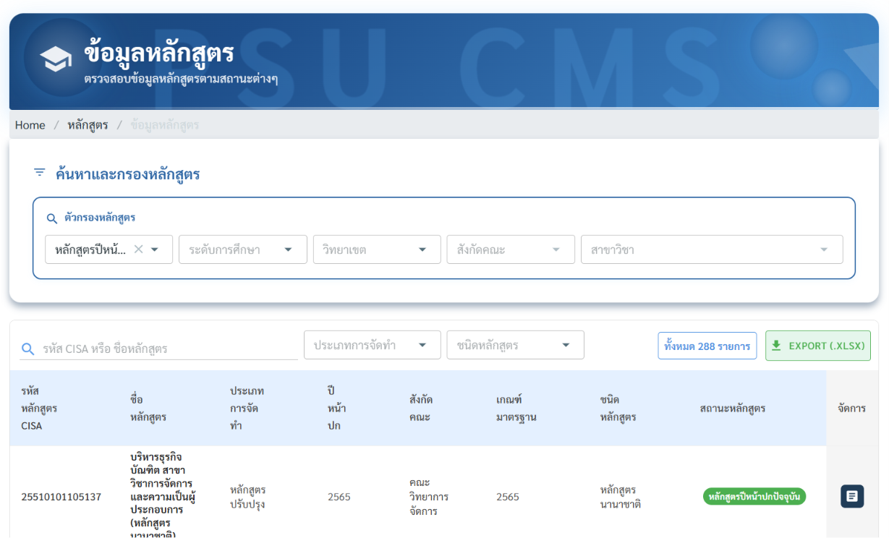
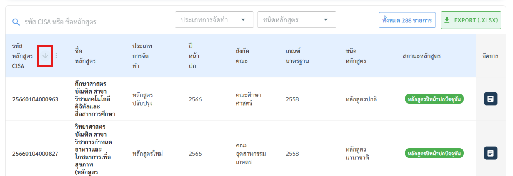
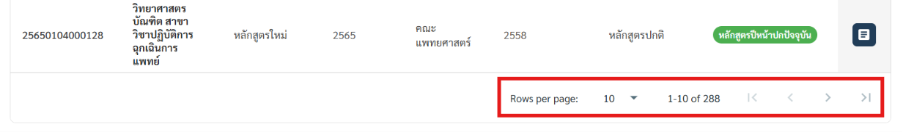
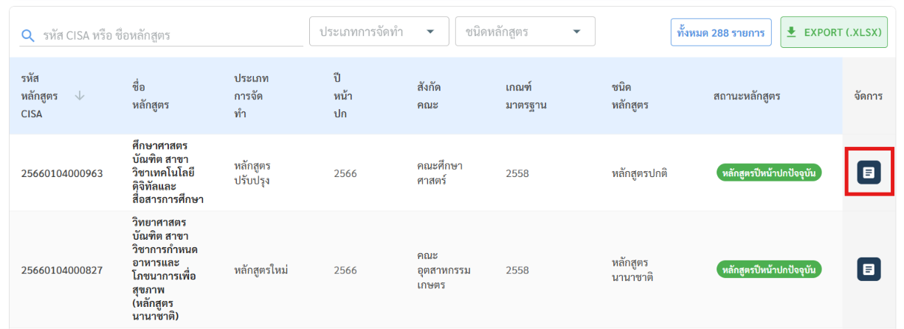
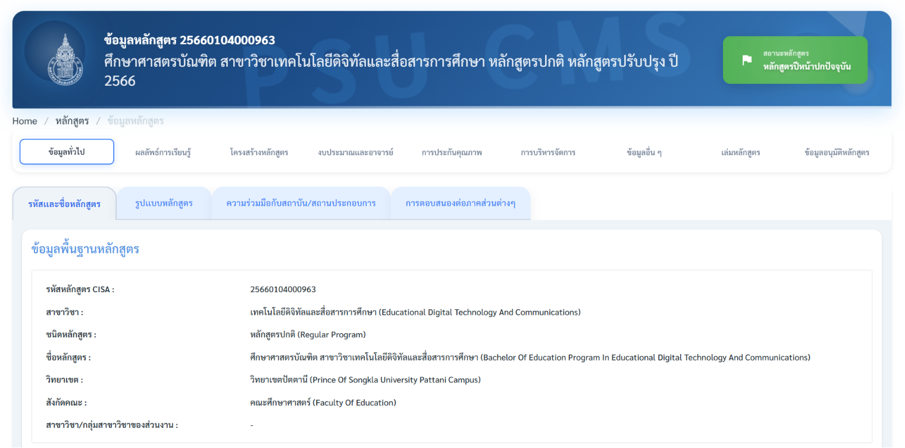

# 4. การดูข้อมูลหลักสูตร

## วิธีค้นหาหลักสูตร

1. คลิกเมนู หลักสูตร ที่แถบด้านซ้าย
2. เลือก ข้อมูลหลักสูตร
3. ใช้ตัวกรองด้านบนเพื่อค้นหา
4. ระบบแสดงผลลัพธ์เป็นตารางทันที (ไม่ต้องกดปุ่มค้นหา ผลจะกรองทันทีที่เปลี่ยนตัวกรอง) **ตัวกรองข้อมูลหลักสูตร**

| ตัวกรอง                  | รายละเอียด                                              | เคล็ดลับการใช้                                                                             |
| ------------------------ | ------------------------------------------------------- | ------------------------------------------------------------------------------------------ |
| สถานะหลักสูตร            | เลือกดูเฉพาะหลักสูตรสถานะที่ต้องการ (เลือกได้หลายสถานะ) | ติ๊กหลายสถานะพร้อมกันได้ เช่น ดู "หลักสูตรปีหน้าปกปัจจุบัน + ระงับการรับนักศึกษา" พร้อมกัน |
| ระดับการศึกษา            | ปริญญาตรี โท เอก หรืออื่นๆ                              | ใช้คู่กับคณะเพื่อแคบผลลัพธ์                                                                |
| วิทยาเขต                 | เลือกวิทยาเขตที่ต้องการ                                 | เหมาะกับผู้ดูแลเฉพาะวิทยาเขต                                                               |
| คณะ                      | เลือกคณะที่สังกัด                                       | รายการคณะดึงจากฐานข้อมูลกลาง                                                               |
| ชื่อหลักสูตร / รหัส CISA | พิมพ์ค้นหาโดยตรง                                        | ค้นด้วยรหัส CISA แม่นยำกว่าค้นด้วยชื่อ                                                     |

**การจัดการตารางผลลัพธ์**

1. คลิกหัวคอลัมน์เพื่อ เรียงลำดับ (เช่น เรียงตามปีหน้าปก)

1. เลื่อนหน้า (pagination) ด้านล่างตารางเมื่อผลลัพธ์มีหลายรายการ

1. คลิกที่ไอคอนของรายการหลักสูตรเพื่อ เปิดดูรายละเอียดหลักสูตร

## ข้อมูลที่ดูได้ในรายละเอียดหลักสูตร

เมื่อเปิดดูหลักสูตรรายการใดรายการหนึ่ง จะพบแท็บข้อมูลดังนี้

| แท็บหลัก           | แท็บย่อย                                                                                              |
| ------------------ | ----------------------------------------------------------------------------------------------------- |
| ข้อมูลทั่วไป       | รหัสและชื่อหลักสูตร, รูปแบบหลักสูตร, ความร่วมมือกับสถาบันหรือสถานประกอบการ, การตอบสนองต่อภาคส่วนต่างๆ |
| ผลลัพธ์การเรียนรู้ | ปรัชญาและวัตถุประสงค์, ผลลัพธ์การเรียนรู้ (PLOs), ระบบการจัดการศึกษา                                  |
| โครงสร้างหลักสูตร  | จัดการรายวิชา, แผนการศึกษา, PLOs รายวิชา, กลยุทธ์และวิธีการสอน                                        |
| งบประมาณและอาจารย์ | งบประมาณตามแผน, อาจารย์ประจำหลักสูตร, อาจารย์ผู้สอน                                                   |
| การประกันคุณภาพ    | การใช้เกณฑ์ประกันคุณภาพ, ตัวชี้วัด/ผลลัพธ์ (OKR), การรับรองโดยสภาวิชาชีพ/องค์กรอื่นๆ                  |
| การบริหารจัดการ    | กรรมการและหน่วยงานบริหารหลักสูตร, การเปิดสอน                                                          |
| ข้อมูลอื่น ๆ       | ข้อมูลประชาสัมพันธ์, Skill Transcript, ค่าธรรมเนียมการศึกษา                                           |
| เล่มหลักสูตร       | เล่มหลักสูตร, เล่มเผยแพร่, เล่มคู่มือการศึกษา                                                         |
